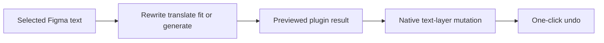

# BUX

> Research status: **Architecture-level** · Last reviewed: **2026-08-12**

BUX (Better UX Writing) is a deliberately narrow AI Figma plugin. It operates on product copy already attached to a design instead of generating a separate document: selected text can be rewritten, corrected, translated, expanded, shortened or turned into a stronger call to action.

## The native text layer is the authority

The useful loop is selection-scoped and reversible.

Context-aware placeholder generation can remove lorem ipsum, but public evidence does not specify how much surrounding frame or component context is sent to the model. Likewise, “100+ languages” describes the interface's offered operation, not independently measured translation quality.

## Failure and governance boundary

Shortening copy can preserve layout while changing meaning; translating text can create false confidence when a reviewer does not speak the target language. BUX provides undo, but no public evidence establishes terminology glossaries, brand-voice rules, approval roles, versioned localization memory or privacy and retention semantics. Those remain human and organization responsibilities.

The creator's launch post identifies a stable approved Figma Community plugin, but does not establish a legal organization or team geography. Region therefore remains unknown.

## Primary evidence

- [BUX Figma Community plugin](https://www.figma.com/community/plugin/1624498270884601172/bux-better-ux-writing-translation)
- [Creator-authored launch and workflow](https://www.reddit.com/r/FigmaDesign/comments/1tbwfj7/i_built_a_free_figma_plugin_that_handles_ux/)
