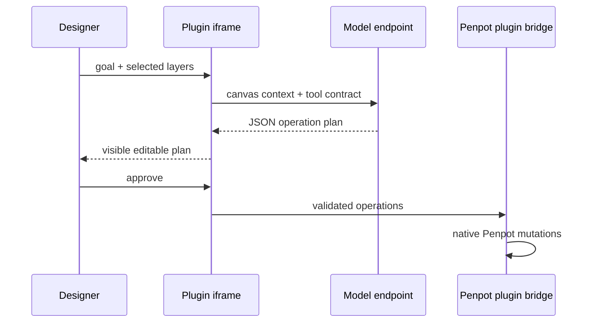

# Canvas Copilot for Penpot

> Research status: **Source-level** · Lifecycle: **active-transition** · Last reviewed: **2026-08-12**

Canvas Copilot's important design decision is not its model provider. It inserts a human-editable operation plan between model output and Penpot's native graph, then uses a bounded observe/act loop for optional autonomy.

## Approval is an explicit protocol state

“Run to goal” repeats read → small tool batch → reread, but stops after six passes. The user can stop earlier and already-applied changes remain normal editable Penpot layers. This is safer and more inspectable than a hidden model writing arbitrary plugin code.

## The mutation surface

At commit [`7dde9e3`](https://github.com/deedima3/penpot-chat/commit/7dde9e3cde83fe57567edca2de02a4168933fed0):

- [`src/main.ts`](https://github.com/deedima3/penpot-chat/blob/7dde9e3cde83fe57567edca2de02a4168933fed0/src/main.ts) owns the iframe UI.
- [`src/plugin.ts`](https://github.com/deedima3/penpot-chat/blob/7dde9e3cde83fe57567edca2de02a4168933fed0/src/plugin.ts) is the sole Penpot-API boundary and contains context collection, schema validation and execution.
- [`AI_TOOL_GUIDE.md`](https://github.com/deedima3/penpot-chat/blob/7dde9e3cde83fe57567edca2de02a4168933fed0/guides/AI_TOOL_GUIDE.md) publishes every supported argument.
- OpenAI-compatible credentials are stored in plugin-local browser storage; LM Studio can supply a local endpoint.

A clean `tsc --noEmit && vite build` completed during this review and produced the versioned plugin bundle under `docs/`.

## Early-project caveats

The repository was created on 2026-08-09 and is therefore marked active-transition rather than treated as a mature platform. No license file was present at the pinned revision. The maintainer profile identifies Denpasar in Bali, supporting Indonesia as team-region evidence.

## Decisive sources

- [Repository README](https://github.com/deedima3/penpot-chat/blob/7dde9e3cde83fe57567edca2de02a4168933fed0/README.md)
- [Published plugin manifest](https://github.com/deedima3/penpot-chat/blob/7dde9e3cde83fe57567edca2de02a4168933fed0/docs/manifest.json)
- [Maintainer profile](https://github.com/deedima3)
