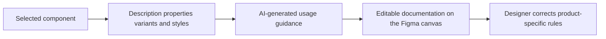

# Design System Docs Generator

> Research status: **Architecture-level** · Last reviewed: **2026-08-12**

Design System Docs Generator is a Figma plugin that drafts usage guidance from the component currently selected in the design system. It reads Figma-native context—description, properties, variants and styles—rather than asking a designer to manually restate that structure in a generic chat.

## Context is extracted locally; guidance remains a draft

The maker explicitly frames the output as a starting point. Component metadata can describe available states, but it cannot reveal every product rule, prohibited context, accessibility exception or organizational decision. Human review is therefore part of the artifact loop, not optional cleanup.

## Authority and maintenance boundary

Figma holds both the component graph and the generated documentation. Public evidence does not show automatic dependency tracking after a component changes, a diff between old and regenerated guidance, product-context retrieval, approval roles or a stable export format. The maker identifies change tracking and keeping documentation synchronized as a desired focus; that direction should not be reported as an already verified mechanism.

The tool began as an internal company utility and is now publicly installable. The reviewed creator evidence does not establish a legal product organization or current team geography.

## Primary evidence

- [Figma Community plugin](https://www.figma.com/community/plugin/1641615767346305619/design-system-docs-generator)
- [Creator-authored explanation and limitations](https://www.reddit.com/r/DesignSystems/comments/1v1l9cx/i_built_a_figma_plugin_that_aigenerates_design/)
