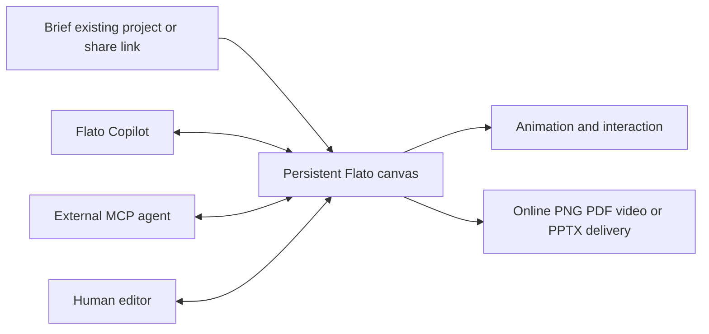

# Flato

> Research status: **Architecture-level** · Last reviewed: **2026-08-12**

| Field | Value |
|---|---|
| Team | Flato · team region not established |
| Ordinary job | co-author an editable presentation from brief through motion interaction and delivery with humans or external agents |
| Authority | the persistent structured Flato project |
| Lifecycle | active |

## A presentation is project state rather than a rendered deck

Flato defines pages blocks text images video shapes layouts styles themes animation definitions interactive behavior and project-level state as one inspectable canvas. Its built-in Copilot and MCP-connected agents read that current state and can update specific pages or blocks. Human editors then manipulate the same project instead of repairing a flattened generation.

MCP can open an authorized editor URL and when supported turn a shared link into an editable copy. That copy boundary matters: agents continue a specific project or fork rather than silently mutating a public share.

## Native authority stops before PowerPoint

Online presentation motion and interaction stay in Flato's runtime. PNG PDF and video are rendered deliveries. Current PPTX export is image-based so it preserves appearance but not Flato's fully editable object graph. The dossier therefore does not call PowerPoint a round-trip target.

## Evidence ceiling

The project serialization operation protocol conflict handling autosave version graph MCP authorization and animation runtime implementation are closed. Product documentation precisely states the visible object model and limits but does not independently prove export fidelity or simultaneous-edit safety.

## Primary evidence

- [Flato native canvas and MCP surface](https://www.flato.ai/)
- [Current technical product definition and explicit limits](https://www.flato.ai/es/about)
- [Operational FAQ](https://www.flato.ai/es/docs/flato-faq)
