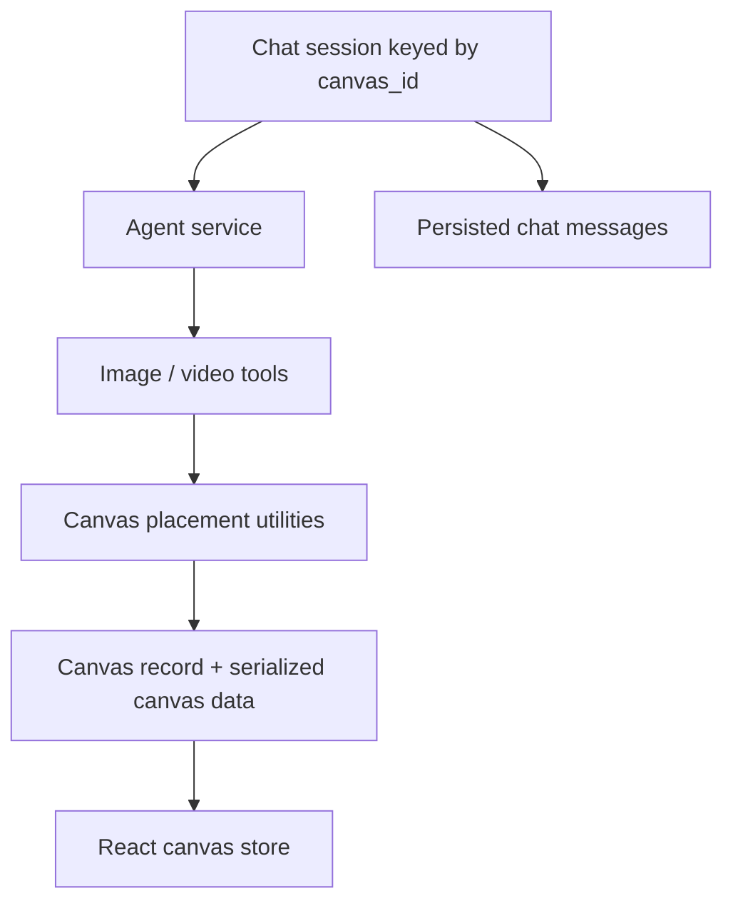

# Jaaz

> Research status: **Source-level** · Last reviewed: **2026-08-12**

Jaaz is the canonical 11cafe product lineage behind several copies encountered in search. It combines an agent conversation, generated media and a directly editable creative canvas in a local desktop application. The census merges `open-gallery` and `jaaz-2506` into this record.

## Canvas and conversation have separate durable state

The local service stores canvases, chat sessions and messages in SQLite. A chat session is linked to a `canvas_id`; generated image/video tools calculate placement and add results to the canvas rather than leaving them only in the chat transcript.

This separation explains recovery: reopening a canvas does not require replaying the whole model conversation, while the conversation remains available as provenance and continuation context.

## Source trace at the canonical revision

Pinned commit [`145dd85`](https://github.com/11cafe/jaaz/commit/145dd85067be77e36d400637a595e19a7b07c77a) contains:

- [`db_service.py`](https://github.com/11cafe/jaaz/blob/145dd85067be77e36d400637a595e19a7b07c77a/server/services/db_service.py), which creates sessions/messages and saves serialized canvas data;
- [database models](https://github.com/11cafe/jaaz/blob/145dd85067be77e36d400637a595e19a7b07c77a/server/models/db_model.py) and the [canvas migration](https://github.com/11cafe/jaaz/blob/145dd85067be77e36d400637a595e19a7b07c77a/server/services/migrations/v2_add_canvases.py);
- [canvas routes](https://github.com/11cafe/jaaz/blob/145dd85067be77e36d400637a595e19a7b07c77a/server/routers/canvas.py) and [canvas placement utilities](https://github.com/11cafe/jaaz/blob/145dd85067be77e36d400637a595e19a7b07c77a/server/utils/canvas.py);
- the React [canvas store](https://github.com/11cafe/jaaz/blob/145dd85067be77e36d400637a595e19a7b07c77a/react/src/stores/canvas.ts) and [canvas route](https://github.com/11cafe/jaaz/blob/145dd85067be77e36d400637a595e19a7b07c77a/react/src/routes/canvas.%24id.tsx);
- LangGraph and OpenAI-agent service implementations under [`server/services`](https://github.com/11cafe/jaaz/tree/145dd85067be77e36d400637a595e19a7b07c77a/server/services).

## License is not equivalent to “open source”

The source is public, but the pinned [license](https://github.com/11cafe/jaaz/blob/145dd85067be77e36d400637a595e19a7b07c77a/LICENSE) is a custom community/commercial dual-license policy. This dossier therefore says source-visible and does not convert the project's own “open-source” wording into an OSI-compliance claim. A reliable team region was not established.

## Decisive sources

- [Canonical repository](https://github.com/11cafe/jaaz)
- [Product site](https://jaaz.app)
- [Repository README](https://github.com/11cafe/jaaz/blob/145dd85067be77e36d400637a595e19a7b07c77a/README.md)
