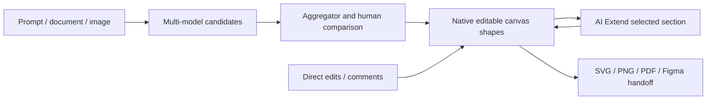

# Jeda.ai

> Research status: **Architecture-level** · Last reviewed: **2026-08-11**

| Field | Value |
|---|---|
| Team | Jeda.ai · team region not established |
| Ordinary job | generate several wireframe directions then edit compare extend and hand them off on a shared visual workspace |
| Native authority | editable wireframe diagram and whiteboard shapes |
| Candidate mechanism | multiple models plus an aggregator retain alternative layouts before selection |

## Models propose but native shapes continue

Jeda can run several model families on one prompt and compare their reasoning through an aggregator. Generated wireframes use dedicated shapes that can be moved resized regrouped and relabeled. A selected section can be expanded through AI Extend without restarting the whole canvas. Versions and comments support shared decisions before export.

## One visual workspace spans artifact types

Wireframes coexist with flowcharts diagrams mind maps matrices and infographics on the same whiteboard. These commands are product surfaces over one Jeda canvas rather than eleven separate agents. Art generation is explicitly less editable and is not used to infer structure for all output types.

SVG can move wireframes into Figma as editable groups. It is a downstream materialization and not evidence of a live round trip or preserved component semantics.

## Evidence ceiling

No public canvas schema or implementation establishes model orchestration selection scores history retention collaboration merge rules or SVG fidelity. Quantitative adoption and comparison claims are not used as technical evidence.

## Primary evidence

- [Jeda AI Wireframe](https://www.jeda.ai/ai-wireframe)
- [Jeda AI Whiteboard](https://www.jeda.ai/ai-whiteboard)
- [Jeda Generative AI Wireframe](https://www.jeda.ai/generative-ai-wireframe)
