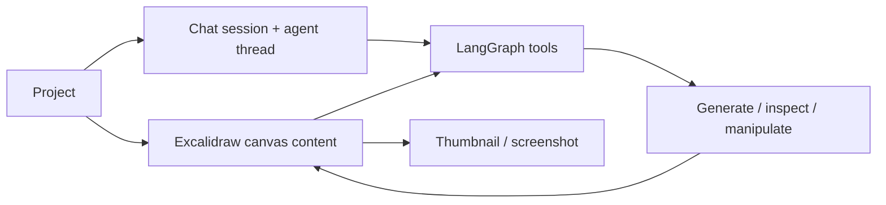

# Loomic

> Research status: **Source-level** · Last reviewed: **2026-08-12**

Loomic is a project-based image/video design agent built around Excalidraw. Canvas context is visible to the LangGraph agent, and generated media returns as manipulable canvas elements rather than a detached gallery.

## Persistence mirrors the user journey

Supabase migrations separate project identity, canvas content, chat sessions, agent threads, thumbnails and canvas screenshots. Those clocks answer different recovery questions:

- canvas content reopens the composition;
- chat sessions and agent threads continue reasoning;
- thumbnails list projects;
- screenshots provide visual history/evidence;
- generated assets live in project buckets.

## Pinned implementation

At commit [`875ff78`](https://github.com/fancyboi999/Loomic/commit/875ff78296c990b29fcfc74b2f528e2825b1812c):

- persistence migrations are under [`supabase/migrations`](https://github.com/fancyboi999/Loomic/tree/875ff78296c990b29fcfc74b2f528e2825b1812c/supabase/migrations);
- [canvas routes](https://github.com/fancyboi999/Loomic/blob/875ff78296c990b29fcfc74b2f528e2825b1812c/apps/server/src/http/canvases.ts), [projects](https://github.com/fancyboi999/Loomic/blob/875ff78296c990b29fcfc74b2f528e2825b1812c/apps/server/src/http/projects.ts) and [chat](https://github.com/fancyboi999/Loomic/blob/875ff78296c990b29fcfc74b2f528e2825b1812c/apps/server/src/http/chat.ts) expose the service boundary;
- agent tools explicitly [inspect](https://github.com/fancyboi999/Loomic/blob/875ff78296c990b29fcfc74b2f528e2825b1812c/apps/server/src/agent/tools/inspect-canvas.ts), [manipulate](https://github.com/fancyboi999/Loomic/blob/875ff78296c990b29fcfc74b2f528e2825b1812c/apps/server/src/agent/tools/manipulate-canvas.ts), generate images/video and capture screenshots;
- the web [canvas route](https://github.com/fancyboi999/Loomic/blob/875ff78296c990b29fcfc74b2f528e2825b1812c/apps/web/src/app/canvas/page.tsx) and normalization code render the project.

## Limits

No license file was present. Source proves the project/canvas/agent contract but no paid provider job was run. Public evidence did not establish the team's region.

## Decisive sources

- [Repository README](https://github.com/fancyboi999/Loomic/blob/875ff78296c990b29fcfc74b2f528e2825b1812c/README.md)
- [Canvas integration note](https://github.com/fancyboi999/Loomic/blob/875ff78296c990b29fcfc74b2f528e2825b1812c/docs/tech/canvas-design-integration.md)
- [Live deployment](https://loomic-one.vercel.app)
