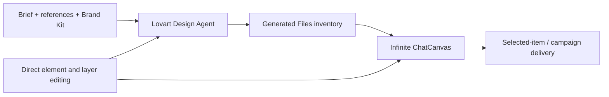

# Lovart

> Research status: **Architecture-level** · Last reviewed: **2026-08-11**

| Field | Value |
|---|---|
| Team | Lovart · team region not established by attributable evidence |
| Ordinary job | direct an agent across a multi-asset creative project then refine and arrange its outputs on an infinite canvas |
| Continuing authority | ChatCanvas elements layers project context and generated-file inventory |
| Delivery | item-level and project creative exports |

## Generated files become canvas material

Lovart's agent can plan a campaign and produce several visual assets. The project keeps every generated file in a panel instead of losing it in chat. Users can select canvas items and move resize group lock reorder crop erase edit text or edit elements. Brand Kit rules and references provide project-level context for later work.

## The native graph is bounded by media type

Canvas operations establish native element and layer structure around text images and compositions. They do not prove that every generated image is internally decomposed into semantic vector layers. “Edit Elements” and touch editing are recorded as product operations while the exact segmentation representation remains unknown.

The agent can work across formats and preserve context inside a project. This is why native artifact authoring is primary: the user continues composing after generation. One-shot image generation is an input to that loop rather than the census unit.

## Evidence ceiling

No public schema or implementation establishes canvas serialization, version restoration, collaboration conflict handling, agent planning state or export lineage. The Generated Files panel proves durable browseable project output but not indefinite retention.

## Primary evidence

- [Design your first Lovart project](https://www.lovart.ai/docs/getting-started/design-your-first-project)
- [Customize the Lovart canvas](https://www.lovart.ai/docs/edit-your-design/customize-your-canvas)
- [Lovart ChatCanvas](https://www.lovart.ai/features/infinite-chatcanvas-ai-collaboration)
