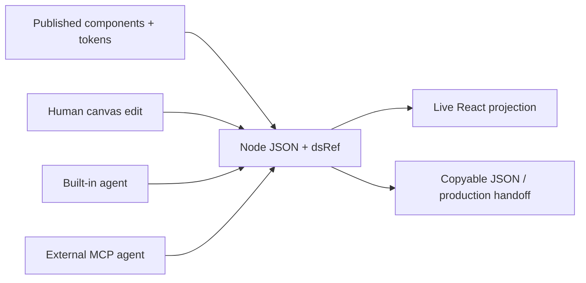

# M2 Canvas

> Research status: **Architecture-level** · Last reviewed: **2026-08-11**

| Field | Value |
|---|---|
| Team | Model Tool Labs Inc. · team region not established |
| Ordinary job | let people and several agents build production UI together on one live canvas |
| Canonical node | structured JSON referencing registered React components and a design-system version |
| Mutation unit | an in-place patch to one node rather than regeneration of the whole screen |

## The canvas is a structured component graph

M2 makes a stronger claim than “code export.” A canvas node carries a stable id, a component tree and a `dsRef` pointing at a published design-system version. Components are real React implementations. The built-in agent and MCP-connected agents create or patch the node JSON; only the affected node rerenders. Human and agent edits therefore meet at the same structured authority.

## Design-system enforcement is referential

Agents do not merely sample colors from a screenshot. They place registered component instances and token-bound variants. The version reference records which published system a node expects. Public evidence does not establish migration behavior when a design-system version changes or whether old versions remain indefinitely available.

Real-time multiplayer includes people and agents. That establishes shared live state but not the operational-transform or CRDT implementation. Likewise exact-node patching limits blast radius; it does not prove semantic merge safety between simultaneous edits.

## Evidence ceiling

The product page exposes example component source and node JSON plus the patch and MCP contract. No implementation or persistence schema is public. Version history retention, conflict resolution, repository synchronization and offline recovery remain unknown.

## Primary evidence

- [M2 Canvas](https://m2ui.ai/)
- [M2 MCP surface](https://m2ui.ai/docs)
