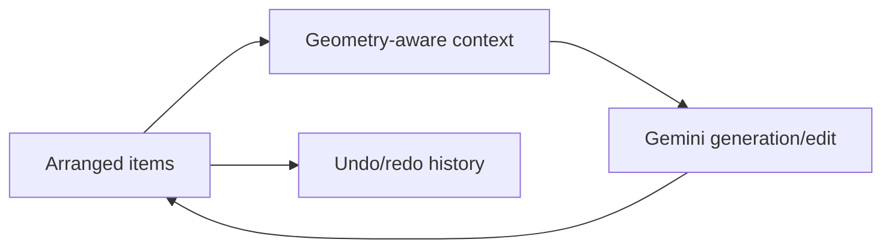

# NanoCanvas

> Research status: **Source-level** · Lifecycle: **active-transition** · Last reviewed: **2026-08-12**

NanoCanvas's design proposition is “layout is the prompt.” Images, notes and drawings are spatially arranged; geometry and selection determine the multimodal context sent to Gemini; generated images/video or edits return to the same infinite canvas.

## Spatial context is explicit

[`types.ts`](https://github.com/anpc849/NanoCanvas/blob/4fa8b69fe965c077c2a70082e23ed18fb8111ed8/types.ts) defines canvas items. [`canvasUtils.ts`](https://github.com/anpc849/NanoCanvas/blob/4fa8b69fe965c077c2a70082e23ed18fb8111ed8/utils/canvasUtils.ts) and [`geometry.ts`](https://github.com/anpc849/NanoCanvas/blob/4fa8b69fe965c077c2a70082e23ed18fb8111ed8/utils/geometry.ts) derive spatial relations. [`geminiService.ts`](https://github.com/anpc849/NanoCanvas/blob/4fa8b69fe965c077c2a70082e23ed18fb8111ed8/services/geminiService.ts) consumes that context.

The [history hook](https://github.com/anpc849/NanoCanvas/blob/4fa8b69fe965c077c2a70082e23ed18fb8111ed8/hooks/useHistory.ts) makes canvas edits undoable. This is the strongest persistence evidence; no account/project database is claimed.

## Boundary

Pinned revision: [`4fa8b69`](https://github.com/anpc849/NanoCanvas/commit/4fa8b69fe965c077c2a70082e23ed18fb8111ed8). No license file was present. The repository is a compact experimental release and is marked active-transition. No reliable region evidence was found.

## Decisive sources

- [Repository README](https://github.com/anpc849/NanoCanvas/blob/4fa8b69fe965c077c2a70082e23ed18fb8111ed8/README.md)
- [Technical notes](https://github.com/anpc849/NanoCanvas/blob/4fa8b69fe965c077c2a70082e23ed18fb8111ed8/technical_notes.md)
- [Canvas component](https://github.com/anpc849/NanoCanvas/blob/4fa8b69fe965c077c2a70082e23ed18fb8111ed8/components/Canvas.tsx)
