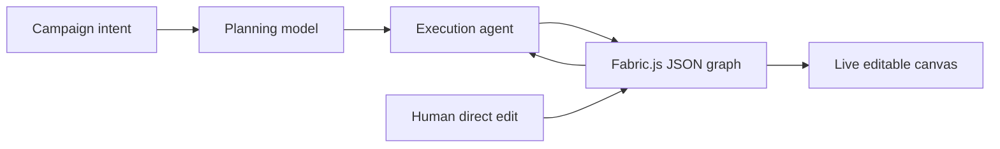

# Niki

> Research status: **Architecture-level** · Last reviewed: **2026-08-11**

| Field | Value |
|---|---|
| Team | Niki Studio / Nipun Khanna · team region not established |
| Ordinary job | watch an agent assemble an ad campaign in real time then intervene and edit every canvas element directly |
| Shared authority | Fabric.js-compatible JSON object graph |
| Lifecycle | early active-transition |

## Human and agent mutate the same JSON state

The builder's technical account describes every text image and layout element as an object with identity geometry content style and hierarchy in one JSON representation. A planning model decomposes campaign intent and an execution agent streams state changes. Fabric.js maps those changes into the visible canvas. Human edits update that same state and become context for the next agent action.

## Streaming makes intervention part of the control model

Elements appear and change as execution proceeds rather than only after a hidden render completes. The user can intervene before completion and the next instruction reads the changed authority. That runtime correction loop is the decisive mechanism even though the product is early.

The evidence is stronger than a community launch claim because the linked product is live and the named builder publishes a concrete state and orchestration account. It remains architecture-level because no implementation source or formal schema is available.

## Evidence ceiling

The public evidence does not establish autosave named projects undo versioning collaboration export formats model error recovery or production usage. Planned video-timeline support is excluded from current classification.

## Primary evidence

- [Niki Studio](https://nikistudio.cloud/)
- [Builder architecture account](https://medium.com/@nipunkhanna/i-built-an-agent-operated-design-canvas-here-is-what-i-learned-about-agentic-architecture-fbd8c6147c25)
- [Niki privacy policy](https://nikistudio.cloud/privacy)
