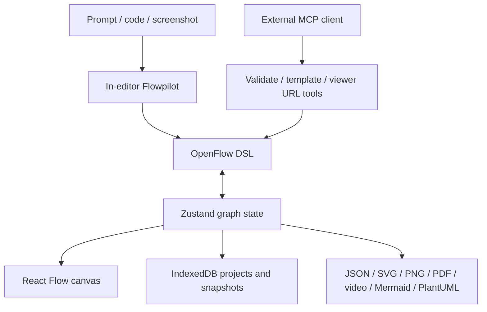

# OpenFlowKit

> Research status: **Source-level** · Last reviewed: **2026-08-11**

| Field | Value |
|---|---|
| Team | Vrun Design |
| Ordinary job | create and refine structured technical diagrams from canvas edits, code, imports, screenshots or AI and export them without an account |
| Canonical local project | structured flow state persisted in browser IndexedDB |
| Textual peer representation | bidirectionally synchronized OpenFlow DSL |
| Pinned source | [`b8faef1071d162a36c83baeba5e1f36fe7475ac9`](https://github.com/Vrun-design/openflowkit/tree/b8faef1071d162a36c83baeba5e1f36fe7475ac9) |

## Canvas and DSL are two editors over one diagram

OpenFlowKit uses React Flow and Zustand for its structured graph, with nodes, edges, pages, layers, sections and design metadata. A live code panel expresses the diagram in OpenFlow DSL. Canvas edits regenerate code; code edits parse back into graph state. The DSL is Mermaid-compatible for common imports but carries additional OpenFlow properties such as icon identities.

This bidirectionality is the defining mechanism. The visual canvas is not a screenshot of code, and the text panel is not an export-only afterthought. Parser and exporter tests are therefore central source evidence: a round trip must preserve relationships and editable semantics.

## AI has two different entry paths

Flowpilot runs inside the editor. It can start from a prompt, source code or screenshot, or refine the current canvas. Provider keys stay in the browser and requests go directly to one of the configured providers, including local Ollama. If generated DSL fails to parse, the error and bad output can be sent back for one repair turn before adoption.

The first-party `@vrun-design/openflowkit-mcp` package is narrower. Its pinned tools validate DSL, analyze a codebase, find icon slugs, obtain templates and create viewer URLs. It uses the MCP client's model; it does not expose an unrestricted live mutation channel into an already-open browser canvas. A generated viewer/import link hands structured DSL to OpenFlowKit, where it can become an editable project. The dossier keeps those two agent paths separate.

## Local-first has observable consequences

Saved flows, snapshots and provider settings are stored on the user's device; the static SPA has no required application backend or account. Complete JSON supports an explicit round trip, while version snapshots can restore prior graph state. An opt-in WebRTC collaboration path exists but is disabled by default, so it must not be used to imply production multiplayer guarantees.

The locality boundary also means clearing browser storage can destroy unexported work. A robust workflow exports JSON or otherwise backs up the browser database. “No server storage” is a privacy property, not automatic durability.

## Rendering and delivery

ELK layout runs in a worker so large layout calculations do not block the main UI. Export paths include editable SVG for Figma import, raster/vector documents and a cinematic MP4 path based on WebCodecs with a MediaRecorder fallback. These are materializations from graph state; JSON/DSL and IndexedDB state retain more authoring semantics than any video or image export.

## Commit-level evidence map

| Pinned path | Evidence |
|---|---|
| `src/store.ts`, `src/store/` | graph actions, history and workspace state |
| `src/lib/openFlowDslParserV2.ts` | DSL-to-graph boundary |
| `src/services/openFlowDSLExporter.ts` | graph-to-DSL boundary |
| `src/services/storage/indexedDbStateStorage.ts` | local project persistence |
| `src/hooks/ai-generation/` | in-editor generation, parsing and repair path |
| `mcp-server/src/tools/` | exact external-agent capabilities and their narrower scope |

## Primary evidence

- [Pinned repository](https://github.com/Vrun-design/openflowkit/tree/b8faef1071d162a36c83baeba5e1f36fe7475ac9)
- [Official documentation](https://docs.openflowkit.com/)
- [Pinned MCP server](https://github.com/Vrun-design/openflowkit/tree/b8faef1071d162a36c83baeba5e1f36fe7475ac9/mcp-server)
