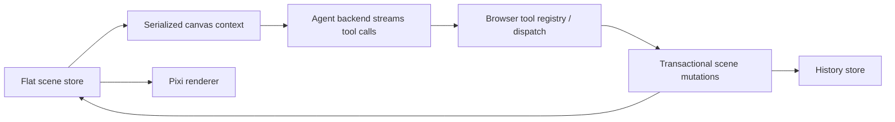

# Pen Editor

> Research status: **Source-level** · Last reviewed: **2026-08-12**

Pen Editor is an original vector-design runtime with an embedded agent, not a chat wrapper around screenshots. Its flat scene store is authoritative for direct editing, rendering, agent reads/writes, undo and export.

## Scene authority and rendering scale

The editor supports frames, text, Bézier paths, components/instances, variants, auto-layout, image operations, shaders and prototype/research modes. PixiJS renders a single WebGL scene; dirty-set synchronization processes only changed nodes; a spatial index culls off-screen content; unchanged top-level frames can be cached as tiles.

Those performance choices are part of the artifact model: the agent must serialize the same effective layout the renderer shows. The changelog records a repaired failure where auto-layout children serialized placeholder zero sizes and misled the agent even though the canvas looked correct.

## Agent writes are browser-side transactions

The backend supplies schemas and reasoning; tool execution remains in the browser. Batch design operations are grouped into one undo entry. The agent can also export selected layers as SVG for use in embedded HTML rather than reconstructing vector paths from prose.

## Commit-level evidence

Pinned revision [`ab9e6a6`](https://github.com/dan-rozhkov/pen-editor/commit/ab9e6a614b183b3523108c65e0af7922faac3b97) exposes:

- the [scene type system](https://github.com/dan-rozhkov/pen-editor/blob/ab9e6a614b183b3523108c65e0af7922faac3b97/src/types/scene.ts);
- the [scene store](https://github.com/dan-rozhkov/pen-editor/tree/ab9e6a614b183b3523108c65e0af7922faac3b97/src/store/sceneStore) and [dirty tracking](https://github.com/dan-rozhkov/pen-editor/blob/ab9e6a614b183b3523108c65e0af7922faac3b97/src/store/sceneStore/dirtyTracking.ts);
- [history](https://github.com/dan-rozhkov/pen-editor/blob/ab9e6a614b183b3523108c65e0af7922faac3b97/src/store/historyStore.ts) and [document persistence](https://github.com/dan-rozhkov/pen-editor/blob/ab9e6a614b183b3523108c65e0af7922faac3b97/src/store/documentStore.ts);
- [tool registration](https://github.com/dan-rozhkov/pen-editor/blob/ab9e6a614b183b3523108c65e0af7922faac3b97/src/lib/toolRegistry.ts), [dispatch](https://github.com/dan-rozhkov/pen-editor/blob/ab9e6a614b183b3523108c65e0af7922faac3b97/src/lib/mcpDispatch.ts) and contract tests;
- PNG/SVG/PDF/PPTX and public Pen export utilities under [`src/utils`](https://github.com/dan-rozhkov/pen-editor/tree/ab9e6a614b183b3523108c65e0af7922faac3b97/src/utils).

## Limits

The repository has extensive unit and end-to-end tests, but this review did not run the full suite or a model-backed session. No license file was present. The source proves behavior at the pinned revision; it does not establish the maintainer's operating region.

## Decisive sources

- [Repository README](https://github.com/dan-rozhkov/pen-editor/blob/ab9e6a614b183b3523108c65e0af7922faac3b97/README.md)
- [Performance contract](https://github.com/dan-rozhkov/pen-editor/blob/ab9e6a614b183b3523108c65e0af7922faac3b97/PIXI_PERFORMANCE_ROADMAP.md)
- [Changelog](https://github.com/dan-rozhkov/pen-editor/blob/ab9e6a614b183b3523108c65e0af7922faac3b97/CHANGELOG.md)
