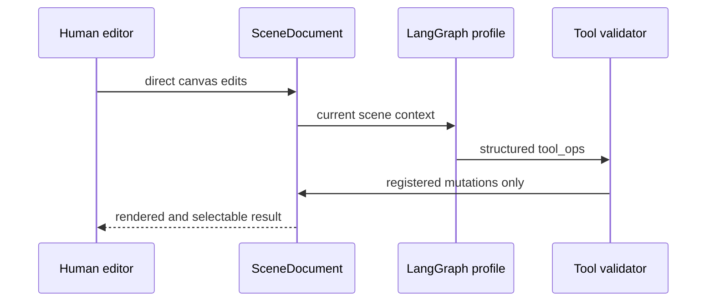

# Recombyn

> Research status: **Source-level** · Last reviewed: **2026-08-12**

Recombyn is unusually useful to this landscape because it publishes both sides of the claim “AI edits a canvas”: the canvas's own scene specification and the agent's permitted operation catalogue. The decisive authority is `SceneDocument`, not a screenshot of generated HTML.

## One document serves human and agent editing

The RCB canvas renders each authoritative node through an SVG host. A CSS camera handles the very large zoom range; `Path2D` supports hit testing and selection overlays; viewport culling and level-of-detail proxies keep large documents operable. The human can directly edit frames, layers, shapes, text and layout.

The Design Agent does not receive an unrestricted code channel. Its LangGraph profile routes intent through decide/paint/observe stages; paint emits structured `tool_ops`; the host validates those operations against the registered catalogue before applying them to the same scene.

## The published control path

Pinned revision [`c3b87fd`](https://github.com/recombyn/recombyn/commit/c3b87fda8014c9e47ceac411ad06bd2e03566f6a) exposes:

- the machine-readable [scene schema](https://github.com/recombyn/recombyn/blob/c3b87fda8014c9e47ceac411ad06bd2e03566f6a/packages/scene-schema/schema/scene-document.schema.json) and its [JSON contract](https://github.com/recombyn/recombyn/blob/c3b87fda8014c9e47ceac411ad06bd2e03566f6a/docs/scene-json-spec.md);
- the [canvas architecture](https://github.com/recombyn/recombyn/blob/c3b87fda8014c9e47ceac411ad06bd2e03566f6a/docs/canvas-architecture.md);
- the configurable [agent profile contract](https://github.com/recombyn/recombyn/blob/c3b87fda8014c9e47ceac411ad06bd2e03566f6a/docs/agent-profile.md);
- the registered [canvas action seed](https://github.com/recombyn/recombyn/blob/c3b87fda8014c9e47ceac411ad06bd2e03566f6a/apps/api/seeds/canvas_actions_seed.json);
- canvas and agent stress tests under [`e2e/tests`](https://github.com/recombyn/recombyn/tree/c3b87fda8014c9e47ceac411ad06bd2e03566f6a/e2e/tests).

## Collaboration and recovery

Yjs provides the shared-document path and the repository supplies a separate collaboration service. Profiles, prompt packs, skills and tools are configuration around the document; changing them does not silently replace the scene authority. Self-hosting is documented with Docker Compose.

## Evidence boundary

The repository is Apache-2.0 licensed and source-visible. The review traces the published implementation but did not run a multi-user deployment or model-backed generation session. The GitHub owner profile does not establish a reliable operating region, so region remains `unknown`.

## Decisive sources

- [Canonical repository](https://github.com/recombyn/recombyn)
- [Self-hosting guide](https://github.com/recombyn/recombyn/blob/c3b87fda8014c9e47ceac411ad06bd2e03566f6a/docs/self-hosting.md)
- [Apache-2.0 license](https://github.com/recombyn/recombyn/blob/c3b87fda8014c9e47ceac411ad06bd2e03566f6a/LICENSE)
