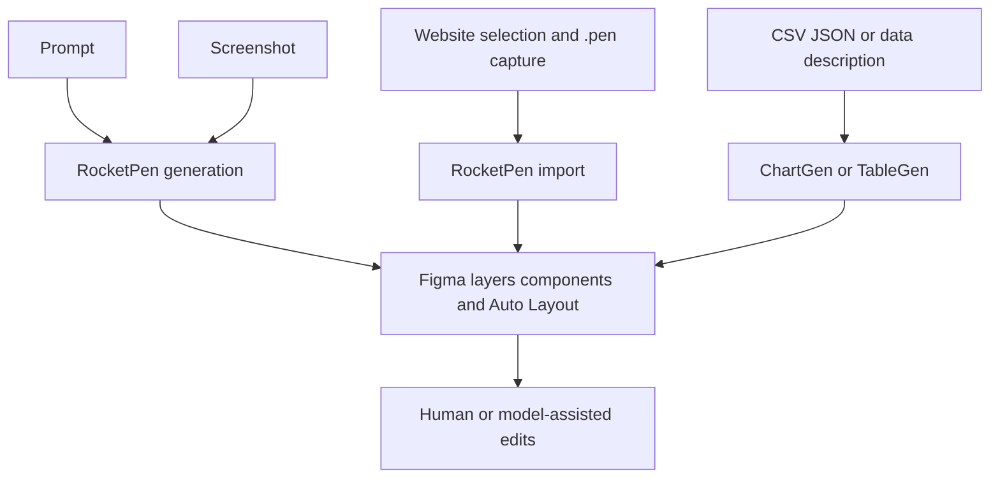

# RocketPen

> Research status: **Architecture-level** · Last reviewed: **2026-08-12**

RocketPen is a Figma-native generation and reconstruction plugin. It accepts prompts, screenshots, web pages and structured data, then materializes editable Figma layers rather than leaving the user with a raster preview.

## Different inputs converge on the Figma graph

The Chrome extension selects DOM regions and serializes styling, layout and content into a `.pen` transfer file; the Figma plugin reconstructs the selection. That deterministic website path is distinct from screenshot inference even though both end in the same canvas.

## Claims and evidence boundary

The product states that output includes components, Auto Layout, variables and styles. Public evidence does not disclose the `.pen` schema, screenshot segmentation, responsive mapping, component inference, model prompts, edit history or loss metrics. “100% editable” means that generated objects can be manipulated, not that every original web behavior or semantic relationship survives.

Figma becomes the working authority after insertion. There is no verified round trip back to the captured website source. Team geography remains unknown.

## Primary evidence

- [RocketPen product and workflows](https://rocketpen.art/)
- [Figma Community entry](https://rocketpen.art/)
