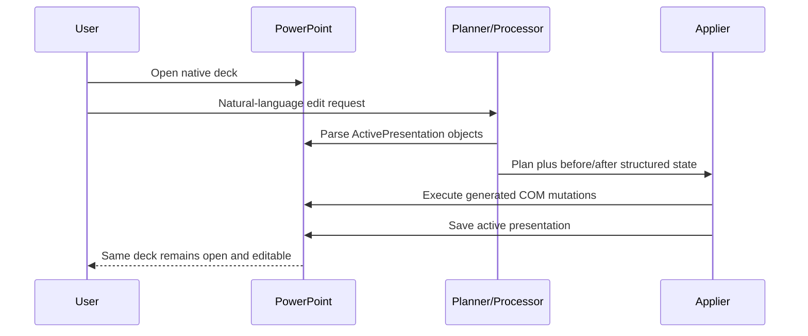

# Talk-to-Your-Slides (`KyuDan1/Talk-to-Your-Slides`)

> Research status: **Source-level** · Last reviewed: **2026-08-11**

| Field | Value |
|---|---|
| Organization / team | KAIST AI and Chung-Ang University research team |
| Ordinary job | give a natural-language correction to slides already open in PowerPoint and have the agent change those native objects in place |
| Canonical artifact | the active PowerPoint presentation and its COM object graph |
| Status | active research implementation with CLI and Flask UI paths; Windows PowerPoint is required for the implemented mutation path |
| Source repository | [KyuDan1/Talk-to-Your-Slides](https://github.com/KyuDan1/Talk-to-Your-Slides) |
| Pinned source revision | [`851494563aea103fcf80d02e3ea3e3f65b245b5b`](https://github.com/KyuDan1/Talk-to-Your-Slides/commit/851494563aea103fcf80d02e3ea3e3f65b245b5b) |

## The agent enters the document the user already has open

Talk-to-Your-Slides is not a file generator that happens to export PowerPoint. Its `Parser` calls `win32com.client.Dispatch("PowerPoint.Application")`, reads `ActivePresentation`, and walks its slides and shapes. Its `Applier` later obtains the same host application, targets slides and shapes, executes generated Python operations, and calls `presentation.Save()`.

That direct host boundary is the project's defining mechanism. The ordinary user does not have to export a generated replica and manually replace the original deck.

## Two levels separate intent from mutation

The implementation follows the paper's two-level design:

- `Planner` interprets the request and decides the high-level edit sequence;
- `Parser` serializes relevant native objects into an agent-readable state;
- `Processor` produces the desired structured state;
- `Applier` generates Python code that mutates the live COM objects;
- `Reporter` and `SharedLogMemory` capture execution context and optional reports.

The planner can reason broadly, while the mutation layer has to address concrete slide and shape objects. This prevents a high-level instruction such as “make the important content red” from being treated as a free-form image regeneration.

## Native objects remain the authority

The generated code can alter text and formatting, fills and lines, pictures, tables, charts and layout geometry. It iterates real `slide.Shapes`, uses PowerPoint APIs and, for embedded chart data, can dispatch Excel automation.

The durable result is therefore the PowerPoint document saved by the host. Parsed JSON-like state, generated Python and logs are transient coordination material. They can explain or replay parts of a run, but they are not a second canonical deck.

This also creates a sharp safety boundary: generated Python has broad authority over the active presentation. The source does not restrict every operation to a declarative allow-list or stage all edits in a detached transaction before adoption.

## Save is explicit; transactionality is not

The `Applier` appends a save step to generated code and reports save errors. It deliberately leaves PowerPoint open. That supports the simple user loop of inspecting and continuing work in the same host.

What the source does not provide is an application-level transaction wrapper over the whole edit:

- several shape mutations can occur before a later operation fails;
- the repository does not clone the deck automatically before execution;
- there is no project-owned undo journal mapping one instruction to one reversible change set;
- concurrent human edits during generated code execution are not revision-guarded;
- a retry can target a document that is already partially changed.

PowerPoint's own undo, AutoRecover, version history or a manual duplicate may help, but those are host/environment recovery mechanisms. They should be tested explicitly and not attributed to this project as guaranteed semantics.

## Object targeting can become ambiguous

Parsing gives the agent shape metadata and content, but ordinary slides contain duplicated placeholders, grouped objects, linked charts and repeated names. Generated code often searches or iterates shapes on a numbered slide. The public source does not introduce a durable cross-run element-ID layer that survives arbitrary user edits.

Acceptance should therefore test:

1. two visually similar shapes on one slide;
2. grouped and nested objects;
3. charts whose workbook is linked or embedded;
4. several slides sharing a layout;
5. a human move or rename between parsing and applying;
6. partial execution followed by retry.

Correctly changing one simple text box is evidence of COM reach, not proof of robust target identity.

## Logs record the run but do not version the deck

`SharedLogMemory` defaults to a `logs` directory, and the repository contains example JSON logs. CLI and web entry points can use this material for reporting and evaluation. The log records agent reasoning and operations; PowerPoint owns the actual saved file.

No source-level branch graph joins log entries to immutable deck versions. To reproduce a result reliably, an operator needs both the starting presentation and the associated instruction/run evidence. A log alone cannot reconstruct manual host edits or external linked data.

## Implementation map

| Concern | Pinned path | What it establishes |
|---|---|---|
| pipeline classes | `pptagent/classes.py` | Planner, Parser, Processor, Applier, Reporter and SharedLogMemory |
| active host access | `pptagent/classes.py` | PowerPoint dispatch and `ActivePresentation` parsing |
| native mutation | `pptagent/classes.py` | generated Python over slides, shapes, charts and formatting |
| durable adoption | `pptagent/classes.py` | explicit `presentation.Save()` after mutation |
| CLI path | `pptagent/main_cli.py` | terminal-driven ordinary run |
| browser path | `pptagent/main_flask.py`, `pptagent/templates/` | local web interaction surface |
| evaluation evidence | `pptagent/evaluation/` | TSBench-related instructions and analysis tooling |

## Commit-level boundary

The public lineage begins at `d43142b4727192a8ff1e6d59dd56bf193747d88b` on 2025-03-29. The pinned revision `851494563aea103fcf80d02e3ea3e3f65b245b5b` captures the maintained public state reviewed here.

Source evidence is sufficient to establish direct PowerPoint authority. It is not sufficient to claim safe atomic editing, durable version linkage, macOS parity or a stable MCP surface in the checked-in ordinary path. The paper discusses AppleScript and MCP as alternatives; the pinned implementation audited here is the Windows COM path.

## Primary evidence

- [Pinned repository](https://github.com/KyuDan1/Talk-to-Your-Slides/tree/851494563aea103fcf80d02e3ea3e3f65b245b5b)
- [Talk to Your Slides paper](https://arxiv.org/html/2505.11604)
- [KAIST location and organization](https://www.kaist.ac.kr/en/html/kaist/01.html)
