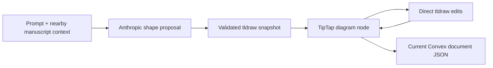

# Author (Autograph)

> Research status: **Source-level** · Lifecycle: **active** · Last reviewed: **2026-08-12**

Author defines a visual not as a neighboring canvas, but as a live node inside a long-form document. The useful unit of analysis is therefore the manuscript: prose owns an embedded tldraw snapshot, and both AI generation and later hand editing must survive through the document lifecycle.

## The document owns the diagram

At commit [`6c3fb657`](https://github.com/withAutograph/author/tree/6c3fb657f856909ac5b0786af3f835061db02e99), [`TldrawDiagramExtension.tsx`](https://github.com/withAutograph/author/blob/6c3fb657f856909ac5b0786af3f835061db02e99/components/extensions/TldrawDiagramExtension.tsx) defines an atomic TipTap node whose attributes carry a serialized tldraw snapshot. Inserting a diagram first creates a placeholder, calls the generation route, then replaces the node attributes with the returned scene. There is no separate diagram record whose identity must be reconciled with the document.

[`generate-diagram/route.ts`](https://github.com/withAutograph/author/blob/6c3fb657f856909ac5b0786af3f835061db02e99/app/api/generate-diagram/route.ts) sends the request and a bounded slice of document context to Anthropic, asks for a strict shape description, validates the returned geometry, and converts it into a tldraw snapshot. The model proposes a small vocabulary of geo, arrow and text shapes; application code establishes the actual scene contract.

## Direct manipulation rejoins the same authority

[`TldrawCanvas.tsx`](https://github.com/withAutograph/author/blob/6c3fb657f856909ac5b0786af3f835061db02e99/components/TldrawCanvas.tsx) mounts a real tldraw editor for the selected node. Shape changes are serialized back into that node after a short debounce. [`useConvexDocument.ts`](https://github.com/withAutograph/author/blob/6c3fb657f856909ac5b0786af3f835061db02e99/components/hooks/useConvexDocument.ts) then saves the containing TipTap JSON to Convex after its own document-level debounce.

This creates a clear ownership rule: the editable visual is part of the writing artifact, not an image pasted after generation. It also means whole-document saves are the concurrency boundary. The source exposes no real editor lock—`hasLock` is effectively fixed true—so simultaneous edits do not gain an object-level merge protocol.

## Snapshot fidelity depends on how the snapshot was made

The [snapshot schema](https://github.com/withAutograph/author/blob/6c3fb657f856909ac5b0786af3f835061db02e99/convex/schema.ts) can retain Markdown and optional TipTap JSON. [`useSnapshots.ts`](https://github.com/withAutograph/author/blob/6c3fb657f856909ac5b0786af3f835061db02e99/components/hooks/useSnapshots.ts) gives manual and post-AI snapshots restorable `contentJson`, while periodic automatic and pre-AI snapshots store Markdown only. Automatic snapshots run every five minutes; the collection is capped and pruning targets old automatic entries.

That distinction is consequential because [`markdown.ts`](https://github.com/withAutograph/author/blob/6c3fb657f856909ac5b0786af3f835061db02e99/lib/markdown.ts) does not serialize the custom tldraw node. Markdown export—and any snapshot that retains only Markdown—can therefore omit the inline visual even while the current Convex document preserves it. “Document history” is not one uniform fidelity tier.

## Access is weaker than the artifact model

The pinned [document mutations](https://github.com/withAutograph/author/blob/6c3fb657f856909ac5b0786af3f835061db02e99/convex/documents.ts) authenticate ownership for listing and creation, but the direct get, update and remove functions do not repeat an ownership check. At this revision, possession of a Convex document ID is consequently an effective access boundary for those operations. This does not change the design mechanism, but it matters when judging the hosted artifact as a durable multi-user product.

Author contributes a document-native definition of AI design: a generated visual remains an editable semantic part of the manuscript. Its unresolved boundary is equally specific—the richest visual state survives only in full TipTap JSON, while several history and export paths flatten through Markdown and lose it.

## Evidence

- [Pinned repository](https://github.com/withAutograph/author/tree/6c3fb657f856909ac5b0786af3f835061db02e99)
- [Inline tldraw node lifecycle](https://github.com/withAutograph/author/blob/6c3fb657f856909ac5b0786af3f835061db02e99/components/extensions/TldrawDiagramExtension.tsx)
- [AI-to-scene boundary](https://github.com/withAutograph/author/blob/6c3fb657f856909ac5b0786af3f835061db02e99/app/api/generate-diagram/route.ts)
- [Snapshot creation and restoration rules](https://github.com/withAutograph/author/blob/6c3fb657f856909ac5b0786af3f835061db02e99/components/hooks/useSnapshots.ts)
