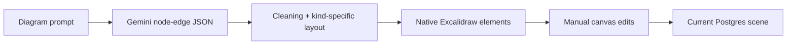

# Flowbase

> Research status: **Source-level** · Lifecycle: **active** · Last reviewed: **2026-08-12**

Flowbase places visual design inside a broader persisted productivity workspace. Its whiteboard path is specific: Gemini proposes a typed diagram graph, deterministic client code turns that graph into native Excalidraw elements, and the resulting scene rejoins ordinary direct editing and autosave.

## The model defines topology, not final Excalidraw geometry

At commit [`4f3389ed`](https://github.com/rrs301/flowbase-productive-ai-app/tree/4f3389ed84c9b3ec7394267d90378079e5db79c6), [`generateWhiteboardDiagram`](https://github.com/rrs301/flowbase-productive-ai-app/blob/4f3389ed84c9b3ec7394267d90378079e5db79c6/app/whiteboard/actions.ts) calls server-side Gemini 2.5 Flash for strict JSON: a title, diagram kind, nodes and edges. Application code bounds labels and details, rejects dangling/self edges, and limits the retained graph to fourteen nodes and twenty edges.

[`whiteboard-workspace.tsx`](https://github.com/rrs301/flowbase-productive-ai-app/blob/4f3389ed84c9b3ec7394267d90378079e5db79c6/app/whiteboard/whiteboard-workspace.tsx) owns geometry. It lays out mind maps radially, architecture diagrams by group and other graphs along an alternating horizontal path, then uses Excalidraw’s converter to materialize rectangles, ellipses, labels and arrows. The generated elements append to the current scene and remain native editable objects.

This is Excalidraw, not tldraw, and the distinction matters: the runtime’s own element converter and scene API are the materialization boundary.

## Whiteboard persistence is current-state persistence

The [whiteboard schema](https://github.com/rrs301/flowbase-productive-ai-app/blob/4f3389ed84c9b3ec7394267d90378079e5db79c6/db/schema.ts) stores one JSON scene and binary-file map per user-owned board. Canvas changes are sanitized and saved after roughly 900 milliseconds by [`updateWhiteboardScene`](https://github.com/rrs301/flowbase-productive-ai-app/blob/4f3389ed84c9b3ec7394267d90378079e5db79c6/app/whiteboard/actions.ts), overwriting the current record. There is no board revision table or durable undo graph.

The product exposes a PNG export derived from the live Excalidraw scene. Its embedded Excalidraw menu deliberately disables the library’s broader save/load and image-export controls, so the verified delivery surface is the app’s own PNG action rather than every capability in the dependency.

## The AI Assistant is a separate confirmation-gated control plane

[`ai-assistant/actions.ts`](https://github.com/rrs301/flowbase-productive-ai-app/blob/4f3389ed84c9b3ec7394267d90378079e5db79c6/app/ai-assistant/actions.ts) gives Gemini a bounded snapshot of board names, note previews, calendar records, generated apps and settings. It can propose typed actions, and [`ai-assistant-workspace.tsx`](https://github.com/rrs301/flowbase-productive-ai-app/blob/4f3389ed84c9b3ec7394267d90378079e5db79c6/app/ai-assistant/ai-assistant-workspace.tsx) requires an explicit Confirm click before execution.

That control plane should not be conflated with the in-canvas diagram modal:

- it can create a blank whiteboard, create or replace note content, create planning objects, change settings and generate a persisted template app;
- its `generate_whiteboard_diagram` action returns a diagram idea and a link, but does not choose a board or insert shapes into one;
- only the modal inside the whiteboard converts returned diagram JSON into the active scene.

The separation is a useful product boundary: confirmation governs workspace mutations, while direct visual insertion happens in the context of an already selected board.

## Collaboration is not universal across the workspace

Flowbase includes Liveblocks infrastructure for shared Kanban behavior, but the verified whiteboard stores a single user-owned Postgres scene and does not mount a Liveblocks room. It should not be described as a collaborative Excalidraw artifact merely because another workspace mode has realtime collaboration.

Flowbase contributes a composite definition of AI-native design: visual generation, direct manipulation and current-state persistence coexist with a broader assistant that can coordinate other durable work objects. The source also shows the limit of that composition—these are explicit adjacent authorities, not one model silently mutating every surface.

## Evidence

- [Pinned repository](https://github.com/rrs301/flowbase-productive-ai-app/tree/4f3389ed84c9b3ec7394267d90378079e5db79c6)
- [Gemini diagram schema and persistence actions](https://github.com/rrs301/flowbase-productive-ai-app/blob/4f3389ed84c9b3ec7394267d90378079e5db79c6/app/whiteboard/actions.ts)
- [Deterministic layout, native insertion and autosave](https://github.com/rrs301/flowbase-productive-ai-app/blob/4f3389ed84c9b3ec7394267d90378079e5db79c6/app/whiteboard/whiteboard-workspace.tsx)
- [Confirmation-gated workspace assistant](https://github.com/rrs301/flowbase-productive-ai-app/blob/4f3389ed84c9b3ec7394267d90378079e5db79c6/app/ai-assistant/actions.ts)
