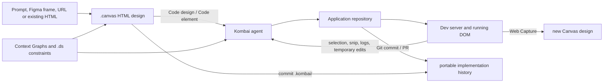

# Kombai

> Research status: **Architecture-level / closed-source boundary reached** · Last reviewed: **2026-08-11**

| Field | Value |
|---|---|
| Organization / team | Kombai, Inc. |
| Category | Design engineering agent spanning native HTML design, repository implementation and browser verification |
| Status | Active; Open VSX version 2.0.81 published 2026-08-08 |
| Current surfaces | Desktop app, VS Code-compatible IDE extension, Design Mode, Kombai Browser and browser extension |
| Durable design formats | project-local `.kombai/canvas/*.canvas` and file-based `.ds` Design Systems |
| Source availability | Proprietary product and extension; immutable public distribution exposes declarative manifests and schemas, not licensed implementation source |
| Evidence ceiling | Product behavior, file authorities, declarative runtime edges and observable formats are established; generation, graph, browser-to-source and save algorithms remain closed |

## The system to understand

Kombai is not one canvas that happens to emit code. It coordinates three mutable surfaces with different authorities:

1. a **design surface** whose saved unit is a `.canvas` file containing HTML designs;
2. an **implementation surface** made from the application's real repository files;
3. a **runtime surface** made from the current DOM, screenshots, logs, requests and performance state in Kombai Browser.

The official [Design overview](https://docs.kombai.com/design/overview) says designs are created as HTML code, can be edited in an infinite Canvas, and can later be passed to the agent for implementation in the chosen repository stack. The [Browser guide](https://kombai.com/guide/how-to-use-kombai-browser-to-refine-and-debug-frontends/) establishes the opposite direction: a user can target and temporarily manipulate the running page, but the change becomes source only after it is sent to the agent. The [Context Graph documentation](https://docs.kombai.com/context/context-graphs) adds repository-specific reusable-component knowledge around that loop.

These paths improve continuity, but they do not create one bidirectionally synchronized document. The dossier is therefore organized around authority transfers, not a generic feature inventory.

The important asymmetry is visible in the arrows: design-to-code is an agent-led implementation, browser-to-code is an evidence-assisted agent repair, and Web Capture creates another design artifact. None is publicly documented as a lossless reverse synchronization protocol.

## Ordinary-user loop crosses all three authorities

An ordinary frontend journey is longer than “generate and accept.” Each stage changes a different ledger and needs its own acceptance evidence.

| Stage | Ordinary action | Authority changed | What must be checked |
|---|---|---|---|
| 1. Open context | Open an existing repository or start a project; let Kombai inspect the stack and available reusable UI | repository context plus graph/index configuration | intended root, framework, component sources and exclusions are correct before generation |
| 2. Establish design constraints | Select or create a `.ds` Design System, attach references, or use a Figma frame | design-generation context | tokens, typography, components and visual references are the intended revision; one-way inputs are not mistaken for synchronized sources |
| 3. Generate directions | Enter Design Mode and request screens or elements | new designs inside the current `.canvas` | compare variants and responsive/theme versions; generation completion is not implementation |
| 4. Refine the design | Edit text, CSS, HTML, attributes, layout or SVG layers; comment or ask AI to alter dynamic regions | `.canvas` node HTML and metadata | save the Canvas, reload it and confirm the intended design remains |
| 5. Choose the handoff | Use **Code design** or **Code element**, review a Plan when needed and approve implementation | agent task, plan and then repository files | the agent reused the intended components/tokens and changed the expected files rather than merely reproducing pixels |
| 6. Run the application | start or attach the dev server and open Kombai Browser | runtime process, DOM and browser observations | main page loads, console/network state is understood and the ordinary journey works with real application state |
| 7. Point at a failure | select or snip DOM, stage copy/CSS/layout changes, or let the autonomous agent inspect the page | ephemeral browser evidence and proposed live mutations | distinguish preview-only DOM state from a durable source edit |
| 8. Send and reconcile | send the browser context to the agent, inspect the source diff and wait for HMR | repository source followed by a new runtime projection | source contains the intended change, HMR reflects it, repeated/shared instances have the intended scope and tests still pass |
| 9. Preserve and deliver | commit source and relevant `.kombai` artifacts, review the PR and deploy through the application's normal path | Git and independent deployment state | exact commit and production revision are known; local Canvas, repository, hosted thread and production are not assumed to roll back together |

The acceptance boundary is therefore two-part: a correct design must survive as a saved Canvas artifact, and a correct application change must survive as reviewed source plus a freshly exercised runtime. A good-looking temporary DOM satisfies neither by itself.

## `.canvas` is an HTML-bearing Git artifact

The official [Canvas documentation](https://docs.kombai.com/design/canvas) places Canvas files under `.kombai/canvas/*.canvas`. The [collaboration guide](https://docs.kombai.com/design/collaboration) recommends committing `.kombai/` so Canvas files can travel through branches and pull requests. Individual designs live inside a Canvas; users can share the whole file or copy selected designs into another Canvas.

### What the public surface establishes

- generation normally produces three variants and performs three refinement passes, although model-specific behavior can differ;
- a **variant** is an alternate style, structure, interaction or responsiveness direction, while a **version** adapts a direction for properties such as viewport or theme;
- a design can be regenerated from its original prompt;
- right-click export supports HTML or PNG, and HTML can also be imported as a design;
- comments live on Canvas designs and can be read by the agent;
- the direct [Canvas Editor](https://docs.kombai.com/design/editor) exposes an HTML-tag layer tree and can edit text, CSS, attributes, layout, order and SVG-based drawing;
- editor CSS changes are inline overrides rather than class or stylesheet rewrites;
- dynamic JavaScript-driven layers are locked in direct editing and must be changed through **Edit with AI**;
- editor Save/Discard/Undo/Redo apply to the design artifact. **Code design** and **Code element** start a separate repository implementation path.

### Public files show the shape, not a stable schema

Kombai does not publish a normative `.canvas` schema. Two immutable third-party files provide bounded observations of artifacts produced by the product:

| Artifact observation | Fields visible at that commit | Consequence |
|---|---|---|
| [`revamp_20260721_135723.canvas`](https://github.com/K-Tanish/symptom-assist/blob/bed8e0f3600241bc4a8e124e35030a0b4dba1663/.kombai/canvas/revamp_20260721_135723.canvas), blob `ec2ef3e7b8a37641ec76fbe6b68a046f2b20aa59` | root `created`, `modified`, `canvas`, `nodes`, `comments`, `nextCommentNumber`; three `variant` nodes with `label`, `parentId`, `themeId`, `rect`, embedded `html`, comments, timestamps and ids | a Canvas can carry several spatially arranged full-HTML directions in one Git file |
| [`persons-cards.canvas`](https://github.com/Melvynx/benchmarks/blob/2db605c94220ef0884223bc08074104cfe76b9c9/benchmarks/thumbfast/base-repo/.kombai/canvas/persons-cards.canvas), blob `983f9225169827ab5f5e154f26a82eb69c3289fd` | additionally contains `themes`; its node records `generation.prompt` and `generation.config`; embedded HTML calls a localhost asset-crawl endpoint with canvas path and node id | optional fields and local runtime hooks exist in real artifacts, but one sample must not be promoted into a compatibility contract |

The packaged extension registers `.canvas` as JSONC, and both observed files are JSON-shaped. Neither observation exposes a public format version or migration contract. Large designs embed large HTML/CSS strings, so Git records them exactly but does not guarantee semantic merges. That merge-risk statement is an inference from the public artifacts, not a claim about an undisclosed conflict resolver.

## `.ds` is a portable constraint file with its own clock

The official [Design System overview](https://docs.kombai.com/design/design-system/overview) defines `.ds` as Markdown with YAML frontmatter: structured tokens live in the frontmatter and explanatory guidance lives in the body. A public third-party example, [`Revolut.ds`](https://github.com/rajlaxmic15-bit/A-T/blob/78014d9dd9eef90450a3f36984edded2d0c0ac5d/.kombai/design-systems/Revolut.ds) at blob `34be56b0e0a8b5f18a985e10b8223bec860a30a9`, contains name/version/description plus color, typography, radius, spacing, component, shadow, motion and icon declarations followed by prose.

Its lifecycle differs from a Canvas:

- [Create a Design System](https://docs.kombai.com/design/design-system/create) can derive one from a URL, images or written requirements;
- [Manage Design Systems](https://docs.kombai.com/design/design-system/manage) supports file-based editing, duplication, renaming and deletion;
- applying a Design System to an existing design regenerates that design while attempting to preserve layout and content—it is not documented as a live token binding;
- docs describe a user-wide `~/.kombai/design-systems/` location and automatic discovery of project `.ds` files, while the create flow also describes saving a `.ds` in the project. The exact default placement is therefore documentation-dependent and should be verified in the current client;
- sharing a Canvas file does not by itself prove that the recipient received the exact `.ds` revision that conditioned it.

Design, Design System and implementation can therefore drift independently. A reproducible handoff records the Canvas commit, the `.ds` file/revision and the repository commit rather than naming only the visual result.

## Context Graphs improve reuse without becoming the artifact

Kombai's most distinctive repository mechanism is not ordinary vector retrieval. The [Context Graph documentation](https://docs.kombai.com/context/context-graphs) describes two phases:

1. discovery subagents inspect project patterns, configuration and exports to identify reusable items across the repository, local packages, npm packages, Git sources and Storybook;
2. parallel semantic-analysis subagents describe purpose, appearance, behavior, props, dependencies and UI/type categories.

The advertised result spans components, hooks/composables/modules, state, utilities, tokens, assets/icons, types, services/API clients and specialized domains such as GraphQL, i18n, forms, charts and Lottie. Package analysis includes manifests, subpaths, source correlation, TypeScript aliases, monorepos, re-exports and cycles. Users can attach a specific indexed item, while the agent can automatically consult all configured graphs. `.kombai/rules/ContextRules.md` can guide indexing.

The decisive boundary is staleness. The docs require a rebuild to reflect current source; no public contract establishes incremental invalidation or a graph revision tied atomically to a repository commit.

### `stack.json` stores index declarations, not the disclosed graph

The immutable 2.0.81 distribution contains a schema for `.kombai/stack.json`. Its `component_indexes` array can describe:

- a local index with `type`, `path`, `name` and optional excluded folders;
- an external index with Git URL/branch, external folder path, selected/total packages and monorepo metadata.

Public files such as [this pinned `.kombai/stack.json`](https://github.com/rusiaaman/chat.md/blob/0562a4d94dbff3005d1caf85d71902b8bbbf623d/.kombai/stack.json) use `component_indexes`. The current docs' configuration example uses `context_graphs`. The packaged schema and observed files therefore disagree with that documentation label. Whether the client migrates or aliases both names is not public and must not be guessed.

Nothing in the public schema exposes the semantic graph's node/edge representation, storage location, embeddings or models, source-span provenance, cache key, update transaction or team-sharing protocol. `stack.json` is established as discovery/index metadata, not as a portable dump of the graph itself.

## Browser return is DOM → evidence → agent → source

Kombai Browser is a dedicated Chrome-based surface connected to the agent. The official [getting-started guide](https://docs.kombai.com/browser/get-started), [capability catalog](https://docs.kombai.com/browser/capabilities) and [autonomous operations](https://docs.kombai.com/browser/autonomous-agent-operations) distinguish manual targeting from agent-driven inspection.

### Manual lane

- element selection captures the chosen element and a page screenshot;
- Snip carries selected DOM elements plus screenshots;
- a browser message automatically includes the DOM tree, console logs, network errors and Web Vitals;
- Layers exposes the current DOM tree and selections can come from multiple tabs;
- text, CSS, movement and deletion edits change the live page as a preview;
- **Add to Chat** stages context, while **Send to agent** asks the coding agent to implement it;
- Web Capture turns a live section or page into a new Canvas design, not into a synchronized mirror of the originating source.

The product guide explicitly says visual DOM changes do not persist by themselves. The durable result is the later source edit, followed by a new render.

### Autonomous lane

The agent can navigate, manage tabs, click, type, scroll, screenshot, select, inspect DOM/computed style, make temporary edits and examine console, network, performance, accessibility and SEO signals. For React, Kombai claims it can map an element to the nearest React component and read component name, props, state and source-file location. It also advertises framework detection, CSS-token inspection and waiting for HMR from Vite, Webpack, Next.js/Turbopack, Remix, Parcel and esbuild after source changes.

Those are product-level capabilities, not a published mapping protocol. Public material does not disclose:

- the selected-element packet or selector/ancestry fields;
- whether source location includes an exact range, source map or repository revision;
- how shared components and repeated instances are scoped;
- how stale DOM evidence is rejected after HMR;
- which React internals are used or what equivalent coverage exists outside React;
- which edits are deterministic rewrites versus model-mediated patches;
- an acceptance receipt that binds the browser observation, source diff, test and Git commit.

### The shipped bridge is broad but declarative

The 2.0.81 VSIX packages a Manifest V3 browser extension whose declarative manifest requests `activeTab`, `tabs`, `scripting`, `sidePanel`, `storage` and clipboard permissions, injects a content script on `<all_urls>` at `document_start`, exposes `page-api.js`, and allows all URL hosts. This proves a broad page-injection/inspection surface. It does not reveal the packet format or writeback algorithm, and it makes repository/browser data handling an operational security boundary rather than a detail. Kombai's [Privacy Policy](https://kombai.com/privacy/) says Service Use Information can include uploaded/created content and that enabling third-party services such as Figma permits information exchange under granted permissions.

The dedicated browser uses a separate profile. Cookie import/synchronization is currently documented as macOS-only, so authenticated Windows/Linux verification may need a separate login and cannot assume the user's normal browser session.

## Figma is a one-way reconstruction input

The official [Figma-to-code guide](https://docs.kombai.com/features/figma-to-code) requires a link to a specific frame carrying `node-id`; a project or page URL is insufficient. The normal path uses Figma OAuth and REST access. The vendor describes handling messy groups, invisible layers and designs without Auto Layout while reusing repository components through the agent.

The operational boundary is explicit:

- after Figma API policy changes on 2025-11-17, rate limits can block extraction;
- the documented fallback is a high-resolution PNG attached as visual context;
- Figma Make and Figma Sites URLs are not accepted directly; content must first be copied into Figma Design;
- no public contract writes changes back to Figma or retains a Figma-node-to-repository-file binding.

Figma is therefore design evidence for a new implementation, not a second live source of truth. The PNG fallback weakens structural provenance further while preserving visual guidance.

## Control artifacts surround the default coding agent

The current [Modes documentation](https://docs.kombai.com/features/modes) shows four specialized mode pills around an unlabelled default autonomous coding agent:

| Control surface | Intended authority | Durable or observable artifact |
|---|---|---|
| Design | generate and refine HTML designs | `.canvas` |
| Plan | ask questions and separate Design Plan, Technical Implementation and To-dos before approval | editable `plan.md`; approval starts implementation |
| Ask | inspect and explain without mutation | conversation answer; documented read-only behavior |
| Debug | plan, execute, track, verify and clean up a repair | temporary instrumentation plus a debug changelog under `.kombai`; temporary changes should be removed |
| default agent | autonomously inspect, edit, run and verify repository work | application files, tool observations and thread history |

This corrects an older five-mode description that counted Code as a named pill. Current documentation treats coding as the default agent state.

Kombai also layers repository and user policy around those modes:

- `.kombai/rules/` and global `~/.kombai/rules/`, plus project/global `AGENTS.md`;
- `.kombai/commands/*.md` for slash commands;
- `.kombai/skills/<skill>/SKILL.md` using the Agent Skills layout, with descriptions discovered before the full matching file is loaded;
- `.kombai/mcp.json` for stdio, SSE or Streamable HTTP servers.

The shipped `mcp.schema.json` introduces another documentation drift: its declarative schema detects stdio through `command`, treats `type` as optional and uses `auth.scope`, while the docs describe required stdio `type` and an auth `scopes` field. This is configuration evidence only; the runtime's compatibility behavior remains unknown.

The [thread compaction guide](https://docs.kombai.com/context/thread-compaction) says long threads are summarized near the context limit and around cache/model/thinking changes, while project/user rules remain available. Editing or restoring earlier messages resets previous compaction. A summary preserves conversational continuity; it does not restore repository, Canvas, browser or Design System state.

## Persistence is a Git-centered federation, not one version graph

| Ledger | Working authority | Version/recovery path | Gap that remains |
|---|---|---|---|
| application source | files in the chosen repository | Git branch, commit, PR and ordinary backups | agent checkpoint/thread restore is not documented as a repository transaction |
| Canvas | `.kombai/canvas/*.canvas` with embedded design HTML and comments | Save/Undo/Redo in editor; commit the file to Git; copy/share the Canvas | no published format version, semantic merge or atomic link to implemented source |
| Design System | user-wide or project `.ds` Markdown/YAML | copy, edit and commit project files; duplicate before destructive changes | independently revised; application to a design regenerates rather than maintains a live binding |
| Context configuration | `.kombai/stack.json` plus `ContextRules.md` | commit project configuration and rebuild graphs | graph body, provenance, cache and commit pin are undisclosed |
| agent policy/tools | rules, commands, Skills, `AGENTS.md` and `mcp.json` | repository or user-home files, with different sharing scope | user-global and project state can diverge; schema/docs can drift |
| task control | `plan.md`, To-dos and debug changelog | edit/review files and thread state | approval/log completion does not prove a source or runtime result |
| conversation | hosted/local thread history, checkpoints and compaction summaries | restore/continue in the client | storage/export schema and exact rewind coverage are closed |
| browser evidence | current profile, tabs, DOM, screenshots, logs, network and temporary edits | recapture after source/HMR changes | ephemeral and session-specific; temporary edits are not durable |

Kombai's [Terms](https://kombai.com/terms/) say the customer owns Customer Data and may delete or export it through available features or by contacting Kombai, while also requiring customers to maintain appropriate backup. The [Privacy Policy](https://kombai.com/privacy/) describes retention while needed for service, legal and business purposes and says backups may delay deletion. These policies establish ownership and service-level retention boundaries; they do not enumerate which Canvas, graph, thread or browser records appear in an export.

No public operation restores all eight ledgers to one moment. Git is the strongest portable convergence point for repository-local source, `.canvas`, project `.ds` and `.kombai` configuration, but it does not include the reconstructed semantic graph, user-home files, hosted thread, browser profile or deployed runtime.

## Public distribution boundary at 2.0.81

The [Open VSX latest API](https://open-vsx.org/api/kombai/kombai/latest) returned version **2.0.81**, timestamp `2026-08-08T09:31:26.700467Z`, on 2026-08-11. The docs' IDE-install page still named 2.0.78, so the marketplace API and [changelog](https://kombai.com/changelog/) are used as current distribution evidence.

The universal 2.0.81 VSIX was downloaded from its [immutable version endpoint](https://open-vsx.org/api/kombai/kombai/2.0.81/file/kombai.kombai-2.0.81.vsix):

| Observation | Result |
|---|---|
| byte size | `27,158,986` |
| SHA-256 | `0c8ff68913c5d8bba1db366b85396d4823c1a1995866a939e69817eea6b859f8` |
| archive entries | 564 |
| source maps | none found |
| bundled `.canvas` / `.ds` examples or a `.canvas` schema | none found |
| declared host | VS Code engine `^1.84.1`, main `extension.js`, dependency on `vscode.git` |
| custom editors | `kombai.canvasEditor` for `*.canvas`; `kombai.designSystemEditor` for `*.ds` |
| packaged project schemas | `.kombai/stack.json` and `.kombai/mcp.json` |

The public [package manifest](https://open-vsx.org/api/kombai/kombai/2.0.81/file/package.json) also declares commands for Canvas source, browser opening, Design Mode, the Design Server, history, diff acceptance/rejection and browser logs. A packaged static Design Mode entry embeds a cross-origin `http://localhost:{port}` UI for VS Code/Electron/browser hosts, consistent with the changelog's later consolidation around one local Design Server/backend socket/MCP server across open projects.

The distribution's [license](https://open-vsx.org/api/kombai/kombai/2.0.81/file/LICENSE.txt) is proprietary, all rights reserved, and prohibits reverse engineering. Accordingly, this research inspected only archive inventory, declarative manifests/schemas and static entry metadata. It did not decompile or analyze bundled implementation code. The absence of source maps and public product source means this dossier cannot provide source/commit-level proof of generation, graph construction, DOM mapping, source reconciliation, persistence or collaboration internals.

Kombai's public GitHub organization contains examples and benchmarks, not the proprietary core. Those repositories are not used as implementation substitutes.

## Evolution explains the present architecture

The official [changelog](https://kombai.com/changelog/) exposes a useful progression:

| Release | Publicly recorded change | Architectural consequence |
|---|---|---|
| 1.4.177–1.4.185, Sep 2025 | editable plans/rules, then agent writes code directly into repositories | repository source becomes the implementation center |
| 1.4.205–1.4.215, Oct–Nov 2025 | Browser beta adds DOM/console context; Plan Mode and autonomous browser follow | runtime evidence becomes an agent input rather than a separate manual tool |
| 1.4.248–1.4.264, Jan 2026 | user and agent browser merge; thread compaction; visual CSS edits can be sent to agent | browser interaction and conversational continuity join the repair loop |
| 1.4.299–1.4.308, Mar–Apr 2026 | Context Graphs, Agent Skills, MCP, Storybook graphs and parallel chats | reusable-code knowledge and external tools become explicit subsystems |
| 1.4.315–2.0.0, Apr–May 2026 | Design Mode alpha, Web Capture and then Design Mode leaves beta | native HTML design becomes a first-class artifact before implementation |
| 2.0.12–2.0.60, Jun–Jul 2026 | Canvas comments become agent-readable; design infrastructure consolidates into a shared server/socket/MCP process | comment context and local service coordination span projects |
| 2.0.64–2.0.81, Jul–Aug 2026 | Desktop app, substantial Canvas Editor work and follow-up reliability fixes | the same design/code/browser model expands beyond one IDE extension host |

This sequence supports the three-authority reading: Kombai first established repository writes, then added the runtime return path, then semantic repository indexing, and finally a native HTML design file and desktop host.

## Failure and recovery map

| Failure boundary | User-visible symptom | Safest recovery / verification |
|---|---|---|
| `.kombai` ignored or path resolution fails | Canvases disappear from the client | 2.0.78 specifically fixed `.kombai`-gitignore disappearance and Windows path resolution; verify the directory is present, intentionally tracked or excluded, and visible after restart |
| Design Server startup retries | repeated processes, unavailable Canvas or stuck connection | current changelog records process/retry fixes; restart through the declared command, inspect logs and confirm one responsive local design service rather than trusting a spinner |
| Canvas fails to load | blank or hanging design surface | 2.0.80 added explicit error reporting for blank/hung canvases; preserve the file, inspect the error and test a copy before editing serialized content manually |
| direct editor meets dynamic JavaScript | layer is locked/read-only | route through Edit with AI; then inspect saved HTML and any repository implementation separately |
| inline editor changes diverge from component styles | one Canvas node looks right but classes/source do not | remember Canvas CSS is an inline design override; regenerate/implement deliberately and inspect application tokens/components |
| Context Graph is stale or misses a reusable component | agent duplicates UI or ignores recent code | refine `ContextRules.md`, confirm index paths/exclusions and rebuild; review actual imports rather than accepting semantic claims |
| Figma rate limit or unsupported URL | extraction fails or lacks node structure | provide a specific frame URL with `node-id`; use the documented high-resolution PNG fallback only with the explicit loss of structural provenance |
| browser live edit looks correct but vanishes | reload/HMR removes the change | Send to agent, review source diff, wait for HMR and repeat the journey; do not treat temporary DOM as a save |
| HMR or DOM evidence is stale | browser still shows an older tree or wrong instance | refresh after source write, recapture selection/logs and verify shared-component scope across all instances |
| Git merge touches embedded HTML strings | syntactically valid file may represent a visually wrong merge | review Canvas in the editor after merge; no public semantic merge protocol is established |
| Canvas shared without its constraints | recipient sees a design but cannot reproduce its generation | share/commit the exact `.ds`, project rules and relevant assets alongside the Canvas |
| thread checkpoint or compaction is treated as rollback | chat appears restored while files/design/runtime differ | inspect Git, `.canvas`, `.ds`, server and browser clocks separately; no suite-wide rewind is documented |

## Evidence boundary

**Established facts** come from current Kombai product/docs/changelog, the immutable Open VSX 2.0.81 distribution's declarative files, and pinned public user artifacts. They establish the ordinary loop, the three authorities, the file-based Canvas and Design System, Context Graph inputs, browser observations, product-level React/source-location claim, modes/configuration, public failures and release evolution.

**Inferences** are labelled as such: embedded HTML makes semantic Git conflict review important; separate ledgers can drift; the three surfaces form a federated rather than atomic version model.

**Not established:** model prompts and routing, HTML generation representation, Canvas migration/schema, Context Graph storage and algorithms, browser selection packet, React mapping technique, deterministic rewrite coverage, revision/conflict guards, thread/checkpoint schema, multiplayer merge semantics, full customer-data export, or a transaction joining design, source, runtime and deployment.

Because the core is proprietary and the license restricts reverse engineering, 2.0.81 plus its SHA is distribution-level evidence, not source-level implementation evidence. No public commit can be cited for the core algorithms.

## Research gaps

- Is there a versioned and supported `.canvas` schema, migration tool or conflict resolver outside the public docs?
- What exact relation links a Canvas node, its HTML, **Code design** output and later repository component—if any?
- Where are Context Graph nodes stored, how are they tied to a source revision, and what is shared with Kombai services?
- Which of `context_graphs` and `component_indexes` is canonical in current project configuration, and how does migration behave?
- What exact DOM/React/source packet crosses the browser bridge, including file range, framework, source map and repository revision?
- Which visual changes use deterministic source transformations, which use model generation, and how are stale-base conflicts handled?
- What does a thread checkpoint restore beyond conversation state, and which user data appears in export/delete flows?
- How do concurrent collaborators and Git merges reconcile node HTML, comments, themes and externally changed Canvas files?
- What acceptance artifact, if any, binds source diff, HMR observation, browser test and Git commit?

## Primary sources

### Official product, docs and policy

- [Kombai product](https://kombai.com/)
- [Design](https://kombai.com/features/design/) and [Code](https://kombai.com/features/code/) product surfaces
- [Quickstart](https://docs.kombai.com/get-started/quickstart)
- [Design overview](https://docs.kombai.com/design/overview), [Canvas](https://docs.kombai.com/design/canvas), [Canvas Editor](https://docs.kombai.com/design/editor) and [collaboration](https://docs.kombai.com/design/collaboration)
- [Design System overview](https://docs.kombai.com/design/design-system/overview), [creation](https://docs.kombai.com/design/design-system/create) and [management](https://docs.kombai.com/design/design-system/manage)
- [Context Graphs](https://docs.kombai.com/context/context-graphs) and [thread compaction](https://docs.kombai.com/context/thread-compaction)
- [Browser getting started](https://docs.kombai.com/browser/get-started), [capabilities](https://docs.kombai.com/browser/capabilities), [autonomous operations](https://docs.kombai.com/browser/autonomous-agent-operations) and [frontend refinement guide](https://kombai.com/guide/how-to-use-kombai-browser-to-refine-and-debug-frontends/)
- [Figma to code](https://docs.kombai.com/features/figma-to-code), [Modes](https://docs.kombai.com/features/modes) and [Rules](https://docs.kombai.com/features/rules)
- [Changelog](https://kombai.com/changelog/)
- [Terms of Service](https://kombai.com/terms/) and [Privacy Policy](https://kombai.com/privacy/), both last modified 2026-01-06 at this snapshot

### Immutable distribution evidence

- [Open VSX latest-version API](https://open-vsx.org/api/kombai/kombai/latest)
- [Kombai 2.0.81 package manifest](https://open-vsx.org/api/kombai/kombai/2.0.81/file/package.json)
- [Kombai 2.0.81 proprietary license](https://open-vsx.org/api/kombai/kombai/2.0.81/file/LICENSE.txt)
- [Kombai 2.0.81 universal VSIX](https://open-vsx.org/api/kombai/kombai/2.0.81/file/kombai.kombai-2.0.81.vsix), SHA-256 `0c8ff68913c5d8bba1db366b85396d4823c1a1995866a939e69817eea6b859f8`

### Pinned public artifact observations

- [Three-variant Canvas artifact](https://github.com/K-Tanish/symptom-assist/blob/bed8e0f3600241bc4a8e124e35030a0b4dba1663/.kombai/canvas/revamp_20260721_135723.canvas)
- [Small Canvas artifact with generation metadata and local asset hook](https://github.com/Melvynx/benchmarks/blob/2db605c94220ef0884223bc08074104cfe76b9c9/benchmarks/thumbfast/base-repo/.kombai/canvas/persons-cards.canvas)
- [Markdown/YAML `.ds` artifact](https://github.com/rajlaxmic15-bit/A-T/blob/78014d9dd9eef90450a3f36984edded2d0c0ac5d/.kombai/design-systems/Revolut.ds)
- [`component_indexes` stack configuration artifact](https://github.com/rusiaaman/chat.md/blob/0562a4d94dbff3005d1caf85d71902b8bbbf623d/.kombai/stack.json)
