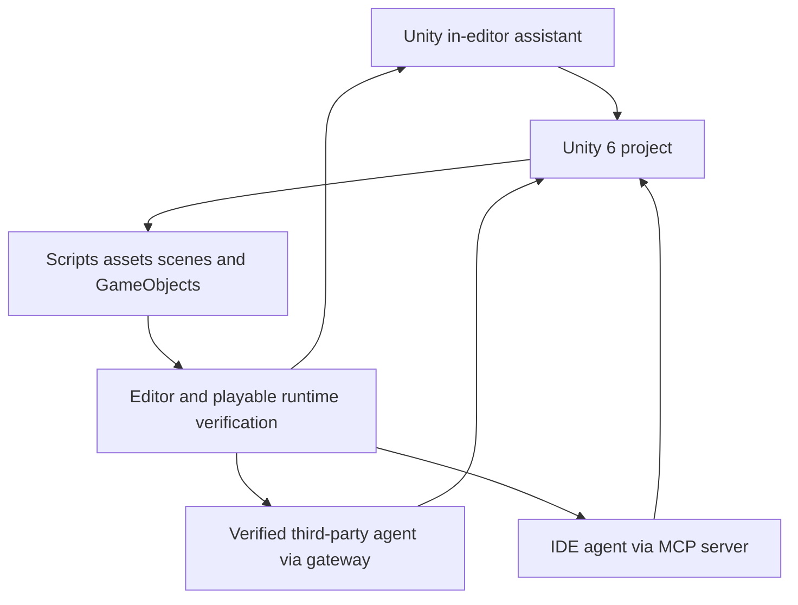

# Unity AI tools

> Research status: **Architecture-level** · Last reviewed: **2026-08-12**

| Field | Value |
|---|---|
| Team | Unity · operating-team region audit pending |
| Former umbrella name | Unity AI is being retired while the tools remain beta |
| Ordinary job | inspect and change a Unity game through a native assistant or approved external agent |
| Authority | linked Unity 6 project and its real scene or source state |
| Lifecycle | active transition |

## Three control surfaces meet in the Editor

Unity now describes an in-editor project-aware assistant an AI gateway for third-party tools and an MCP server for IDE or application clients. The assistant can inspect scenes GameObjects and components drive Editor actions and verify resulting behavior. The same product family can turn visual references into project-ready assets and playable scenes.

The gateway can use an external subscription while the MCP server does not require AI credits. All routes still require the package and Unity 6 or newer; the linked Cloud project supplies service identity but does not replace local project authority.

## Evidence boundary

Official pages explicitly state the “Unity AI” brand retirement so the candidate is normalized to Unity AI tools. The beta implementation is closed and public docs do not establish complete write coverage transaction boundaries or deterministic rollback for every Editor operation.

## Primary evidence

- [Unity current AI tools and naming transition](https://unity.com/features/ai)
- [Unity assistant documentation](https://docs.unity3d.com/Packages/com.unity.ai.assistant@latest)
- [Unity MCP server documentation](https://docs.unity3d.com/Packages/com.unity.ai.mcp@latest)
