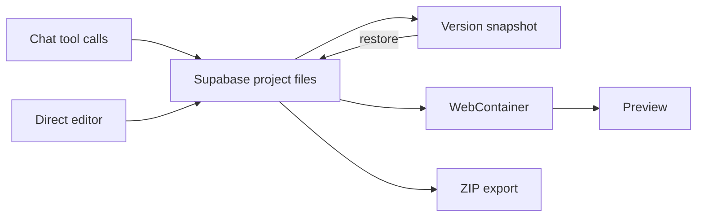

# AI App Builder by Abdul Baqui

> Research status: **Source-level** · Lifecycle: **active** · Last reviewed: **2026-08-13**

This project is a Supabase-backed file workspace with a complete recovery loop. Users create a project, let the model write files, inspect or directly edit them, run the project in a WebContainer, save versions, restore a selected snapshot and export the source.

## Normalized files are canonical

Pinned revision: `0875628aca92719a1ec5cdce3097e39dd599d0f6`.

The database schema separates projects, files, messages and versions. A version captures a project file state; the restore route resolves the chosen version and writes its snapshot back into the current project. Monaco and the agent both operate against the same file-oriented model, while the WebContainer is rebuilt as a runtime projection.

## Recovery semantics

Restore changes the current file set; it is not merely a read-only old preview. Messages remain a separate ledger, so restoring files does not imply rewinding conversation or external data. Export creates another copy and does not remain synchronized with the Supabase project.

## Evidence ceiling

The source establishes route and schema semantics. It does not prove transactional recovery across a running WebContainer, chat history and any external deployment, so those boundaries remain explicit.

## Pinned evidence

- [Repository](https://github.com/abdulbaqui17/Ai-app-builder)
- [Supabase project/file/version schema](https://github.com/abdulbaqui17/Ai-app-builder/blob/0875628aca92719a1ec5cdce3097e39dd599d0f6/supabase/schema.sql)
- [Version restore route](https://github.com/abdulbaqui17/Ai-app-builder/blob/0875628aca92719a1ec5cdce3097e39dd599d0f6/src/app/api/projects/%5Bid%5D/versions/%5BversionId%5D/restore/route.ts)
- [WebContainer hook](https://github.com/abdulbaqui17/Ai-app-builder/blob/0875628aca92719a1ec5cdce3097e39dd599d0f6/src/hooks/useWebContainer.ts)
- [Project export](https://github.com/abdulbaqui17/Ai-app-builder/blob/0875628aca92719a1ec5cdce3097e39dd599d0f6/src/lib/export-project.ts)
