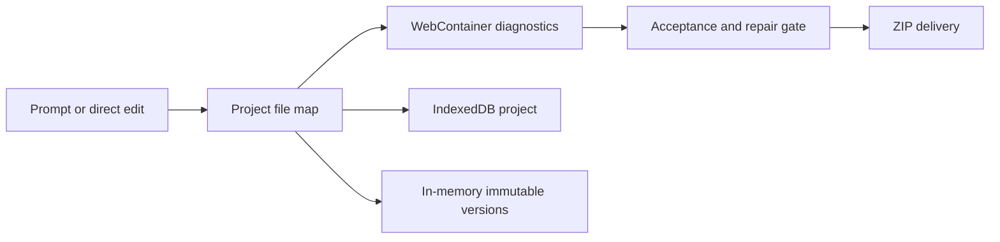

# AI App Builder by Shoaib Ahmed

> Research status: **Source-level** · Lifecycle: **active** · Last reviewed: **2026-08-13**

This AI App Builder is a local-first React workspace whose most distinctive work is not prompt generation but the machinery between a model response and an acceptable deliverable: project mapping, diagnostics, escalating repair, runtime smoke checks and export gates.

## Two persistence lifetimes coexist

Pinned revision: `e0aab8abdd7766d6da872ac4e2c84a653d2ebef6`.

Projects and chat are stored in IndexedDB; large file maps are written incrementally. The backend `VersionManager`, however, keeps immutable snapshots in process memory with fifty versions per project and LRU project eviction. Undo and targeted revert create a new child snapshot, but server restart can erase that history while the browser project survives. The dossier therefore does not call its version history durable.

## Repair is a staged delivery decision

Generated files pass acceptance checks and runtime smoke evaluation. Failures can move through deterministic fixes, AI repair and per-file rollback before approval. Monaco edits and WebContainer execution operate on the same path-to-content map that export packages.

## Pinned evidence

- [Repository](https://github.com/edge555/ai-builder-app)
- [IndexedDB project store](https://github.com/edge555/ai-builder-app/blob/e0aab8abdd7766d6da872ac4e2c84a653d2ebef6/frontend/src/services/storage/project-store.ts)
- [Bounded version manager](https://github.com/edge555/ai-builder-app/blob/e0aab8abdd7766d6da872ac4e2c84a653d2ebef6/backend/lib/core/version-manager.ts)
- [Delivery gate](https://github.com/edge555/ai-builder-app/blob/e0aab8abdd7766d6da872ac4e2c84a653d2ebef6/backend/lib/core/project-delivery-gate.ts)
- [WebContainer projection](https://github.com/edge555/ai-builder-app/blob/e0aab8abdd7766d6da872ac4e2c84a653d2ebef6/frontend/src/components/PreviewPanel/WebContainerPreview.tsx)
- [Export service](https://github.com/edge555/ai-builder-app/blob/e0aab8abdd7766d6da872ac4e2c84a653d2ebef6/backend/lib/core/export-service.ts)
