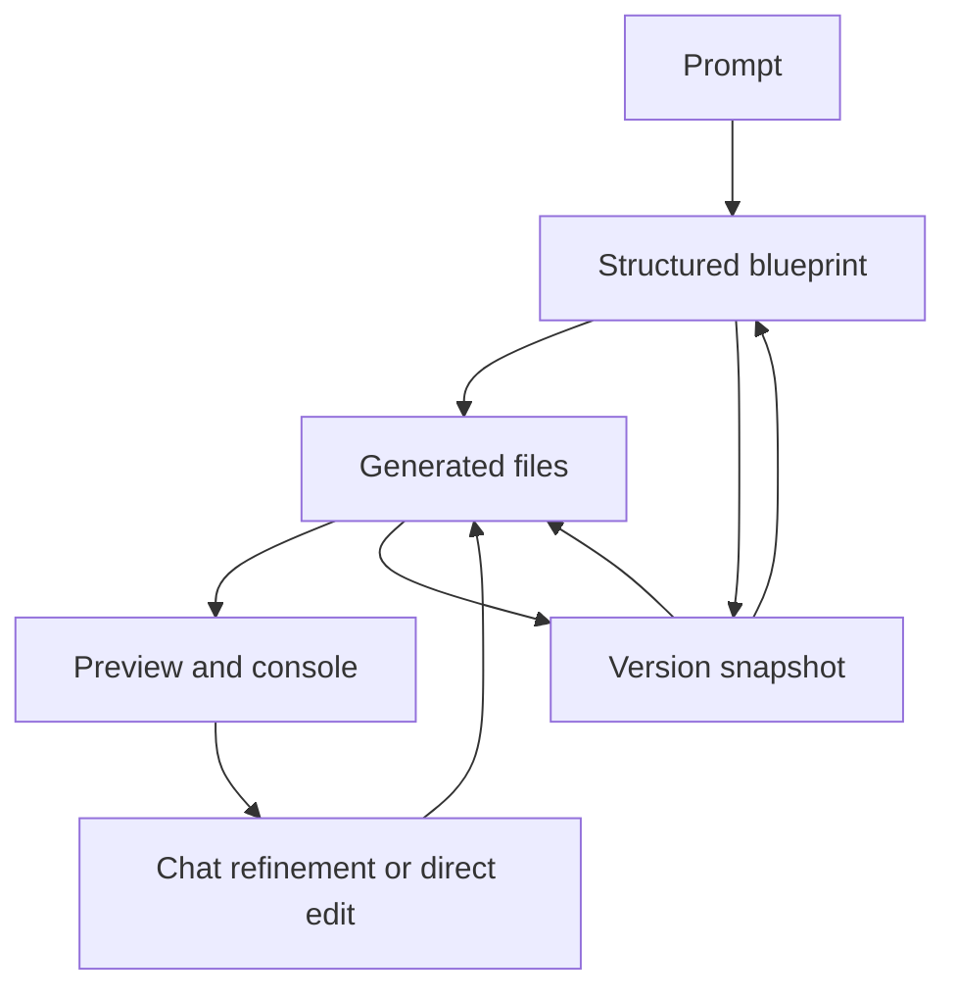

# ForgeAI by Mousewarriors

> Research status: **Source-level** · Lifecycle: **active** · Last reviewed: **2026-08-13**

ForgeAI is a local-first app builder whose product model is unusually explicit. It moves from prompt to structured blueprint, then to files, preview, conversational refinement and bounded version restore, all stored in the user's browser.

## Blueprint and files travel together

Pinned revision: `1196dd6fb6c37be2593d7a1796318b4f000b7051`.

The Zustand store persists projects, ordering, blueprint, files, chat messages, console lines, integration settings and up to 25 versions in `localStorage`. A snapshot deep-copies both blueprint and files. Restore writes both back and resets the project name from the restored blueprint. This is stronger recovery semantics than a log entry or prompt-only history.

## The runtime is evidence, not authority

Preview consumes the current files and reports console output; source changes remain in the store. Export and deployment surfaces take copies of the selected project state. Because persistence is browser-local, another device or cleared storage has no server project to recover.

## Pinned evidence

- [Repository](https://github.com/Mousewarriors/ForgeAI)
- [Local project and version store](https://github.com/Mousewarriors/ForgeAI/blob/1196dd6fb6c37be2593d7a1796318b4f000b7051/lib/storage/store.ts)
- [AI service](https://github.com/Mousewarriors/ForgeAI/blob/1196dd6fb6c37be2593d7a1796318b4f000b7051/lib/ai/service.ts)
- [Preview panel](https://github.com/Mousewarriors/ForgeAI/blob/1196dd6fb6c37be2593d7a1796318b4f000b7051/components/workspace/PreviewPanel.tsx)
