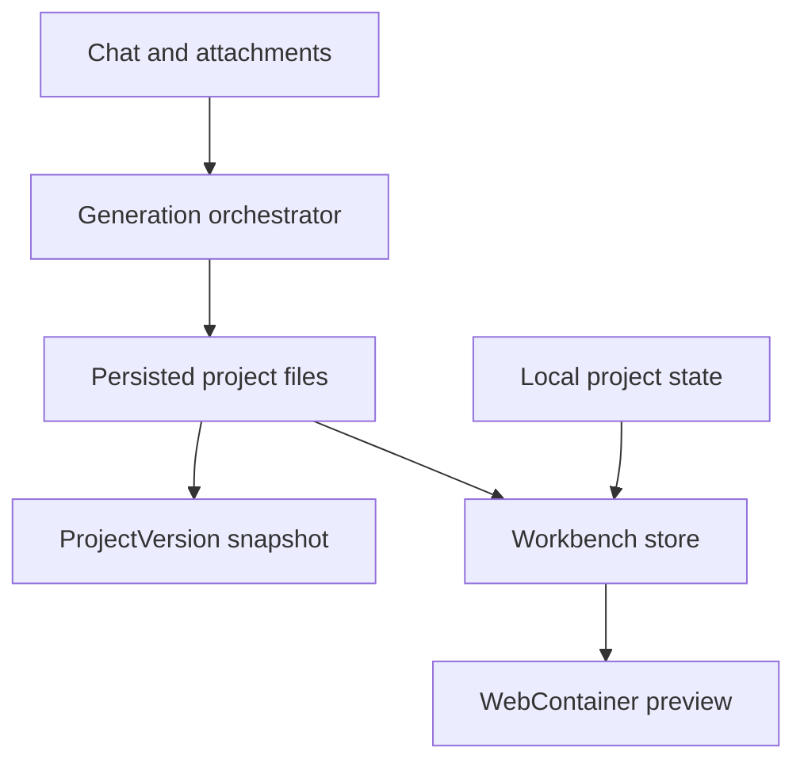

# Quibly

> Research status: **Source-level** · Lifecycle: **active** · Last reviewed: **2026-08-13**

Quibly begins with the open Bolt workbench grammar but adds a durable product model large enough to count as a material derivative. A user can reopen projects, continue chat-driven source changes, inspect code and preview, and recover named versions rather than relying only on replaying a browser chat.

## Derivation and independent authority

Pinned revision: `bd5f877988f41b2ff7734299ae54c38a55af1f42`.

The frontend still contains Bolt-style workbench stores and WebContainer preview behavior. The backend, however, introduces project services, a `ProjectVersion` model, generation orchestration, attachments, credit accounting and deployment-oriented surfaces. Quibly's authority is the persisted project plus its file/version snapshot, not the inherited chat component alone.

## Two persistence paths require reconciliation

The frontend also contains local project-state persistence. Local state can make the editor recover quickly, while backend project/version records govern account-level continuity. The source does not prove that these ledgers commit atomically. A robust recovery test must therefore reopen the server project and compare its files with the last visible local workbench state.

## Counting decision

Shared ancestry is recorded, but the versioned backend and account project lifecycle materially change artifact authority. That is why Quibly is not counted as another Bolt duplicate.

## Pinned evidence

- [Repository](https://github.com/Rohit173-sv/Loveable-style-website)
- [Backend schema](https://github.com/Rohit173-sv/Loveable-style-website/blob/bd5f877988f41b2ff7734299ae54c38a55af1f42/backend/prisma/schema.prisma)
- [Project version model](https://github.com/Rohit173-sv/Loveable-style-website/blob/bd5f877988f41b2ff7734299ae54c38a55af1f42/backend/src/models/ProjectVersion.js)
- [Frontend persistence adapter](https://github.com/Rohit173-sv/Loveable-style-website/blob/bd5f877988f41b2ff7734299ae54c38a55af1f42/frontend/app/lib/persistence/projectState.ts)
