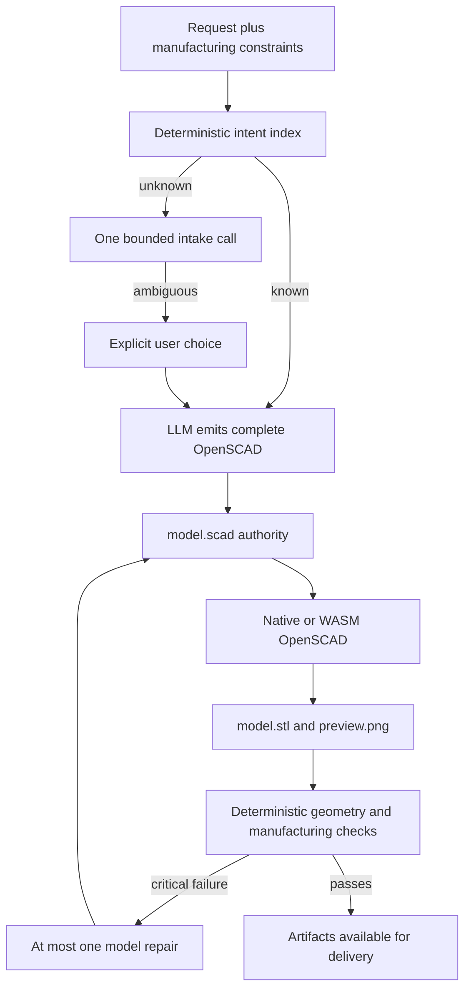

# AgentSCAD

> Research status: **Source-level** · Last reviewed: **2026-08-12**

| Field | Verified value |
|---|---|
| Maintainer | Kevoyuan / AgentSCAD contributors |
| Product | local-first parametric CAD job workspace with an optional hosted deployment |
| Canonical editable artifact | `model.scad` |
| Materialized evidence | `model.stl`, `preview.png` and validation report |
| Local persistence | SQLite jobs plus filesystem artifacts and `.agentscad/providers.json` |
| License | MIT |
| Pinned source | [`bfece663d40a1aba7ee9ddd1e101c0de2847b52a`](https://github.com/Kevoyuan/AgentSCAD/tree/bfece663d40a1aba7ee9ddd1e101c0de2847b52a) |

This project is distinct from **AgentsCAD**, an unrelated paper-only candidate already excluded by the census. AgentSCAD ships an inspectable application whose authority and failure states can be traced through source.

## OpenSCAD remains geometry authority

The model interprets a request and writes OpenSCAD. Native OpenSCAD or a checksum-pinned official WASM CLI then compiles that source into real mesh and preview artifacts. Top-level SCAD assignments are extracted as editable parameters, so ordinary correction can change dimensions and re-render without asking a model to regenerate the whole part.

## Validation narrows claims rather than certifying the design

`execute-cad-job.ts` deliberately skips visual validation in the normal pipeline. Deterministic rules inspect measurable mesh and manufacturing facts. A critical failure can trigger one repair and re-render; remaining blockers move the job to human review. Optional vision review happens only when the user requests it and has a capable provider.

The state `DELIVERED` means that required artifacts exist and critical deterministic checks did not block them. It does not prove semantic agreement with the request, fitness for manufacture or user acceptance. The application README makes this distinction explicit and the dossier preserves it.

## Persistence differs by deployment

Local mode keeps jobs in SQLite and SCAD/STL/PNG under the local artifact root. Provider settings are local machine files. A Vercel deployment can use Postgres and Blob storage; provider credentials are encrypted into a browser-session cookie rather than written to the database. The hosted route is therefore not simply “the same local files in the cloud.”

Jobs retain generation state, source, validation output and versions. Filesystem and database records jointly constitute a recoverable project; an STL without its SCAD source is only a delivery artifact and cannot preserve parametric intent.

## Source evidence map

| Pinned path | Decisive mechanism |
|---|---|
| [`src/lib/pipeline/execute-cad-job.ts`](https://github.com/Kevoyuan/AgentSCAD/blob/bfece663d40a1aba7ee9ddd1e101c0de2847b52a/src/lib/pipeline/execute-cad-job.ts) | bounded intake, generation, real render, validation, one repair and terminal states |
| [`src/lib/tools/scad-renderer.ts`](https://github.com/Kevoyuan/AgentSCAD/blob/bfece663d40a1aba7ee9ddd1e101c0de2847b52a/src/lib/tools/scad-renderer.ts) | native/WASM OpenSCAD invocation |
| [`src/lib/tools/artifact-store.ts`](https://github.com/Kevoyuan/AgentSCAD/blob/bfece663d40a1aba7ee9ddd1e101c0de2847b52a/src/lib/tools/artifact-store.ts) | fixed SCAD/STL/PNG artifact identities and storage backends |
| [`src/lib/validation/`](https://github.com/Kevoyuan/AgentSCAD/tree/bfece663d40a1aba7ee9ddd1e101c0de2847b52a/src/lib/validation) | deterministic checks and readiness construction |
| [`src/lib/repair/`](https://github.com/Kevoyuan/AgentSCAD/tree/bfece663d40a1aba7ee9ddd1e101c0de2847b52a/src/lib/repair) | validation-fed repair path |
| [`prisma/schema.prisma`](https://github.com/Kevoyuan/AgentSCAD/blob/bfece663d40a1aba7ee9ddd1e101c0de2847b52a/prisma/schema.prisma) | job and version persistence |

## Primary evidence

- [Pinned repository](https://github.com/Kevoyuan/AgentSCAD/tree/bfece663d40a1aba7ee9ddd1e101c0de2847b52a)
- [Pinned architecture document](https://github.com/Kevoyuan/AgentSCAD/blob/bfece663d40a1aba7ee9ddd1e101c0de2847b52a/docs/ARCHITECTURE.md)
- [Pinned benchmark boundaries](https://github.com/Kevoyuan/AgentSCAD/blob/bfece663d40a1aba7ee9ddd1e101c0de2847b52a/docs/BENCHMARK.md)
- [MIT license](https://github.com/Kevoyuan/AgentSCAD/blob/bfece663d40a1aba7ee9ddd1e101c0de2847b52a/LICENSE)
