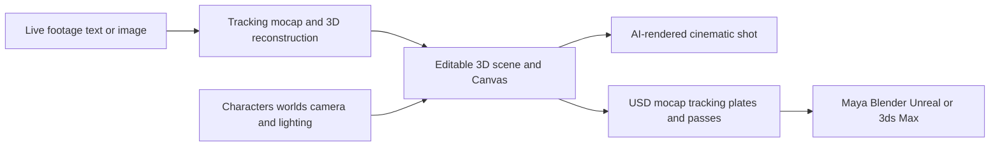

# Autodesk Flow Studio

> Research status: **Architecture-level** · Last reviewed: **2026-08-12**

| Field | Value |
|---|---|
| Team | Autodesk · operating-team region audit pending |
| Former name | Wonder Studio |
| Ordinary job | reconstruct and direct editable CG structure from footage text or images then continue in production DCC tools |
| Authority | Flow Studio 3D Editor and Canvas until structured export |
| Lifecycle | active transition |

## AI output remains a scene rather than only a video

Flow Studio combines generated 3D characters worlds animation camera direction and AI renders in a unified editor. It can create textured characters from text or images auto-rig them derive markerless body face and hand motion and reconstruct camera tracking from live-action footage. Users retain editable camera paths clean plates alpha masks character passes lighting and composition.

The rendered shot is only one projection. Structured exports allow production authority to transfer into Maya Blender Unreal or 3ds Max through USD and supporting data. Public evidence does not establish a round trip from those downstream edits back into Flow Studio.

Autodesk explicitly documents the Wonder Studio rename which keeps one product lineage. The new 3D Editor and Canvas justify active-transition status because the current product boundary is expanding while its earlier reconstruction workflow continues.

## Primary evidence

- [Autodesk Flow Studio current product](https://www.autodesk.com/products/flow-studio/overview)
- [Flow Studio feature inventory and structured exports](https://www.autodesk.com/products/flow-studio/features)
