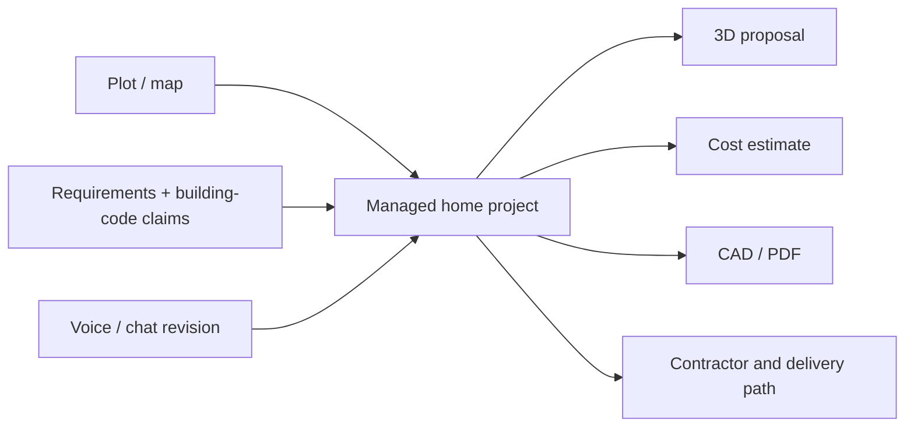

# Bunyan

> Research status: **Architecture-level** · Last reviewed: **2026-08-11**

| Field | Value |
|---|---|
| Team | Bunyan · Riyadh, Saudi Arabia |
| Ordinary job | turn a plot and household requirements into a revisable home project, estimate it and prepare handoff toward a contractor |
| Managed authority | provider-hosted saved home project |
| Lifecycle | active-transition / beta |

## A regional home-delivery project, not only a render prompt

Bunyan presents a Saudi-oriented loop: choose land, describe requirements in Arabic, receive a proposed home, revise it through voice or chat, inspect it in 3D and continue toward cost, CAD/PDF and contractor handoff. The live surface includes account and project states and says a started design saves automatically. These continuing states are the evidence for inclusion; an isolated promotional render would not be enough.

## Constraint claims are bounded by observable authority

The product describes Saudi building-code awareness and municipal collaboration. Public evidence does not reveal a geometric constraint model, code-check result graph, licensed drawing workflow or verified government integration. The census therefore treats the hosted project as primary architecture and constraint-driven engineering as the product definition, without upgrading it to proven parametric authority.

Similarly, CAD/PDF export and contractor connection indicate a delivery intention. They do not establish that an automatically generated plan is permit-ready, structurally engineered or contractually complete. Those claims remain acceptance boundaries for a beta product.

## Persistence and correction

Automatic saved-project language establishes resumability. Conversational revision appears to update the same project and 3D result, but public pages do not document named versions, diffing, rollback, export format detail or how cost estimates respond to each change. The dossier does not infer those mechanics.

## Primary evidence

- [Bunyan product and beta application](https://bunyan.one/)
- [Bunyan project entry surface](https://bunyan.one/#projects)
