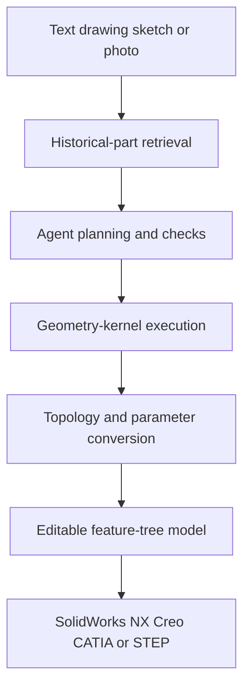

# CadCursor

> Research status: **Architecture-level** · Last reviewed: **2026-08-12**

| Field | Value |
|---|---|
| Team | CadCursor · team region not established |
| Availability | live public beta plus enterprise deployment |
| Ordinary job | reconstruct or generate feature-tree parts under an organization's historical design rules |
| Authority | parameterized CAD model and enterprise part knowledge inside CadCursor until export |
| Lifecycle | active transition |

## Historical parts become a design constraint

CadCursor accepts text engineering drawings sketches photos and existing enterprise parts. Its published architecture separates interaction from agent planning and retrieval geometry-kernel execution topology checking and a model layer. Generated results preserve a feature tree parameters and modeling history for later engineering changes.

Enterprise libraries are parsed into private conventions so later generation can reuse established modeling methods and standards. Deployment can be cloud SaaS or an on-premises stack connected to CAD PLM SSO and audit systems.

The consumer maker community is described as coming soon and is not counted as another current product. The beta application warns that data may be deleted after the test period so persistence is provisional. Team geography is not inferred from Chinese language or domestic partners.

## Primary evidence

- [CadCursor product and four-layer architecture](https://cadcursor.com/)
- [CadCursor live beta application](https://user.cadcursor.com/)
