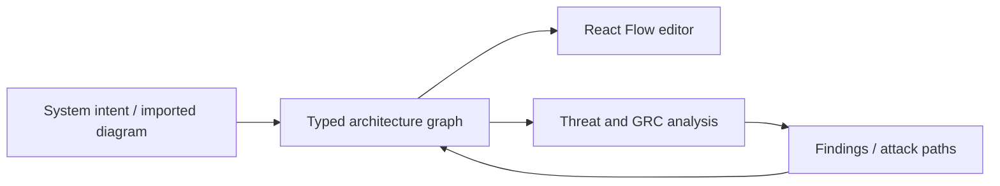

# ContextCypher

> Research status: **Source-level** · Lifecycle: **active** · Last reviewed: **2026-08-12**

ContextCypher defines architecture design as a security model that must remain drawable. The artifact is not the AI report: it is a structured system graph enriched with zones, trust boundaries, assets, data flows and framework findings. AI can propose the graph or analyze it, while direct editing and deterministic mappings remain available offline.

## One graph drives drawing and threat analysis

At commit [`9cd7564b`](https://github.com/Threat-Vector-Security/contextcypher/tree/9cd7564b24f16c495f922c763167b9c701054175) [`DiagramGenerationService`](https://github.com/Threat-Vector-Security/contextcypher/blob/9cd7564b24f16c495f922c763167b9c701054175/src/services/DiagramGenerationService.ts) converts provider output into typed diagram data. [`diagramMergeUtils`](https://github.com/Threat-Vector-Security/contextcypher/blob/9cd7564b24f16c495f922c763167b9c701054175/src/utils/diagramMergeUtils.ts) is the important correction boundary: generated or imported nodes can be merged with an existing design rather than replacing it blindly.

The repository includes deterministic validation and parsers for Draw.io, Mermaid, PlantUML, DOT and its own JSON. Local Ollama is a first-class provider, so offline mode does not mean a fake response. Autosave and recent-file services keep the model recoverable; export and 3D views are projections.

## What AI may and may not own

AI owns semantic suggestions: components, relationships and security hypotheses. It does not own MITRE or NIST meaning, canvas geometry after a human changes it, or the final risk decision. That separation is why ContextCypher is counted under constraint-driven engineering rather than generic diagram generation.

Threat Vector Security's first-party GitHub profile locates the team in Australia.

## Decisive evidence

- [Pinned product contract](https://github.com/Threat-Vector-Security/contextcypher/blob/9cd7564b24f16c495f922c763167b9c701054175/README.md)
- [Diagram import boundary](https://github.com/Threat-Vector-Security/contextcypher/blob/9cd7564b24f16c495f922c763167b9c701054175/src/services/DiagramImportService.ts)
- [Server-side diagram validation](https://github.com/Threat-Vector-Security/contextcypher/blob/9cd7564b24f16c495f922c763167b9c701054175/server/utils/diagramValidator.js)
