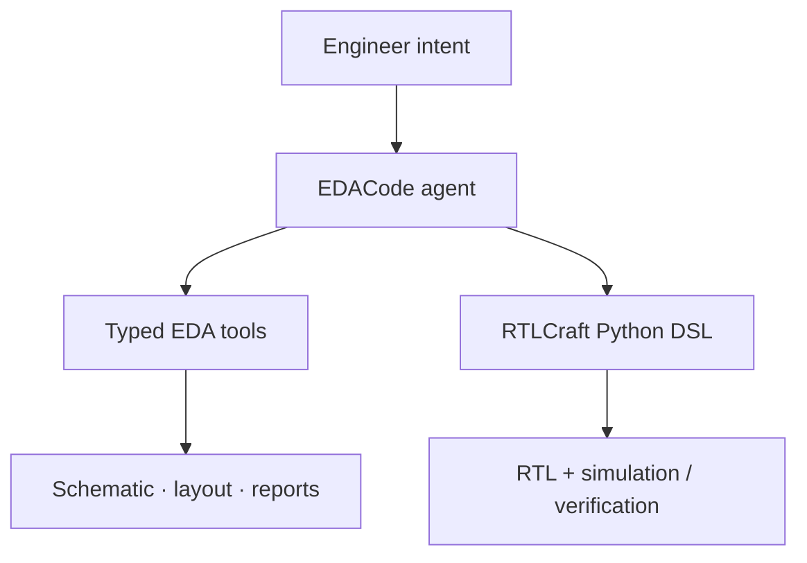

# EDACraft

> Research status: **Source-level** · Lifecycle: **active** · Last reviewed: **2026-08-12**

EDACraft is best read as a workshop of related EDA mechanisms rather than one monolithic assistant. The monorepo joins a white-box RTL DSL and verification path with an agent that can use schematic layout simulation and sign-off tools.

## Two kinds of authority coexist

At commit [`052242d`](https://github.com/ephonic/EDACraft/tree/052242d0d263288f523c7ad8937e022cb19f591b) RTLCraft makes Python structures executable and materializes RTL; EDACode supplies provider adapters context management and domain tools. The [agent core](https://github.com/ephonic/EDACraft/blob/052242d0d263288f523c7ad8937e022cb19f591b/EDACode/src/eda_agent/core/agent.py) can call OpenAI or Anthropic through explicit provider classes while [EDA tools](https://github.com/ephonic/EDACraft/tree/052242d0d263288f523c7ad8937e022cb19f591b/EDACode/src/eda_agent/tools/eda) expose schematic layout PEX EMIR simulation and planning operations.

The important design claim is white-box closure: generated source and tool results remain inspectable. The repository contains several unevenly mature subprojects so this dossier counts the public EDACraft product family once rather than presenting every directory as an independent team.

Public evidence did not establish the maintainer's region.

## Pinned sources

- [Monorepo map](https://github.com/ephonic/EDACraft/blob/052242d0d263288f523c7ad8937e022cb19f591b/README.md)
- [Anthropic provider](https://github.com/ephonic/EDACraft/blob/052242d0d263288f523c7ad8937e022cb19f591b/EDACode/src/eda_agent/providers/anthropic_provider.py)
- [VS Code bridge](https://github.com/ephonic/EDACraft/blob/052242d0d263288f523c7ad8937e022cb19f591b/EDACode/src/eda_agent/server/vscode_server.py)
