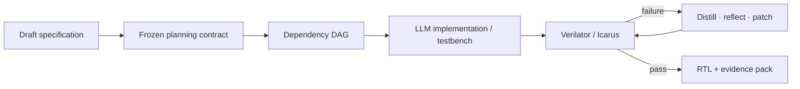

# FPGA Design Agent

> Research status: **Source-level** · Lifecycle: **active** · Last reviewed: **2026-08-12**

FPGA Design Agent puts specification planning ahead of RTL generation. Its primary artifact is a verified Verilog package accompanied by the frozen intent execution DAG testbench and run evidence needed to explain failure or acceptance.

## Planning state gates execution

At commit [`7bdfb75`](https://github.com/jacoboforero/FPGA_Design_Agent/tree/7bdfb752c78048fd0762049b61f2d484b274b316) a specification helper resolves omissions into a structured planning contract. A queue-backed orchestrator then assigns implementation testbench reflection and debug agents while deterministic workers run lint simulation and acceptance checks.

Run-scoped traces costs task memory and artifacts keep concurrent jobs isolated. Benchmark results are useful implementation evidence but remain configuration-dependent and are not treated as a universal leaderboard. Public first-party evidence did not establish the team region.

## Pinned evidence

- [Planning schema](https://github.com/jacoboforero/FPGA_Design_Agent/blob/7bdfb752c78048fd0762049b61f2d484b274b316/core/schemas/planning_spec.py)
- [Specification helper](https://github.com/jacoboforero/FPGA_Design_Agent/tree/7bdfb752c78048fd0762049b61f2d484b274b316/agents/spec_helper)
- [Pinned README](https://github.com/jacoboforero/FPGA_Design_Agent/blob/7bdfb752c78048fd0762049b61f2d484b274b316/README.md)
