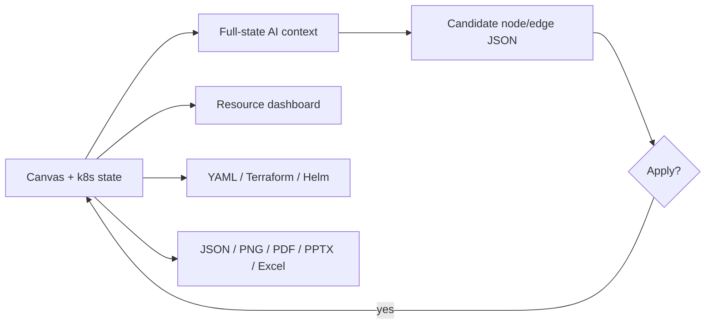

# Loom

> Research status: **Source-level** · Lifecycle: **active** · Last reviewed: **2026-08-12**

Loom is a single-file Kubernetes architecture studio. Its definition of design joins diagram geometry, infrastructure semantics and resource planning in one portable browser document: a node is both a shape and a schedulable system component, and the same model can produce drawings, capacity warnings and IaC exports.

## A diagram model that can answer operational questions

At commit [`88d93cf3`](https://github.com/flyingcatstudio/loom/tree/88d93cf32b60163f84fd37f93c26ba3d6dfe08a5), all implementation lives in [`index.html`](https://github.com/flyingcatstudio/loom/blob/88d93cf32b60163f84fd37f93c26ba3d6dfe08a5/index.html). Its in-memory authority is a JavaScript object containing nodes, edges, layers, nested-infrastructure navigation, viewport state and a Kubernetes configuration. Nodes carry diagram fields and scheduling/resource fields; this is why the same state can drive a canvas, namespace filters, CPU/memory/GPU utilization, completeness checks, Kubernetes YAML, Terraform and Helm values.

Rendering uses an imperative HTML canvas rather than a diagram-language renderer. Manual edits therefore act directly on geometry and semantic properties. Fifty node/edge snapshots supply undo/redo.

## AI returns a candidate complete model

Loom calls Claude, OpenAI, Gemini or Ollama directly from the browser. Its system prompt supplies an explicit node/edge JSON schema, icon vocabulary, layout rules, current state and optional Kubernetes configuration. In append and modify modes the prompt requests a complete diagram while preserving existing geometry.

The response is parsed but not immediately authoritative. It is held in the chat as a candidate with an **Apply** button; only `applyAIDiagram` writes it into `state`. This is a lightweight approval gate, but not a structural transaction engine: validation is limited to parse/shape checks and invalid edge references are skipped during application.

## Portability is the runtime architecture

The single-file constraint is not cosmetic. There is no build step or application backend. Cloud provider keys and model configuration are stored in browser `localStorage`; cloud calls therefore expose keys to the page and provider, while Ollama supplies the air-gapped route.

Persistence is hybrid. The active root state is autosaved locally, while explicitly saved tabs retain complete tab snapshots—including history, layers and viewport—and are restored across sessions. JSON import/export is the portable canonical handoff; URL sharing compresses the diagram into the fragment. Conversation history itself remains in memory.

## What Loom adds to the landscape

Loom is not merely an AI flowchart editor. It defines architecture design as an executable planning surface where visual structure and resource allocation share one artifact. The tradeoff is equally clear: a large untyped single-file implementation gains extreme deployability and inspectability, but lacks schema migrations, multi-user coordination and a server-side security boundary.

## Evidence

- [Pinned product contract and workflow](https://github.com/flyingcatstudio/loom/blob/88d93cf32b60163f84fd37f93c26ba3d6dfe08a5/README.md)
- [Complete implementation: state, AI, persistence and exports](https://github.com/flyingcatstudio/loom/blob/88d93cf32b60163f84fd37f93c26ba3d6dfe08a5/index.html)
