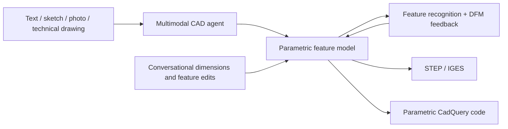

# MANTIS CAD

> Research status: **Architecture-level** · Last reviewed: **2026-08-11**

| Field | Value |
|---|---|
| Team | MANTIS Software Inc. · attributable region not established |
| Ordinary job | describe or upload a part, refine dimensions/features conversationally, inspect DFM feedback and export manufacturing-oriented CAD |
| Canonical engineering claim | editable parametric model whose design intent survives conversational changes |
| Delivery | STEP, IGES and parametric CadQuery code |
| Lifecycle | Windows early access; product says ordinary work runs offline |

## The correction unit is a feature or parameter

MANTIS describes an agent-first CAD loop: a prompt, sketch, photo or technical drawing becomes parametric geometry; follow-up requests such as adding an 8 mm fillet or increasing thickness modify the model while preserving design intent. That is materially different from regenerating a mesh after each sentence.

Feature recognition identifies holes, pockets and thin walls for design-for-manufacturing feedback. The user can then revise the engineering model and export standard CAD or CadQuery source.

## Offline execution narrows the data boundary

The product states that it runs on Windows without a cloud requirement and keeps designs on the machine. Public evidence does not reveal the local file format, database, model packaging or update mechanism. “Offline” therefore supports a deployment boundary, not an inference that project files are plain, open or independently versionable.

CadQuery export is especially valuable evidence because it exposes a parametric downstream representation rather than only tessellated geometry. STEP and IGES preserve exchange geometry but may not carry the same feature history. The ability to continue editing after reimport must be tested per format.

## Why early access is included

The earlier review left MANTIS pending because public identity and project persistence were thin. The current first-party site now exposes a coherent named product, early-access/download path, Windows/offline boundary, parametric conversational correction, DFM step and exact export formats. That is enough for an architecture-level product record while preserving unknown internals.

It is not enough to claim mature availability, atomic feature transactions, assemblies, collaborative PDM, deterministic regeneration or manufacturing validation. Lifecycle remains active-transition.

## Acceptance should target engineering invariants

Tests should edit a dimension referenced by later features, remove geometry on which a fillet depends, repeat the same instruction, close/reopen a project offline, compare STEP and CadQuery exports and deliberately request an unmanufacturable thin wall. A visually plausible viewport is not evidence that constraints regenerate or exports are production-ready.

## Primary evidence

- [MANTIS product and ordinary workflow](https://www.mantiscad.com/)
- [MANTIS feature documentation](https://www.mantiscad.com/features)
- [MANTIS roadmap](https://www.mantiscad.com/roadmap)
