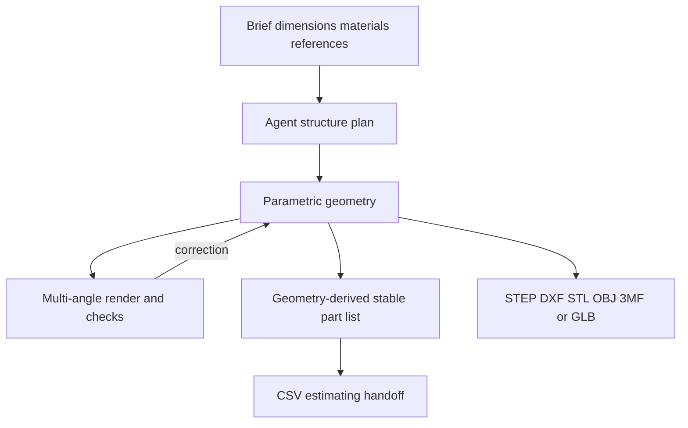

# Prompt2CAD

> Research status: **Architecture-level** · Last reviewed: **2026-08-12**

| Field | Value |
|---|---|
| Team | Prompt2CAD · team region not established |
| Ordinary job | develop furniture fixtures mechanical parts and products as inspectable parametric assemblies |
| Authority | hosted parametric model and stable part inventory |
| Lifecycle | active |

## Geometry and manufacturing data share identifiers

The agent clarifies dimensions materials and constraints then plans parts and builds geometry. Users select a part or change sliders and toggles to refine the same model. The agent renders multiple views reads its geometry code diagnoses visible defects and repeats the build.

Part lists are derived from the model rather than generated as unrelated prose. Stable IDs connect quantities dimensions materials and finishes to physical parts and allow CSV estimating. The site warns that this list still requires verification before fabrication.

Public material does not reveal which CAD language or kernel is authoritative whether identifiers survive every export or how model versions merge. Photoreal materials affect preview and presentation but do not replace geometric authority.

## Primary evidence

- [Prompt2CAD current product and agent loop](https://prompt2cad.com/)
- [Prompt2CAD model capabilities](https://prompt2cad.com/#features)
