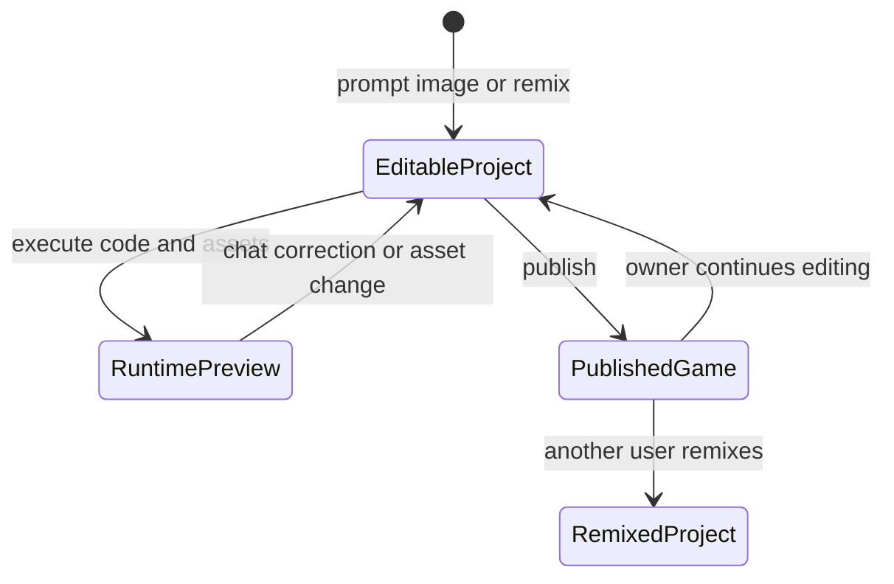

# Rosebud AI

> Research status: **Architecture-level** · Last reviewed: **2026-08-12**

| Field | Value |
|---|---|
| Team | Rosebud AI · team region not established |
| Ordinary job | create and keep changing a playable 2D or 3D experience through chat code assets and live preview |
| Authority | the saved Rosebud game project containing code and assets |
| Runtime delivery | published playable URL; a remix creates a new editable project |
| Lifecycle | active |

## Design is evaluated in the running game

Rosebud begins with a prompt image or template and opens an integrated project editor. The Rosie chat agent changes the game's code while the user manages visual and audio assets beside a real-time preview. A correction is validated by playing the current state rather than comparing only a generated frame.

The public playable link is a runtime projection. Remix copies a community game into a new project rather than proving live synchronization with the original. This makes Rosebud different from UI mockup products: the decisive Design artifact includes behavior game state code and media and is judged in execution.

## Evidence ceiling

Official guides establish the editor loop publishing and remix semantics but do not disclose the project schema runtime sandbox source control asset provenance or merge behavior. The platform implementation itself is closed.

## Primary evidence

- [Rosebud editor interface guide](https://lab.rosebud.ai/blog/rosebud-ai-interface-guide)
- [Prompt-to-playable beginner workflow](https://lab.rosebud.ai/blog/beginner-guide)
- [Rosebud development surface](https://develop.play.rosebud.ai/)
