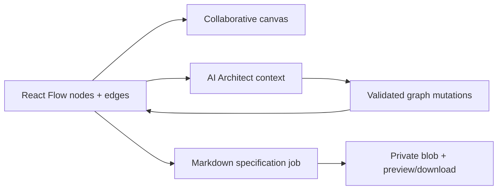

# Syntropy

> Research status: **Source-level** · Last reviewed: **2026-08-12**

Syntropy defines Design as collaborative system architecture: the working object is a typed node/edge topology, and the AI Architect can reason about and mutate that topology before projecting it into a technical specification.

## The graph has three consumers

Human drag/drop and inline label edits update the same graph the agent reads. Liveblocks supplies presence and shared state; the autosave path persists project canvas state. A generated specification consumes the graph plus AI conversation history and becomes a separate versionable delivery artifact rather than replacing the editable topology.

## Mutation is applied as data

Pinned revision [`e03b0da`](https://github.com/PrateetMishraUSC/Syntropy/commit/e03b0da02689c5de869318d4dd99a9eb35233f4b) exposes:

- the [canvas type contract](https://github.com/PrateetMishraUSC/Syntropy/blob/e03b0da02689c5de869318d4dd99a9eb35233f4b/types/canvas.ts);
- the durable [design-agent task](https://github.com/PrateetMishraUSC/Syntropy/blob/e03b0da02689c5de869318d4dd99a9eb35233f4b/trigger/design-agent.ts);
- explicit [canvas mutation application](https://github.com/PrateetMishraUSC/Syntropy/blob/e03b0da02689c5de869318d4dd99a9eb35233f4b/trigger/lib/apply-canvas-mutations.ts) and tool definitions in [`canvas-tools.ts`](https://github.com/PrateetMishraUSC/Syntropy/blob/e03b0da02689c5de869318d4dd99a9eb35233f4b/trigger/lib/canvas-tools.ts);
- [canvas autosave](https://github.com/PrateetMishraUSC/Syntropy/blob/e03b0da02689c5de869318d4dd99a9eb35233f4b/hooks/use-canvas-autosave.ts);
- the independent [specification task](https://github.com/PrateetMishraUSC/Syntropy/blob/e03b0da02689c5de869318d4dd99a9eb35233f4b/trigger/generate-spec.ts).

## Collaboration is part of authority

Project owners can invite collaborators; shared AI chat is visible through the room feed; collaborative undo respects participant changes. The specification is stored privately in Vercel Blob and exposed through preview/download routes, while the graph remains the source for later architecture edits.

## What remains unverified

No license file was present at the pinned revision. The source proves the graph/mutation/specification path, but this review did not provision Clerk, Liveblocks, Trigger.dev and Vercel Blob to run a multi-user session. The maintainer profile gives San Francisco as a public location, supporting a United States label without implying company incorporation.

## Decisive sources

- [Repository README](https://github.com/PrateetMishraUSC/Syntropy/blob/e03b0da02689c5de869318d4dd99a9eb35233f4b/README.md)
- [Canvas API](https://github.com/PrateetMishraUSC/Syntropy/blob/e03b0da02689c5de869318d4dd99a9eb35233f4b/app/api/projects/%5BprojectId%5D/canvas/route.ts)
- [Maintainer profile](https://github.com/PrateetMishraUSC)
