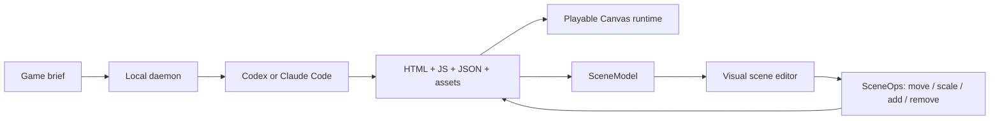

# Agent Game Forge

> Research status: **Source-level** · Lifecycle: **active-transition** · Last reviewed: **2026-08-12**

Agent Game Forge (AGF) extends the landscape beyond websites and static images. A coding agent creates a playable 2D game project; a visual scene editor then changes the same scene data so the user can correct positions, scale, assets and level composition without translating every adjustment back into prose.

## Two authoring paths meet in the project

The default delivery is framework-free JavaScript and Canvas, so the generated folder can be deployed as a normal static site. Image providers generate sprites/backgrounds, but those media files are ingredients inside an executable project and scene graph rather than the terminal artifact.

## Conventions constrain the agent

Each project receives `.ogf/conventions/` and agent skills. The agent is expected to follow the provided sprite and map procedures and use the daemon's image endpoint. This keeps project layout and scene data predictable enough for the visual editor to reopen and mutate.

Pinned commit [`96c8e15`](https://github.com/0x0funky/agent-game-forge/commit/96c8e15e450fc6fa4c96c60d1ddef41b0df43276) exposes:

- the [architecture document](https://github.com/0x0funky/agent-game-forge/blob/96c8e15e450fc6fa4c96c60d1ddef41b0df43276/docs/architecture.md);
- daemon scene loading and mutation in [`web-scene.ts`](https://github.com/0x0funky/agent-game-forge/blob/96c8e15e450fc6fa4c96c60d1ddef41b0df43276/apps/daemon/src/web-scene.ts) and [`scenes.ts`](https://github.com/0x0funky/agent-game-forge/blob/96c8e15e450fc6fa4c96c60d1ddef41b0df43276/apps/daemon/src/scenes.ts);
- the [visual SceneEditor](https://github.com/0x0funky/agent-game-forge/blob/96c8e15e450fc6fa4c96c60d1ddef41b0df43276/apps/web/src/components/SceneEditor.tsx);
- shared API/event/scene contracts under [`packages/contracts`](https://github.com/0x0funky/agent-game-forge/tree/96c8e15e450fc6fa4c96c60d1ddef41b0df43276/packages/contracts);
- SQLite-backed project conversations described in the architecture and implemented by the daemon.

## Maturity boundary

The repository is Apache-2.0 licensed. Web/Canvas output is the shipped path; Godot and Unity remain roadmap targets and are not counted as current capabilities. The product is marked active-transition because its README frames launch and additional engines as still in progress. No reliable team-region evidence was found.

## Decisive sources

- [Repository README](https://github.com/0x0funky/agent-game-forge/blob/96c8e15e450fc6fa4c96c60d1ddef41b0df43276/README.md)
- [Apache-2.0 license](https://github.com/0x0funky/agent-game-forge/blob/96c8e15e450fc6fa4c96c60d1ddef41b0df43276/LICENSE)
