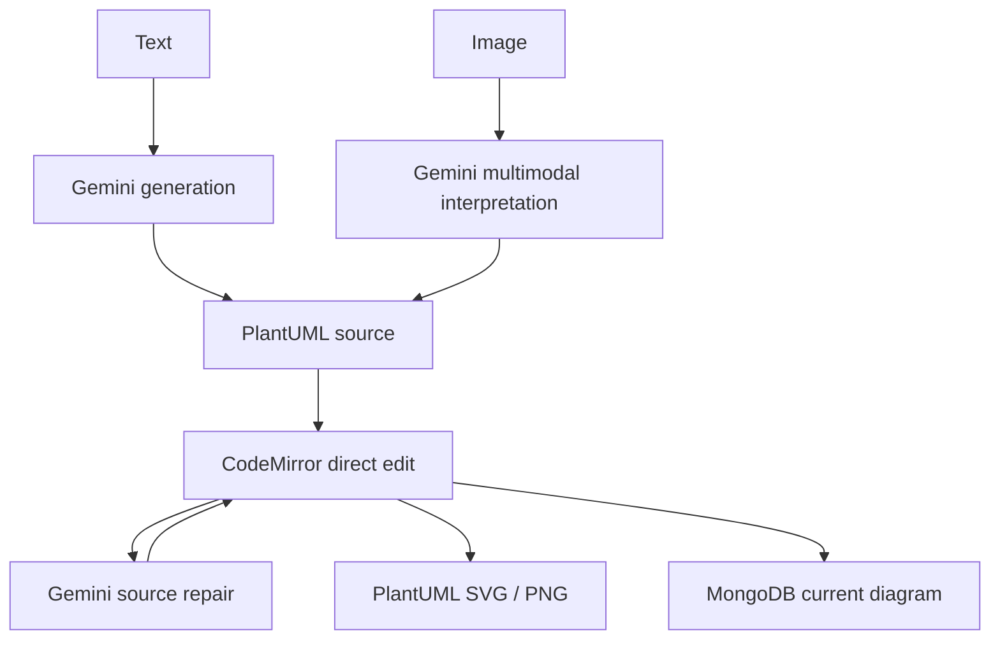

# AI Diagrams

> Research status: **Source-level** · Lifecycle: **active** · Last reviewed: **2026-08-12**

AI Diagrams defines a diagram as editable PlantUML that can originate in either language or pixels. Text generation, image interpretation and AI repair all converge on the same source editor; rendering and persistence remain separate services around that source.

## Three AI entrances, one textual artifact

At commit [`5166b4e9`](https://github.com/kavishannip/Ai-Diagrams/tree/5166b4e973ff7a0da99047cd8602c1cacd8b913d), [`text-to-plantuml`](https://github.com/kavishannip/Ai-Diagrams/blob/5166b4e973ff7a0da99047cd8602c1cacd8b913d/src/app/api/text-to-plantuml/route.js) asks Gemini 2.5 Flash for a diagram-language response and normalizes missing wrappers. [`img-to-plantuml`](https://github.com/kavishannip/Ai-Diagrams/blob/5166b4e973ff7a0da99047cd8602c1cacd8b913d/src/app/api/img-to-plantuml/route.js) sends an uploaded image as multimodal input and extracts a complete PlantUML block. [`plantuml-ai-fix`](https://github.com/kavishannip/Ai-Diagrams/blob/5166b4e973ff7a0da99047cd8602c1cacd8b913d/src/app/api/plantuml-ai-fix/route.js) gives the current source back to Gemini for a rewritten, syntactically repaired version.

All three paths terminate in [`EditDiagram`](https://github.com/kavishannip/Ai-Diagrams/blob/5166b4e973ff7a0da99047cd8602c1cacd8b913d/src/components/EditDiagram.jsx). Its CodeMirror value is the live authority. Manual edits are debounced into an in-memory undo/redo sequence; Update promotes the editor value to the current diagram and triggers a new render. AI repair replaces source rather than patching mapped elements, so review happens at the code level.

## Rendering is a separate trust and privacy boundary

[`plantuml-to-img`](https://github.com/kavishannip/Ai-Diagrams/blob/5166b4e973ff7a0da99047cd8602c1cacd8b913d/src/app/api/plantuml-to-img/route.js) encodes the source into a request to the public `www.plantuml.com` server and proxies the returned SVG or PNG. The browser never has to execute PlantUML locally, but private architecture text leaves the application server. The PWA and offline shell do not make generation or rendering offline: Gemini and the public renderer remain network dependencies.

## Cloud saves preserve state, not history

The Mongoose model in [`diagrams.modal.js`](https://github.com/kavishannip/Ai-Diagrams/blob/5166b4e973ff7a0da99047cd8602c1cacd8b913d/src/app/lib/modals/diagrams.modal.js) stores Clerk ownership, title, current PlantUML code and timestamps. [`diagrams.actions.js`](https://github.com/kavishannip/Ai-Diagrams/blob/5166b4e973ff7a0da99047cd8602c1cacd8b913d/src/app/lib/actions/diagrams.actions.js) creates, reads, updates and deletes the current document. Editor undo is not persisted as revision rows, and the repository itself lists diagram versioning and rollback as future work. “History” here means a live editing buffer, not durable version recovery.

The verified first-party GitHub profile locates the project lineage in Sri Lanka.

## The definition exposed by the implementation

AI Diagrams treats text as the interoperability layer between perception, generation, correction and delivery. An image can seed the source, but it never becomes the authority; a rendered SVG can communicate the result, but it is not the editable artifact. This gives users a portable source model while accepting whole-source regeneration, external rendering and the absence of durable revisions as the current boundaries.

## Evidence

- [Pinned repository contract](https://github.com/kavishannip/Ai-Diagrams/blob/5166b4e973ff7a0da99047cd8602c1cacd8b913d/README.md)
- [Source editor and local history](https://github.com/kavishannip/Ai-Diagrams/blob/5166b4e973ff7a0da99047cd8602c1cacd8b913d/src/components/EditDiagram.jsx)
- [External PlantUML rendering route](https://github.com/kavishannip/Ai-Diagrams/blob/5166b4e973ff7a0da99047cd8602c1cacd8b913d/src/app/api/plantuml-to-img/route.js)
- [Current-state persistence actions](https://github.com/kavishannip/Ai-Diagrams/blob/5166b4e973ff7a0da99047cd8602c1cacd8b913d/src/app/lib/actions/diagrams.actions.js)
