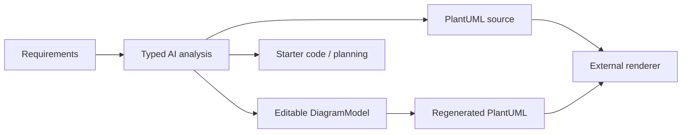

# Diagram AI

> Research status: **Source-level** · Lifecycle: **active** · Last reviewed: **2026-08-12**

Diagram AI, branded NEXUS in parts of the repository, defines diagram design as the front end of a broader software-engineering pipeline. Requirements are analyzed once, then projected into PlantUML, an editable object model, starter code and planning material. Its most revealing technical decision is that no single representation owns the whole lifecycle.

## One analysis produces two diagram authorities

At commit [`3521633b`](https://github.com/Mohamed2004925/Diagram-AI/tree/3521633b7899e532ae84a48e853a022f2843bc12), the [`/generate` route](https://github.com/Mohamed2004925/Diagram-AI/blob/3521633b7899e532ae84a48e853a022f2843bc12/backend/app/routes/diagrams.py) first extracts a typed analysis for class, use-case, ER or sequence diagrams. The same analysis feeds code generation, PlantUML generation and a `DiagramModel` of entities, relationships and coordinates. If a model cannot be built directly, the server parses the generated PlantUML back into one.

That creates a deliberate dual representation:

PlantUML is the portable textual artifact and the stored render input; `DiagramModel` is the direct-manipulation authority while the user is in the visual editor. [`editor.js`](https://github.com/Mohamed2004925/Diagram-AI/blob/3521633b7899e532ae84a48e853a022f2843bc12/editor.js) lets users move and edit entities and relationships, keeps fifty undo states in memory, and hands the current model back to `/render-model` to regenerate PlantUML and PNG. The conversion is best-effort rather than a lossless bidirectional compiler, so the two authorities can express different amounts of detail.

## Retrieval is part of generation, not a separate search feature

[`rag_service.py`](https://github.com/Mohamed2004925/Diagram-AI/blob/3521633b7899e532ae84a48e853a022f2843bc12/backend/app/services/rag_service.py) indexes checked-in `.puml` examples with Ollama embeddings and Chroma, combines vector retrieval with per-type BM25 search, and can add a user's recent saved diagrams as personalized context. The analyzers therefore ground generation in diagram-type examples and prior work before materializing either representation.

The provider layer in [`llm_service.py`](https://github.com/Mohamed2004925/Diagram-AI/blob/3521633b7899e532ae84a48e853a022f2843bc12/backend/app/services/llm_service.py) supports local Ollama and Gemini. Gemini retry exhaustion or fatal errors fall back to Ollama; this is a real alternate inference path, not a canned response.

## Persistence records a current engineering package

[`db_models.py`](https://github.com/Mohamed2004925/Diagram-AI/blob/3521633b7899e532ae84a48e853a022f2843bc12/backend/app/models/db_models.py) stores a diagram's PlantUML source, generated code, agile board and serialized visual model together. [`diagram_ops.py`](https://github.com/Mohamed2004925/Diagram-AI/blob/3521633b7899e532ae84a48e853a022f2843bc12/backend/app/routes/diagram_ops.py) creates, overwrites and deletes those rows. Browser undo and session storage help during editing, but there is no append-only durable revision model: updating a saved diagram replaces its current fields.

Rendering also crosses a consequential boundary. [`plantuml_service.py`](https://github.com/Mohamed2004925/Diagram-AI/blob/3521633b7899e532ae84a48e853a022f2843bc12/backend/app/services/plantuml_service.py) sends encoded source to public PlantUML or Kroki servers, then tries a direct Kroki POST before producing a local fallback image. A local Ollama model therefore does not by itself make the end-to-end diagram path private.

## What this project adds to the landscape

Diagram AI is evidence for a definition of design in which a diagram is an intermediate engineering model: it is retrieved, generated, visually corrected, persisted and then translated into code and planning artifacts. Its unresolved issue is representation ownership. PlantUML, the visual model and downstream code are synchronized at explicit conversion points, not by a single lossless source map.

## Evidence

- [Pinned product and setup contract](https://github.com/Mohamed2004925/Diagram-AI/blob/3521633b7899e532ae84a48e853a022f2843bc12/README.md)
- [Generation and representation-conversion routes](https://github.com/Mohamed2004925/Diagram-AI/blob/3521633b7899e532ae84a48e853a022f2843bc12/backend/app/routes/diagrams.py)
- [Hybrid retrieval and user-history context](https://github.com/Mohamed2004925/Diagram-AI/blob/3521633b7899e532ae84a48e853a022f2843bc12/backend/app/services/rag_service.py)
- [Durable diagram row model](https://github.com/Mohamed2004925/Diagram-AI/blob/3521633b7899e532ae84a48e853a022f2843bc12/backend/app/models/db_models.py)
