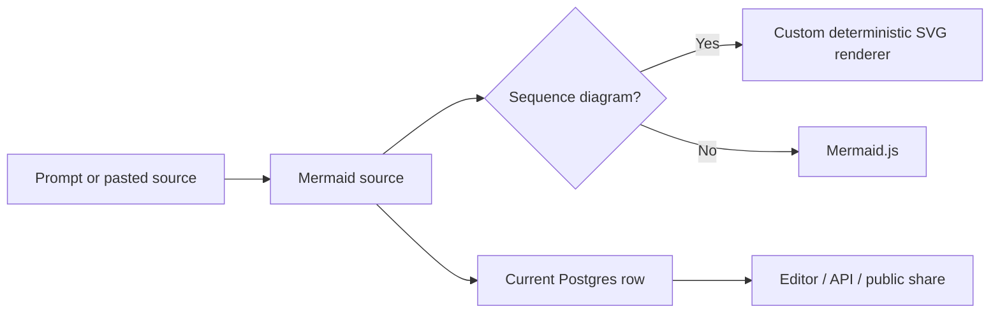

# Diagrams by Bunlong Heng

> Research status: **Source-level** · Lifecycle: **active** · Last reviewed: **2026-08-12**

Diagrams defines AI-assisted design as authoring and publishing executable Mermaid source. Claude can produce the first sequence diagram, but the lasting product is a code-backed diagram whose source, renderer, API and public share page remain connected.

## Mermaid source owns the artifact

At commit [`d9143a85`](https://github.com/bunlongheng/diagrams/tree/d9143a856d8b439296c9399ace4557b56995857f), the [`/api/ai/generate` route](https://github.com/bunlongheng/diagrams/blob/d9143a856d8b439296c9399ace4557b56995857f/app/api/ai/generate/route.ts) asks Claude Sonnet 4.6 for strict JSON containing a title, Mermaid code and a sequence type. Successful generation immediately creates a database record and records token counts. The AI path is therefore narrower than the editor: it generates sequence diagrams, while manually supplied Mermaid can use many more diagram types.

[`DiagramEditor.tsx`](https://github.com/bunlongheng/diagrams/blob/d9143a856d8b439296c9399ace4557b56995857f/app/DiagramEditor.tsx) keeps the code as the editable authority. Rendering does not create an opaque replacement artifact; edits to the text feed the preview, export and shared view. Existing saved diagrams are patched after a short debounce, whereas a new diagram requires an explicit first save.

## Sequence diagrams have a product-owned renderer

The project does not delegate every render to Mermaid.js. [`svg-renderer.ts`](https://github.com/bunlongheng/diagrams/blob/d9143a856d8b439296c9399ace4557b56995857f/lib/svg-renderer.ts) parses participants, messages, notes and display settings into a typed internal representation, computes layout and emits SVG without a DOM. Sequence diagrams therefore have a deterministic renderer that can be reused in the browser, server exports and social previews; other supported Mermaid types use Mermaid.js.

This split is more than a rendering detail. It lets the product promise stable server-side delivery for its primary diagram family while retaining the wider Mermaid vocabulary in the editor.

## Persistence is current state, not durable history

The base [`diagrams` schema](https://github.com/bunlongheng/diagrams/blob/d9143a856d8b439296c9399ace4557b56995857f/db/migrations/00000000000000_init.sql) and later migrations store one current code body plus title, type, settings, visibility, tags and accounting fields. [`app/api/diagrams/[id]/route.ts`](https://github.com/bunlongheng/diagrams/blob/d9143a856d8b439296c9399ace4557b56995857f/app/api/diagrams/%5Bid%5D/route.ts) overwrites those allowed fields and can delete the row. There is no revision table or append-only source log in the verified schema.

The editor's bounded undo stack concerns display settings and lives in memory. Source is deliberately not copied into local storage. Recovery across sessions therefore means reopening the latest database state, not choosing an earlier durable revision.

## Publishing and automation share the same authority

Private diagrams are owner-gated; public diagrams can be rendered from a share URL. The API also accepts automation-created diagrams and returns stored records rather than maintaining a parallel integration format. Source, persistence and delivery converge on the same Mermaid artifact.

Diagrams adds a publishing-oriented definition to the landscape: design is a small piece of executable visual source that can be generated, corrected, addressed, shared and automated. Its strongest technical distinction is the owned sequence renderer; its main lifecycle limit is the absence of durable source versions.

## Evidence

- [Pinned product contract](https://github.com/bunlongheng/diagrams/blob/d9143a856d8b439296c9399ace4557b56995857f/README.md)
- [Claude generation and initial persistence](https://github.com/bunlongheng/diagrams/blob/d9143a856d8b439296c9399ace4557b56995857f/app/api/ai/generate/route.ts)
- [Live source editor and save behavior](https://github.com/bunlongheng/diagrams/blob/d9143a856d8b439296c9399ace4557b56995857f/app/DiagramEditor.tsx)
- [Product-owned sequence renderer](https://github.com/bunlongheng/diagrams/blob/d9143a856d8b439296c9399ace4557b56995857f/lib/svg-renderer.ts)
