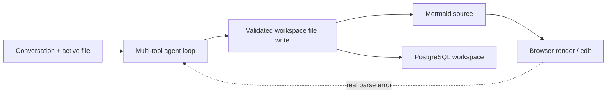

# Graphini

> Research status: **Source-level** · Lifecycle: **active** · Last reviewed: **2026-08-12**

Graphini defines an AI diagram product as a file-oriented workspace with an agent, not as a one-shot prompt box. Mermaid remains editable and portable, but it sits inside a larger persistent model of workspaces, files, conversations, tools, documents and rendered views.

## Mermaid is a workspace file, not merely chat output

At commit [`0c18ea4f`](https://github.com/MagnovaAI/graphini/tree/0c18ea4f4ec924ecd892d6eaaa0e7ea7ffcb8da3), the client workspace model in [`workspace.svelte.ts`](https://github.com/MagnovaAI/graphini/blob/0c18ea4f4ec924ecd892d6eaaa0e7ea7ffcb8da3/src/lib/client/stores/workspace.svelte.ts) groups multiple diagrams, Mermaid code, rendered canvas state, document Markdown, chat and auxiliary files. A `.mermaid` workspace file is nevertheless the clearest source authority: it can be edited as text, parsed by the actual browser renderer and persisted independently.

The server schema makes this duality explicit. [`diagramWorkspaces`](https://github.com/MagnovaAI/graphini/blob/0c18ea4f4ec924ecd892d6eaaa0e7ea7ffcb8da3/src/lib/server/db/schema.ts) stores the aggregate document, while `workspace_files` stores path-addressed Markdown, JSON, YAML and Mermaid content. Conversations, messages and snapshots are separate records rather than being embedded into diagram text.

## The agent edits through constrained file operations

[`createDiagramTools`](https://github.com/MagnovaAI/graphini/blob/0c18ea4f4ec924ecd892d6eaaa0e7ea7ffcb8da3/src/lib/server/chat/tools/index.ts) exposes questions, styling, data analysis, error checking, file operations, icon/style search, skills and web search. The decisive write interface is [`fileSystem.ts`](https://github.com/MagnovaAI/graphini/blob/0c18ea4f4ec924ecd892d6eaaa0e7ea7ffcb8da3/src/lib/server/chat/tools/fileSystem.ts): it lists, reads, greps, creates, edits and deletes workspace files, enforces allowed kinds, rejects Markdown in Mermaid files and validates focused edits.

After a Mermaid write, the multi-step loop in [`loop.ts`](https://github.com/MagnovaAI/graphini/blob/0c18ea4f4ec924ecd892d6eaaa0e7ea7ffcb8da3/src/lib/server/chat/harness/loop.ts) explicitly nudges the model to run `errorChecker`. A clean server check does not overrule the canvas: the system prompt states that the browser renderer is the source of truth when the two disagree.

There is no separate “approve patch” transaction in this loop: a successful tool edit becomes file state. Trust comes from scoped paths, per-kind validation, read-before-focused-edit guards and post-write checking rather than a human approval modal.

## Persistence has three different meanings

Graphini separates durable server workspaces, persistent conversation records and browser history. [`history.ts`](https://github.com/MagnovaAI/graphini/blob/0c18ea4f4ec924ecd892d6eaaa0e7ea7ffcb8da3/src/lib/client/features/history/history.ts) keeps manual and 30-entry automatic state history in local storage; PostgreSQL stores workspace documents, files, messages and file-version rows. A local-files bridge can expose host files to the agent, but its write operations are deliberately rejected, making it a read-only context source rather than a second authority.

## Why Graphini is not just another Mermaid editor

Its distinct technical thesis is that diagram design belongs in the same file-and-agent workflow as documentation and data. The model can inspect a workspace, target a named file, make a narrow source edit and validate it, while the user retains a diffable Mermaid artifact. Realtime co-editing and deep diagram diff/review remain roadmap items, so collaboration should not be inferred from the collaborator API alone.

## Evidence

- [Pinned product and deployment contract](https://github.com/MagnovaAI/graphini/blob/0c18ea4f4ec924ecd892d6eaaa0e7ea7ffcb8da3/README.md)
- [Agent loop and renderer-trust rule](https://github.com/MagnovaAI/graphini/blob/0c18ea4f4ec924ecd892d6eaaa0e7ea7ffcb8da3/src/lib/server/chat/harness/loop.ts)
- [Workspace file tool and validation boundary](https://github.com/MagnovaAI/graphini/blob/0c18ea4f4ec924ecd892d6eaaa0e7ea7ffcb8da3/src/lib/server/chat/tools/fileSystem.ts)
- [Persistent data model](https://github.com/MagnovaAI/graphini/blob/0c18ea4f4ec924ecd892d6eaaa0e7ea7ffcb8da3/src/lib/server/db/schema.ts)
