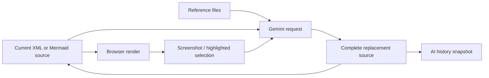

# HTML AI Diagram Editor

> Research status: **Source-level** · Lifecycle: **active** · Last reviewed: **2026-08-12**

HTML AI Diagram Editor defines AI editing as whole-source transformation inside a browser-local workspace. Draw.io XML or Mermaid text remains visible and portable, while Gemini can regenerate that source from a prompt, textual references, a rendered screenshot or a selected visual region.

## Source is shared by editing, rendering and delivery

At commit [`cc4aa3f`](https://github.com/pulipulichen/HTML-AI-Diagram-Editor/tree/cc4aa3f1b65ed5d68282ead9ae1741d8ba59efaa), [`sourceFormatController.js`](https://github.com/pulipulichen/HTML-AI-Diagram-Editor/blob/cc4aa3f1b65ed5d68282ead9ae1741d8ba59efaa/scripts/features/sourceFormatController.js) detects and switches between Draw.io XML and Mermaid modes. [`renderEngine.js`](https://github.com/pulipulichen/HTML-AI-Diagram-Editor/blob/cc4aa3f1b65ed5d68282ead9ae1741d8ba59efaa/scripts/core/viewer/renderEngine.js) feeds XML into the browser Draw.io viewer or parses and renders Mermaid. The same source can be copied, downloaded or opened in Draw.io.

There is no separate opaque scene database: the text is the artifact authority, and renderers are projections of it.

## Visual context returns to the model as snapshots

[`aiService.js`](https://github.com/pulipulichen/HTML-AI-Diagram-Editor/blob/cc4aa3f1b65ed5d68282ead9ae1741d8ba59efaa/scripts/services/aiService.js) calls Gemini directly from the client and includes the complete current source in an edit request. It can add text reference files, a diagram screenshot and full-plus-highlighted images for a selected region. The response is again complete Draw.io or Mermaid source; a prompt can also convert Mermaid into Draw.io XML.

Selected-region prompts tell the model to change only the highlighted area, but the verified client does not structurally diff or reject out-of-region changes. The constraint is visual prompt context, not an enforced patch boundary.

## AI results have browser-local versions

[`aiHistoryController.js`](https://github.com/pulipulichen/HTML-AI-Diagram-Editor/blob/cc4aa3f1b65ed5d68282ead9ae1741d8ba59efaa/scripts/features/aiHistoryController.js) keeps up to twenty entries in local storage. Each entry combines the prompt, complete returned source, source format, filename and thumbnail; a user can copy, download or restore it. This is durable within the browser profile and materially stronger than an in-memory undo stack, although ordinary manual source edits are not all captured as equivalent revisions.

[`main.js`](https://github.com/pulipulichen/HTML-AI-Diagram-Editor/blob/cc4aa3f1b65ed5d68282ead9ae1741d8ba59efaa/scripts/main.js) also restores the latest current diagram from local storage. There is no account, server workspace, merge model or cross-device synchronization.

## Local execution does not imply local inference

The PWA can run as static browser code, but [`geminiSettingsController.js`](https://github.com/pulipulichen/HTML-AI-Diagram-Editor/blob/cc4aa3f1b65ed5d68282ead9ae1741d8ba59efaa/scripts/features/geminiSettingsController.js) persists the provider key and settings in local storage, and the client sends source and selected reference material to the configured Gemini endpoint. Reference files remain in memory until used, yet their content becomes provider input when attached to a request.

This project contributes a browser-local, source-first definition of diagram design with unusually concrete AI snapshot recovery. Its critical boundary is that visual selection guides a whole-document model rewrite; human review, rather than a structural patch system, guards unintended changes.

## Evidence

- [Pinned product contract](https://github.com/pulipulichen/HTML-AI-Diagram-Editor/blob/cc4aa3f1b65ed5d68282ead9ae1741d8ba59efaa/README.md)
- [Whole-source Gemini editing and multimodal context](https://github.com/pulipulichen/HTML-AI-Diagram-Editor/blob/cc4aa3f1b65ed5d68282ead9ae1741d8ba59efaa/scripts/services/aiService.js)
- [Draw.io and Mermaid rendering boundary](https://github.com/pulipulichen/HTML-AI-Diagram-Editor/blob/cc4aa3f1b65ed5d68282ead9ae1741d8ba59efaa/scripts/core/viewer/renderEngine.js)
- [Restorable browser-local AI history](https://github.com/pulipulichen/HTML-AI-Diagram-Editor/blob/cc4aa3f1b65ed5d68282ead9ae1741d8ba59efaa/scripts/features/aiHistoryController.js)
