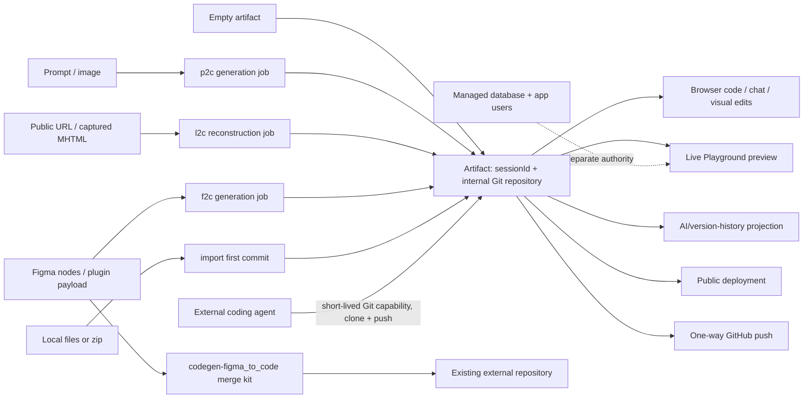

# Anima

> Research status: **Architecture-level / closed-source boundary reached** · Last reviewed: **2026-08-11**

| Field | Value |
|---|---|
| Organization / team | Anima App, Inc. / Anima / Agent Grid |
| Category | Design-aware code generation, Git-backed artifact workspace and agent hosting bridge |
| Status | Active; Playground and the newer Agent Grid artifact surface coexist in current public material |
| Native working artifact | A `sessionId`-addressed hosted artifact backed by an internal Git repository |
| Source availability | Hosted generator, editor, agent, database and deployment core closed; inspectable MIT-declared CLI distribution, ISC-declared SDK source, unlicensed public MCP guide, and an archived MIT Storybook addon expose bounded edges |

## Evidence pin: Anima's durable center is code, but not all product state is code

Anima now presents a stronger claim than ordinary design-to-code export: [every Playground is a real Git repository](https://docs.animaapp.com/docs/anima-mcp), and an authorized agent changes an existing artifact by cloning, committing and pushing rather than regenerating it. The current [Agent Grid guide](https://github.com/AnimaApp/mcp-server-guide/blob/8039750ab6ac3aaaf738f044c3210e420fda6426/README.md) makes the same rule explicit and gives one artifact one `sessionId`.

That does **not** make the repository the only authority. The browser keeps chat and AI history, the Data tab owns database records and users, metadata owns name/privacy, publishing owns a public deployment, and Figma/GitHub exits create additional artifacts. The product therefore has a Git-centered code authority inside a federation of state, not a single Git transaction covering the whole app.

This dossier pins four inspectable edges without treating them as the hosted implementation:

- [`@animaapp/cli@0.7.0`](https://registry.npmjs.org/@animaapp%2fcli/0.7.0) is an MIT-declared npm package whose complete source map embeds 36 TypeScript source files; its declared Git repository is not publicly reachable.
- [`AnimaApp/anima-sdk` at `95b66d7`](https://github.com/AnimaApp/anima-sdk/tree/95b66d7e56514908d2017b6d9da03699e6ee0e00) is the exact `gitHead` published as both SDK packages at `0.27.0`; package manifests declare ISC, although the repository has no standalone license file.
- [`AnimaApp/mcp-server-guide` main at `8039750`](https://github.com/AnimaApp/mcp-server-guide/tree/8039750ab6ac3aaaf738f044c3210e420fda6426) documents the current Agent Grid contract but has no declared license and contains no server implementation.
- [`storybook-anima` at `085b95d`](https://github.com/AnimaApp/storybook-anima/tree/085b95d743848019b75ac70a375f7ee1a3c88b3c) is an archived MIT historical client, not evidence for the present Playground core.

## Decisive architecture: several compilers can create code, then Git takes over

The most useful model is not “Figma becomes code.” It is “one of several ingress paths creates or supplies an initial repository state; human and agent writers then converge on that code; preview and delivery project it elsewhere.”



The five artifact-creation modes have different provenance and completion semantics:

| Ingress | Public operation | First durable result | What does not remain bound |
|---|---|---|---|
| Prompt or image | `p2c` | asynchronously generated HTML or React files in a new artifact repository | prompt/image is generation evidence, not a live source graph |
| Public website | `l2c` | semantically reconstructed HTML or React in a new repository | original DOM, scripts and authored source identity; dynamic content and complex animation are explicitly limited |
| Figma | `f2c` | generated code for selected nodes or multi-screen flows | no documented live node-to-file or revision binding after generation |
| Existing local code | `import` | uploaded files become the first commit of a **new** artifact | the original folder does not become a clone or receive later pushes |
| New repository | `empty` | a repository seeded with an initial `README.md` commit | it is not a bare remote and rejects unrelated-history pushes |

The sixth path, `codegen-figma_to_code`, is deliberately different: it returns a merge kit for an existing external codebase and creates no Anima artifact at all.

## Ordinary journey: make a first repository state, refine it, then prove the right projection

### 1. Plan can remain non-mutating

[Plan Mode](https://docs.animaapp.com/docs/plane-mode) lets a user discuss and revise a structured plan before asking the agent to generate code. Ordinary chat skips that gate and writes immediately. This makes “plan accepted” an intent checkpoint, not an artifact receipt.

### 2. Generation registration is not generation completion

The current Agent Grid contract says `artifact-create` for `p2c`, `l2c` or `f2c` returns immediately with `status: "generating"`. The supported completion loop is repeated `artifact-status(sessionId, wait: true)` calls; each long-poll returns on `ready`/`failed` or after about 45 seconds still generating. Calling create again makes a second artifact rather than retrying the first. The per-user active-job ceiling is three across generation, codegen and deploy.

This is also a current CLI limitation. Version `0.7.0` registers no `status` command: `anima create` calls `artifact-create` once and prints success when it receives a `sessionId`. The pinned [official Skill](https://github.com/AnimaApp/mcp-server-guide/blob/8039750ab6ac3aaaf738f044c3210e420fda6426/skills/anima/SKILL.md) consequently recommends MCP for generated artifacts because only MCP can run the completion loop. A long CLI timeout and progress callback do not change that server contract.

### 3. Human edits and agent edits meet at files

Once ready, Anima exposes three code-changing browser routes:

- chat can add, modify or delete files;
- the [Code tab](https://docs.animaapp.com/docs/code-tab) directly edits project files and refreshes Preview in real time;
- [visual text edit](https://docs.animaapp.com/docs/preview) stages a target, shows the file/change in chat and applies only after confirmation.

The Element Selector supplies one or more rendered elements as chat context. [Debug Mode](https://docs.animaapp.com/docs/debug-mode) gives a specialized agent the rendered output and full codebase so it can diagnose and write a repair. An external agent instead obtains an artifact-scoped Git URL, edits a clone, commits and pushes; pushing updates the live artifact.

### 4. Preview, history and deployment answer different questions

Preview proves that one current browser projection can run and be interacted with. [Version History](https://docs.animaapp.com/docs/version-history) records every AI change, lets a user preview or restore an earlier state, saves the displaced current state first, and can duplicate from a historical point. [Publish](https://docs.animaapp.com/docs/publish) is a separate deployment action; later edits require an explicit Update, and Unpublish removes only the public site.

A sound acceptance sequence is therefore: wait for the artifact to be ready, inspect the diff/files, exercise the intended journey in Preview, verify managed data separately where used, and publish only when public delivery was requested.

## Bring-your-own-code is a repository bootstrap protocol

The inspectable CLI source map shows how local files cross the boundary:

1. it walks a directory while excluding `.git`, dependency folders, build output, coverage and common caches;
2. text-only projects up to 1,000 files and 10 MiB are sent as a normalized `{path: content}` map;
3. any recognized binary, NUL byte, larger tree or provided `.zip` switches the entire upload to a zip grant;
4. the CLI requests `artifact-get_zip_upload_url`, PUTs the archive to the presigned URL, then submits the single-use `zipUploadId`;
5. the server commits the accepted source and returns skipped-file notes plus, normally, a read-write Git URL.

The [pinned tool reference](https://github.com/AnimaApp/mcp-server-guide/blob/8039750ab6ac3aaaf738f044c3210e420fda6426/skills/anima/references/mcp-tools.md) adds the server boundary: zip is capped at 50 MiB, the upload id lasts 30 minutes and is single-use, and shell/executable files, dependencies and build output are excluded. A failed or lost create after consuming a grant cannot safely be replayed without checking whether the artifact already exists.

An imported local folder is not silently re-pointed to Anima. The [current CLI documentation](https://docs.animaapp.com/docs/anima-ai-agent-design-skill) tells the user to continue from the returned remote, making the new internal repository—not the original folder—the hosted artifact's code lineage.

## Anonymous handoff is a separate pre-ownership state machine

`@animaapp/cli@0.7.0` exposes a distinctive path for an agent that has no account or token yet:

- only `import` is allowed anonymously; generation and `empty` require an authenticated owner;
- this one flow bypasses MCP and POSTs directly to `/v1/generationSessions`, because every normal MCP call requires a bearer token;
- the response carries `sessionId`, preview URL, a human-facing `claimUrl`, a private `handoffToken` and a claim deadline;
- the artifact is read-only and expires after 24 hours if no human claims it;
- claiming transfers the artifact to the human; granting ongoing agent access is an additional choice;
- `anima login --handoff` polls the OAuth token endpoint using the private handoff token and stores an agent credential only if the human granted it.

The client persists the pending handoff in `~/.config/anima/handoff.json` with restrictive permissions, writes through a temporary sibling and rename, clears it after redemption/expiry, and removes it on logout. The token does not itself claim the artifact and should never be sent to the human. This is an ownership transition, not just another sharing link.

## Agent interface: MCP is the governed control plane; Git is the content plane

At pinned main, the public guide documents ten normal MCP tools:

| Group | Tools | Authority |
|---|---|---|
| Artifact creation/status | `artifact-create`, `artifact-status`, `artifact-get_zip_upload_url` | create and observe one artifact; never edit an existing artifact in place |
| Artifact lifecycle | `artifact-get_git_token`, `artifact-update_metadata`, `artifact-duplicate` | issue code capability, change metadata, or fork an independent artifact |
| Delivery | `artifact-publish`, `artifact-unpublish` | create/remove a public deployment without deleting code |
| Workspace/codegen | `workspace-list_artifacts`, `codegen-figma_to_code` | discover authorized artifacts or generate a non-artifact merge kit |

The CLI is a client for that surface, not a parallel application API. Its source-map implementation constructs a streamable-HTTP MCP client at `/v1/mcp`, adds bearer/team/Figma headers, parses the first text content block as JSON, resets a 10-minute idle timeout on progress, and closes the transport after each command. Every authenticated artifact command goes through this one client. OAuth device/invite/handoff/refresh and anonymous import are the limited direct REST exceptions.

The code capability is deliberately narrow:

- a `gitRemoteUrl` embeds a token scoped to one artifact;
- access is read-only or read-write according to the principal's artifact permission;
- requested lifetime is 300–3,600 seconds, with one hour the default and maximum;
- a token cannot be renewed; the caller mints a new URL and changes the clone's remote;
- metadata changes never touch code;
- the MCP server offers no ordinary file-mutation tool for existing artifacts—Git is the supported path.

This is a real least-authority improvement over handing an agent a long-lived team Git credential, but the URL itself is a secret and can leak through logs, shell history or chat.

## Figma codegen is an integration packet, not a runnable project

`codegen-figma_to_code` serves a different journey: implement selected Figma nodes **inside an existing repository**. The [current contract](https://github.com/AnimaApp/mcp-server-guide/blob/8039750ab6ac3aaaf738f044c3210e420fda6426/skills/anima/references/mcp-tools.md#codegen-figma_to_code) returns:

- generated text/binary files;
- separately downloadable assets;
- a visual snapshot URL for each node;
- implementation guidelines;
- token usage.

It also intentionally filters boilerplate, entry points, declarations, utility setup and everything under `src/components/`. That last exclusion includes extracted and shadcn components, so the returned `files` map is explicitly a partial tree. The receiving agent must inspect the existing stack, use snapshots as visual ground truth, follow the guidelines, map `data-variant` attributes to real props, download assets to the promised base URL, and integrate rather than overwrite blindly.

The current CLI weakens that packet. Its `codegen` command asks for the MCP result, writes only `result.files` under a path-traversal guard, and reports file count/session/token usage. It does not surface or download the returned snapshots, guidelines or separate assets. Using CLI output alone can therefore omit exactly the evidence and dependencies the MCP guide says are required.

## The open SDK exposes generation transport, not generation algorithms

The ISC-declared [`@animaapp/anima-sdk@0.27.0`](https://github.com/AnimaApp/anima-sdk/blob/95b66d7e56514908d2017b6d9da03699e6ee0e00/sdk/package.json) is a source-visible edge around a closed service:

### Figma acquisition and validation

[`FigmaRestApi`](https://github.com/AnimaApp/anima-sdk/blob/95b66d7e56514908d2017b6d9da03699e6ee0e00/sdk/src/FigmaRestApi.ts) distinguishes personal (`figd_`) and OAuth (`figu_`) tokens, fetches file geometry and Anima plugin data, retrieves rendered node images and image fills, maps several 403 causes, and optionally retries a 429 after `Retry-After` plus one second. Abort cancels the wait. Before codegen, [`Anima.generateCode`](https://github.com/AnimaApp/anima-sdk/blob/95b66d7e56514908d2017b6d9da03699e6ee0e00/sdk/src/anima.ts) tries to fetch the Figma file and locally checks that requested nodes are compatible; acquisition failure is deliberately ignored so the backend can retry.

### Closed jobs behind a typed SSE edge

The client gzips request JSON and POSTs to `/v1/codegen`, `/v1/l2c` or `/v1/p2c` on `public-api.animaapp.com`. It parses SSE events for queue/start/progress, generated files, Figma metadata, assets, job state, error and completion, and can reattach to `/v1/jobs/{sessionId}`. The React package forwards those events through caller-owned authenticated backend routes, tolerates up to ten transient EventSource errors, and can download external assets as base64 local files.

This establishes job identity, transport, payload options and failure handling. It does not expose Figma interpretation, component decomposition, semantic website reconstruction, prompt planning, diff generation, model routing or repository commit logic.

### The SDK and agent surface are not identical

The SDK settings expose Figma-specific `data-id`, `data-name` and `data-variant` instrumentation, responsive page groups, auto-splitting, design-system id, images and image-mode routing. Its public SSE union declares a `snapshots_urls` event, but the pinned parser has no branch that stores or forwards that event, and `AnimaSDKResult` has no snapshot field. The Agent Grid MCP contract separately returns snapshots and guidelines. “Official API support” therefore needs a package-and-surface qualifier; these clients do not project the same result shape.

## Rendering and target return: useful visual grounding, closed identity

At launch, Anima described Playground as an in-browser runtime [powered by Bolt.new's WebContainers](https://www.animaapp.com/blog/product-updates/introducing-anima-playground-and-anima-api-ui-first-ai-code-generation/). A May 2025 update described a new diff engine that reduced small multi-screen changes and preserved Figma prototype navigation. These posts establish historical runtime choices; current Agent Grid hosting, build isolation and renderer internals are not publicly specified, so WebContainers should not be asserted as the entire 2026 runtime.

Current product docs establish stronger behavior without revealing the mapping:

- Preview has an Element Selector that sends one or more rendered targets to chat.
- visual text edit identifies a file and proposed change before Apply;
- direct code edits re-render in real time;
- Debug Mode observes rendered output and reads the codebase before applying a fix;
- SDK generation can add `data-id`/`data-name`/`data-variant` attributes.

No public contract joins those facts. The Preview selection packet, locator producer, repeated-instance scope, framework coverage, file/range/AST/source-map identity, repository revision and conflict precondition remain undisclosed. The SDK attributes may support testing or identification, but public evidence does not show that the Playground selector uses them or that they survive a Figma roundtrip. Anima therefore has source-addressed visual text behavior at the product boundary, not a source-inspected target-return mechanism.

## Persistence is a set of clocks

| State | Authority and recovery | Independence / break |
|---|---|---|
| Artifact code | internal Git repository addressed by `sessionId`; clone/push is agent read/write | public branch model, server-side merge policy and push-to-live atomicity are not documented |
| Browser AI history | automatic version for each AI change; preview, restore and duplicate from a point | no public mapping from a history version to a Git commit; direct code/visual edit coverage is not stated |
| Team browser state | each contributor can have a local copy; overwrite confirmation and fork are documented | Reset targets the last commonly saved version, not an explicit Git merge or CAS |
| Chat | explains and can restore to message points | artifact duplication explicitly omits chat |
| Database and users | managed Data tab, records, security policies, roles and authentication | code/Git restore is not documented to restore records, users or policies |
| Metadata | name and public/private visibility | separate tool; never changes code |
| Playground URL | live authorized preview of current artifact | privacy/team access differs from public deployment |
| Deployment | `liveUrl`, subdomain and optional custom domain | Publish/Update/Unpublish are separate from code mutation |
| External GitHub | one-way pushed repository | GitHub changes do not return; continuing requires local work or a new import |
| Figma copy | editable reconstructed layers and auto-layout | no node/revision binding or merge back to the originating code repository is public |

The [collaboration documentation](https://docs.animaapp.com/docs/project-visibility) is particularly consequential: two browser contributors can have divergent local copies, later save can require an overwrite confirmation, and a rejected overwrite can be forked. This proves the hosted editor does not publicly promise transparent multi-writer Git merging even though the durable content is repository-backed.

## Managed data and authentication sit outside the repository contract

[Database Management](https://docs.animaapp.com/docs/database) lets chat create tables, policies and a configured backend; the Data tab can inspect/import/export rows, while permissions are changed through chat. [App Users](https://docs.animaapp.com/docs/app-users) adds signup mode, roles, accounts and login methods. Deleting a user is permanent but intentionally leaves records the user created.

The Agent Grid duplicate tool copies code, assets and supported database content, fails the whole duplication if the database cannot be copied, and omits chat/custom domains. This is direct evidence that the database is an artifact-adjacent authority, not ordinary Git content. Public docs do not define a transaction between an AI code version, schema/policy changes, row mutations, user state and publish. A source clone or GitHub export is therefore not a complete application backup.

## Design System is a generated Storybook artifact and a separate context lane

The current [Figma Design System workflow](https://docs.animaapp.com/docs/add-figma-design-system) imports selected Figma components, variables and styles into a new Playground that renders a live Storybook. Variants, states, props and controls become reusable generation context. Later plugin updates add selected components to that same design-system Playground, and team projects can choose it when generating UI.

Agent access is narrower than the browser story suggests:

- Enterprise workspaces may expose separately gated `design_system-get_manifest` and `design_system-get_files` reads;
- the ordinary MCP guide does not document a design-system write protocol;
- `artifact-publish(mode: "designSystem")` is documented to fail over MCP, while webapp publication works;
- no public contract pins a consuming artifact/job to an immutable design-system revision or describes conflict behavior when selected Figma components are updated.

The historical architecture ran in the opposite direction. The archived [`storybook-anima`](https://github.com/AnimaApp/storybook-anima/blob/085b95d743848019b75ac70a375f7ee1a3c88b3c/README.md) addon packaged Storybook source/metadata, control combinations and DTCG-like tokens and uploaded them for reconstruction as Figma components. Its 1,025-variant cap, boolean-control dependency and “rendered story becomes Figma” behavior show a lossy export client. It was deprecated in 2022 for a successor repository that is no longer public. It should not be used to infer the current Figma-to-Storybook generator.

## Similar-looking roundtrips are intentionally different

### Internal Git remote is bidirectional; GitHub is not

An artifact's capability URL lets an authorized agent clone and push back to the same internal repository. The product's [GitHub integration](https://docs.animaapp.com/docs/github) is explicitly one-way: Anima pushes to a new or existing GitHub repository, but GitHub changes do not appear in Playground. A project changed on GitHub must continue locally or be imported as a new Playground. Calling both paths “Git sync” hides the decisive difference.

### Figma import and Copy to Figma are two reconstructions

Figma link/plugin import converts structure, auto-layout, variables, components and prototype links into runnable code. [Copy to Figma](https://docs.animaapp.com/docs/copy-to-figma) reconstructs Preview as editable frames, text, styles, images and icons rather than a flattened bitmap. Neither direction publishes a persistent cross-artifact id, base revision or merge protocol. Editable output is not live synchronization.

### Public URL and authenticated capture are semantic inputs

[URL import](https://docs.animaapp.com/docs/starting-from-a-url) rebuilds the visible initial page as editable semantic code and explicitly limits dynamic loading, complex animation and highly interactive SPAs. For private pages, SDK `l2c` accepts hosted MHTML and the [Chrome extension](https://docs.animaapp.com/docs/capture-elements) can preserve rendered HTML structure, computed properties and hierarchy. These paths improve reconstruction context but do not carry the original application's authored files, module graph or repository revision.

## Failure and recovery map

| Failure / ambiguity | Public behavior | Safe recovery |
|---|---|---|
| generation appears slow | create already made an artifact and returns `generating` | retain `sessionId`; long-poll `artifact-status(wait: true)` until ready/failed |
| CLI says created before generated app is ready | CLI 0.7.0 has no status command | use MCP status; do not call create again |
| three active jobs already exist | generation/codegen/deploy share a per-user cap | wait for one to complete, then retry only the rejected job |
| empty-repo push is non-fast-forward | remote already has a seed commit | clone it and commit on top; reconcile histories deliberately if necessary |
| zip import is missing/rejected | size/content rules apply; grant is expiring and single-use | strip dependencies/build output/executables, get a fresh grant, check for an already-created artifact before retry |
| Git push says token expired | capability is intentionally non-renewable | mint a new scoped URL and `git remote set-url origin ...` |
| workspace list is empty | no `read` access can return an empty list rather than an error | do not infer the team has no artifacts; verify principal/workspace permission |
| duplicate response is lost | duplication is non-idempotent and may have copied database content | list recent artifacts before retrying |
| codegen output lacks components/assets | tool filters component/setup files; CLI ignores auxiliary packet | use MCP response, snapshots/guidelines and asset list; merge into the inspected stack |
| visual text change is visible but unapplied | Preview stages a confirmation | inspect file/change and click Apply; rebuild before acceptance |
| browser collaborators diverge | local copies and overwrite confirmation are documented | fork the rejected local version or reset deliberately; inspect resulting Git/history state |
| GitHub was edited externally | product integration is one-way | continue in GitHub/local source or import a new artifact; do not expect reverse sync |
| published site is stale | code edits do not imply deployment update | explicitly Update and test `liveUrl`; Unpublish affects only delivery |
| current docs and tools disagree | endpoint, names and commands are in transition | pin the exact CLI/guide revision and inspect the live tool list before automation |

## Evolution: export utility became a Git-addressable artifact platform

- **2022:** the MIT Storybook addon exported code component metadata/tokens toward Figma and was archived in favor of a separate CLI.
- **2025-03:** Playground launched as Figma-to-runnable-code vibe coding with a Bolt/WebContainers browser preview and one-click delivery.
- **2025-05:** multi-screen Figma prototype links and a new incremental diff path made Playground a flow-level code workspace rather than a single-screen exporter.
- **2025-08 to 2026-06:** the public SDK added prompt generation, image/MHTML input, attachable SSE jobs, design-system ids, `data-variant`, image routing and viewport metadata. Commit history shows this public edge widening from Figma conversion to a general code-generation service.
- **2026-02:** Anima MCP framed Playground code as agent-readable handoff rather than manual export.
- **2026-07:** official material described every Playground as a live preview backed by Git, with import/empty creation, short-lived repository access and explicit public publish.
- **2026-08:** the pinned public guide renamed the surface around Agent Grid, `artifact-*` tools and a new host while live Anima docs/blogs still expose the older endpoint and names.

## Surface drift is itself an operational fact

The 2026-08-11 snapshot contains two simultaneously live MCP hosts: unauthenticated `GET`/`HEAD` returns `401` and `OPTIONS` returns `204` for both `https://public-api.animaapp.com/v1/mcp` and `https://api.agentgrid.io/v1/mcp`. Public documentation still names the first; CLI 0.7.0 and pinned guide default to the second.

| Question | Older/live Anima docs or July blog | Pinned guide / CLI 0.7.0 | Consequence |
|---|---|---|---|
| endpoint | `public-api.animaapp.com/v1/mcp` | `api.agentgrid.io/v1/mcp` | both respond, but an OAuth/token is origin-specific |
| tool names | `playground-create`, `project-get_git_token`, `playground-publish` | `artifact-create`, `artifact-get_git_token`, `artifact-publish` plus `artifact-status` | hard-coded clients must discover/pin the surface |
| inline import | described as roughly 100 KiB | enforced 1,000 files / 10 MiB in guide and CLI | choose transport from current contract, not blog copy |
| generation completion | CLI docs say agents should wait for command completion | guide says CLI returns on registration and lacks status | use MCP status for a completion receipt |
| download | July blog shows `anima download` | 0.7.0 command registry has no `download` | use Git clone rather than a nonexistent current command |
| MCP config | live CLI docs say the config contains a Bearer token | `npx @animaapp/cli@0.7.0 mcp-config --json` emits URL-only OAuth config | do not paste or expect a token based on stale instructions |

This does not prove either host is being retired. It proves that unversioned prose is insufficient as an automation contract during the Agent Grid transition.

## Implementation evidence map

| Edge | Pinned evidence | What source establishes | What remains closed |
|---|---|---|---|
| Current CLI | npm `@animaapp/cli@0.7.0`; tarball SHA-256 `b880f62701744923f27797c45c9fb55ed70a7297dfe16d3b2edc41bd750524ba`; source-map SHA-256 `7d91418105f2bc9be6f57763e70f65ab90ec21410733fae3e29ae742ad6ea5b0` | command registry, MCP transport, auth/refresh/handoff, import/zip selection, scoped Git handling, publish/update/duplicate clients, file-write guard | package-declared `gitHead` repository is 404; server tools and hosted artifact implementation absent |
| API SDK | [`95b66d7`](https://github.com/AnimaApp/anima-sdk/commit/95b66d7e56514908d2017b6d9da03699e6ee0e00), npm `0.27.0`, matching npm `gitHead` | Figma REST adapter, settings validation, gzipped REST/SSE jobs, attachment, assets and React client retry logic | generation engines, storage, repository creation and deployment absent |
| Agent guide | [`8039750`](https://github.com/AnimaApp/mcp-server-guide/commit/8039750ab6ac3aaaf738f044c3210e420fda6426) | current tool schemas, limits, permissions, Git and failure guidance | no license and no MCP server/runtime source |
| Historical Storybook | [`085b95d`](https://github.com/AnimaApp/storybook-anima/commit/085b95d743848019b75ac70a375f7ee1a3c88b3c) | Webpack/source packaging, story/control/token payload and hosted upload edge | archived 2022; successor and hosted conversion service unavailable |

The CLI npm manifest declares MIT, but the tarball contains no license file and its declared `https://github.com/AnimaApp/anima-cli.git` repository returns 404. The source map makes the published client inspectable; it does not create a verifiable public source history. Conversely, the SDK is in a public Git repository whose package manifests declare ISC but which lacks a standalone license text. These distinctions matter when “publicly readable,” “source-available” and “open source” are used as synonyms.

## Reproducibility of this review

The following read-only checks reproduced the pinned edges on Windows/PowerShell:

```powershell
git clone --filter=blob:none https://github.com/AnimaApp/anima-sdk.git
git -C anima-sdk rev-parse HEAD
# 95b66d7e56514908d2017b6d9da03699e6ee0e00

git clone --filter=blob:none https://github.com/AnimaApp/mcp-server-guide.git
git -C mcp-server-guide rev-parse HEAD
# 8039750ab6ac3aaaf738f044c3210e420fda6426

npm view @animaapp/cli@0.7.0 version license gitHead dist.integrity --json
npm pack @animaapp/cli@0.7.0 --json
npx --yes @animaapp/cli@0.7.0 --help
npx --yes @animaapp/cli@0.7.0 mcp-config --json
# URL-only config for https://api.agentgrid.io/v1/mcp
```

The unpacked CLI contained only `README.md`, `package.json`, `dist/index.js` and `dist/index.js.map`; the map contained 36 matching `sources` and `sourcesContent` entries. Direct `node dist/index.js` without installing dependencies failed on the externalized `commander` import, while normal `npx` installed declared dependencies and returned version `0.7.0`; that is expected package behavior, not an application failure.

The public docs index fetched on 2026-08-11 had UTF-8 SHA-256 `dce9dd2f70137ec20c6918f6ae349c80bef95753360c8b7df0ab755f101a3578`. Hashes make this time-sensitive comparison reproducible even if the hosted pages are later reconciled.

## Evidence boundary and open questions

The available public evidence is sufficient to establish the artifact/Git authority, ingress modes, agent capability model, current protocol drift, codegen/SDK edges, preview behavior, plural persistence and delivery boundaries. It is not sufficient to answer:

- which models, planners or intermediate representations drive p2c/l2c/f2c and Debug Mode;
- how browser AI versions map to Git commits, branches or reflog, and whether every direct edit is versioned;
- how a Git push is validated, built and promoted to the live Preview, including rollback on build failure;
- how Element Selector and visual text edit recover a file/target, handle repeated components or guard against stale revisions;
- whether the launch-era WebContainer runtime remains the current runtime for every browser/artifact mode;
- how simultaneous browser and Git writers are serialized or merged beyond documented overwrite prompts;
- how database schema/policies/users/records are versioned, exported and restored with code;
- how a consuming generation pins a design-system revision and how plugin updates merge generated Storybook source;
- which exact tool host/name set is canonical after the Agent Grid transition;
- what server receipt proves that a specific Git commit, database state and public domain are the delivered application.

Those remain unknown rather than inferred from the inspectable clients.

## Primary sources

### Current product and artifact behavior

- [Anima MCP](https://docs.animaapp.com/docs/anima-mcp)
- [Anima CLI](https://docs.animaapp.com/docs/anima-ai-agent-design-skill)
- [Starting from a prompt](https://docs.animaapp.com/docs/starting-from-a-prompt)
- [Starting from a URL](https://docs.animaapp.com/docs/starting-from-a-url)
- [Starting from Figma](https://docs.animaapp.com/docs/starting-from-figma)
- [Chat input and prompting](https://docs.animaapp.com/docs/chat-input-and-prompting)
- [Preview](https://docs.animaapp.com/docs/preview)
- [Code tab](https://docs.animaapp.com/docs/code-tab)
- [Version History](https://docs.animaapp.com/docs/version-history)
- [Project Visibility](https://docs.animaapp.com/docs/project-visibility)

### Data, design systems and exits

- [Database Management](https://docs.animaapp.com/docs/database)
- [App Users](https://docs.animaapp.com/docs/app-users)
- [Add Figma Design System](https://docs.animaapp.com/docs/add-figma-design-system)
- [GitHub one-way integration](https://docs.animaapp.com/docs/github)
- [Copy to Figma](https://docs.animaapp.com/docs/copy-to-figma)
- [Publish](https://docs.animaapp.com/docs/publish)
- [Capture Elements](https://docs.animaapp.com/docs/capture-elements)

### Agent/API contracts and distributions

- [Agent Grid MCP Server Guide at `8039750`](https://github.com/AnimaApp/mcp-server-guide/tree/8039750ab6ac3aaaf738f044c3210e420fda6426)
- [MCP tool reference at `8039750`](https://github.com/AnimaApp/mcp-server-guide/blob/8039750ab6ac3aaaf738f044c3210e420fda6426/skills/anima/references/mcp-tools.md)
- [Git workflow at `8039750`](https://github.com/AnimaApp/mcp-server-guide/blob/8039750ab6ac3aaaf738f044c3210e420fda6426/skills/anima/references/git-workflow.md)
- [`@animaapp/cli@0.7.0` registry record](https://registry.npmjs.org/@animaapp%2fcli/0.7.0)
- [`@animaapp/cli@0.7.0` embedded source map](https://unpkg.com/@animaapp/cli@0.7.0/dist/index.js.map)
- [Anima SDK at `95b66d7`](https://github.com/AnimaApp/anima-sdk/tree/95b66d7e56514908d2017b6d9da03699e6ee0e00)
- [SDK generation client](https://github.com/AnimaApp/anima-sdk/blob/95b66d7e56514908d2017b6d9da03699e6ee0e00/sdk/src/anima.ts)
- [SDK public result/event types](https://github.com/AnimaApp/anima-sdk/blob/95b66d7e56514908d2017b6d9da03699e6ee0e00/sdk/src/types.ts)
- [React SSE job client](https://github.com/AnimaApp/anima-sdk/blob/95b66d7e56514908d2017b6d9da03699e6ee0e00/sdk-react/src/job.ts)

### Evolution and historical implementation

- [Playground/API launch](https://www.animaapp.com/blog/product-updates/introducing-anima-playground-and-anima-api-ui-first-ai-code-generation/)
- [Multi-screen Figma flows and diff-engine update](https://animaapp.com/blog/playground-en/full-figma-prototypes-into-anima-ai-playground-vibe-coding/)
- [Anima MCP launch](https://www.animaapp.com/blog/code/connect-your-ai-coding-agent-to-anima-playground-and-figma-with-mcp/)
- [Share agent output as a Git-backed live link](https://animaapp.com/blog/code/share-agent-output-as-a-link/)
- [Archived Storybook addon at `085b95d`](https://github.com/AnimaApp/storybook-anima/tree/085b95d743848019b75ac70a375f7ee1a3c88b3c)
