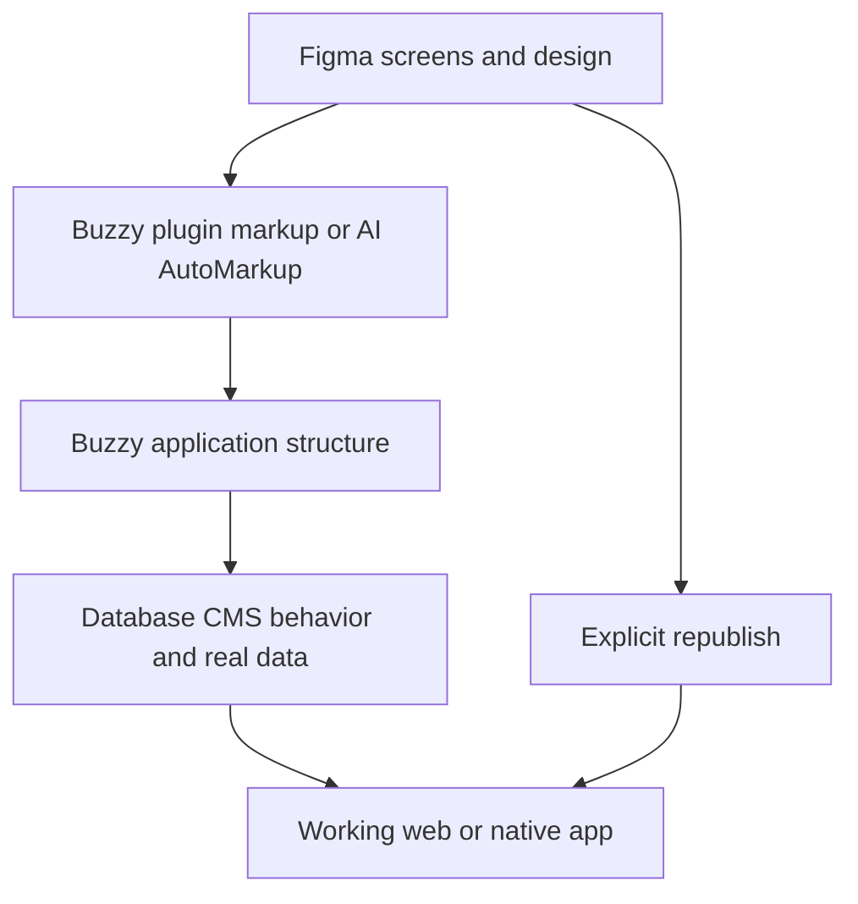

# Buzzy

> Research status: **Architecture-level** · Last reviewed: **2026-08-12**

Buzzy connects a Figma design to a managed working application. Its AI AutoMarkup scans the design and derives application structure, database and CMS configuration; the plugin then lets the user keep Figma as a design-facing authority and explicitly republish changes to the hosted app.

## Publication is an explicit boundary

The plugin can begin with a design brief and data model generated through its assistant or with existing Figma screens. Buzzy extracts screens and annotated behavior when publishing, then provides debug and live previews. A designer can test working forms and real data, revise the Figma source and republish.

## Two authorities require reconciliation

Figma owns visual design while Buzzy owns executable data and application behavior. The product's explicit republish step avoids implying continuous magic synchronization, but public evidence does not fully specify what happens when a live app change and a Figma change conflict, how identifiers survive duplicated frames, how migrations protect existing data or which visual properties are round-trippable.

AI AutoMarkup reduces manual annotation, but the generated schema still needs review: inferred fields and behaviors can be plausible yet wrong. The implementation, model routing and version graph are closed. Reviewed first-party pages do not establish a reliable current team region.

## Primary evidence

- [Buzzy and Figma product workflow](https://www.buzzy.buzz/figma/)
- [Buzzy for Figma architecture](https://docs.buzzy.buzz/working-with-buzzy/buzzy-for-figma/about-buzzy-for-figma)
- [AI-assisted start-to-app workflow](https://docs.buzzy.buzz/working-with-buzzy/buzzy-for-figma/creating-a-new-app-directly-in-figma/step-by-step-version)
