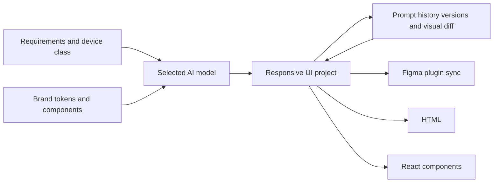

# DisenIA

> Research status: **Architecture-level** · Last reviewed: **2026-08-12**

| Field | Value |
|---|---|
| Team | DisenIA · team region not established |
| Ordinary job | generate and version one UI system across mobile tablet desktop TV watch and automotive targets |
| Authority | the DisenIA component token and versioned design project |
| Lifecycle | active |

## Device is a constraint dimension inside one workflow

The current application lets the user choose an AI provider and device class then generate interfaces with reusable components design tokens and responsive auto-layout. Prompts can revise components and versions retain visual diffs. The result can move into Figma or be exported as HTML and React.

The ordinary loop is broader than “make six screenshots.” Components and tokens are reused while device targets alter responsive constraints. Version comparison gives a human a promotion point before handoff.

## Export splits authority

DisenIA owns the generated project and version history. Figma or code becomes authoritative after downstream manual changes unless a documented synchronization event brings changes back. Current public material says the Figma plugin can import export and generate variations but does not establish universal code-to-design round trip.

## Evidence ceiling

The live application exposes capability text but does not publish the project schema version-diff representation model prompts token enforcement or generated code mapping. Exact provider behavior and cross-device semantic consistency remain unverified.

## Primary evidence

- [DisenIA current application](https://disenia.app/)
- [DisenIA Figma integration surface](https://disenia.app/#figma)
- [DisenIA version and export surface](https://disenia.app/#export)
