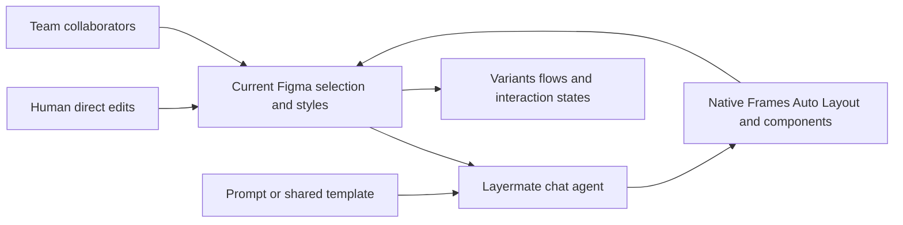

# Layermate

> Research status: **Architecture-level** · Last reviewed: **2026-08-11**

| Field | Value |
|---|---|
| Team | Layermate Inc. in the Goodpatch group · Japan |
| Ordinary job | generate explore and revise UI without leaving the current Figma file |
| Authority | native Figma Frames Auto Layout components and project collaboration |
| Lifecycle | active |

## Selection is both context and edit target

Layermate's chat can create a screen flow from a prompt or take selected Figma layers as the visual reference for new work. It analyzes color typography spacing and existing style then inserts editable native layers. Follow-up requests can create variants states or fine adjustments while human Figma editing remains available.

Because generation lands in the existing Figma graph there is no export-import authority switch. The agent and designers operate the same file. This distinguishes the product from browser generators that only return screenshots or flatten a result on import.

## Corporate lineage

Rera launched the product in 2025. A newly formed Layermate Inc. inherited the business and became a Goodpatch subsidiary in October 2025. The current website and corporate account describe one continuing product; the acquisition is not counted as a new design team lineage.

## Evidence ceiling

The plugin source model provider layer serialization prompting history rollback and collaboration conflict rules are closed. Coming-soon features are not counted. Native layer output is an inspectable structure but does not by itself prove design-system correctness accessibility or implementability.

## Primary evidence

- [Layermate current product](https://www.layermate.ai/)
- [Role-specific generation and edit mechanisms](https://www.layermate.ai/features)
- [Goodpatch acquisition and Japan team boundary](https://goodpatch.com/news/2025-10_layermate-gp-ax)
- [Current service terms](https://www.layermate.ai/terms)
