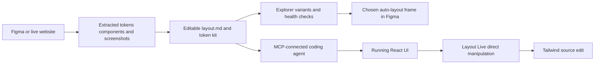

# Layout

> Research status: **Architecture-level** · Last reviewed: **2026-08-12**

Layout is not just a Figma-token exporter and not just an MCP server. It treats a design system as a compiled context package that can be inspected in Studio, tested against generated candidates, delivered to coding agents and brought back into either Figma or live React source.

## The project artifact is a governed context kit

A project can start from a Figma file, a live website or a blank kit. Extraction collects resolved tokens, components, fonts and screenshots. Studio then turns those observations into an editable `layout.md` plus token files and agent rules. The extracted inventory is evidence; the curated context file is the project decision surface.

Snapshots and rollback matter because an AI edit to `layout.md` changes what every downstream coding agent will be told. Layout therefore gives the context artifact its own history instead of treating it as a disposable generated prompt.

## Explorer makes comparison an explicit operation

Explorer generates two to six alternatives from one prompt. It can compare the same request with and without the Layout context and attaches a health score to the result. A user selects the useful direction; a chosen candidate can be pushed into Figma as a real auto-layout frame. That promotion path is why this record includes variant decision and native artifact authoring rather than classifying Layout as static documentation.

## Four interfaces share one design-system authority

| Surface | Reads | Mutates or delivers |
|---|---|---|
| Studio | extracted inventory and current project kit | `layout.md`, tokens, brand assets, snapshots |
| MCP / CLI | current design context and components | agent context, compliance checks, previews and Figma-push requests |
| Figma plugin | local styles, variables and current selection | Layout Cloud inventory, Figma Variables and captured canvas evidence |
| Layout Live | a running React element and its Tailwind classes | the corresponding source class in the connected application |

The Figma plugin's additive page pushes and authoritative whole-document push have different deletion semantics. Layout Live is also narrower than a general source editor: the public contract establishes Tailwind-class writeback from direct manipulation, not arbitrary program transformation.

## Evidence ceiling

The closed implementation does not expose the internal extraction heuristics, model prompts or exact mapping from a browser element to source. The dossier therefore records the observable authority and return paths without claiming a lossless compiler between every Figma node and every source component.

## Primary evidence

- [Product and architecture overview](https://layout.design/docs)
- [Studio and Explorer workflow](https://layout.design/docs/studio)
- [Figma plugin contracts](https://layout.design/docs/figma-plugin)
- [Layout Live](https://layout.design/docs/layout-live)
- [CLI and MCP](https://layout.design/docs/cli)
