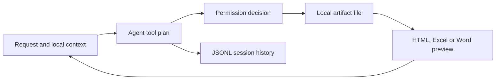

# Deskhand

> Research status: **Source-level** · Lifecycle: **active** · Last reviewed: **2026-08-13**

Deskhand is a general desktop agent, included only for its evidenced visual-artifact loop. A non-technical user can ask it to create or modify HTML, Excel and Word outputs, inspect those files in an artifact side panel, continue the conversation and retain the session. It is not counted as a native design canvas.

## Files remain authoritative while previews specialize by format

Pinned revision: `f9fa5eb7965dfc03d110e83d7603e655a3345850`.

Deskhand's artifact model ties file create/update/delete events to the message that produced them. The artifact panel dispatches HTML/code, spreadsheet and document files to different preview components. `ExcelPreview` and `WordPreview` are renderers over saved files; they do not replace the underlying workbook or document as authority.

The product also supports generated interactive UI for structured choices, including style exploration and preference tournaments. Those controls gather intent inside a conversation, while final deliverables still materialize as local files.

## Persistence and permission boundary

Sessions are stored as append-only JSONL and can be reopened. Workspace memory helps restore context, but the filesystem remains independently mutable outside the chat. File operations can require confirmation, so an agent proposal, an approved tool event and a changed artifact are distinct states.

## Pinned evidence

- [Repository](https://github.com/YUHAO-corn/Deskhand)
- [Artifact event model](https://github.com/YUHAO-corn/Deskhand/blob/f9fa5eb7965dfc03d110e83d7603e655a3345850/packages/core/src/types/artifact.ts)
- [Artifact panel](https://github.com/YUHAO-corn/Deskhand/blob/f9fa5eb7965dfc03d110e83d7603e655a3345850/apps/electron/src/renderer/components/artifact/ArtifactPanel.tsx)
- [Excel preview](https://github.com/YUHAO-corn/Deskhand/blob/f9fa5eb7965dfc03d110e83d7603e655a3345850/apps/electron/src/renderer/components/artifact/ExcelPreview.tsx)
- [Workspace memory](https://github.com/YUHAO-corn/Deskhand/blob/f9fa5eb7965dfc03d110e83d7603e655a3345850/packages/shared/src/agent/workspace-memory.ts)
