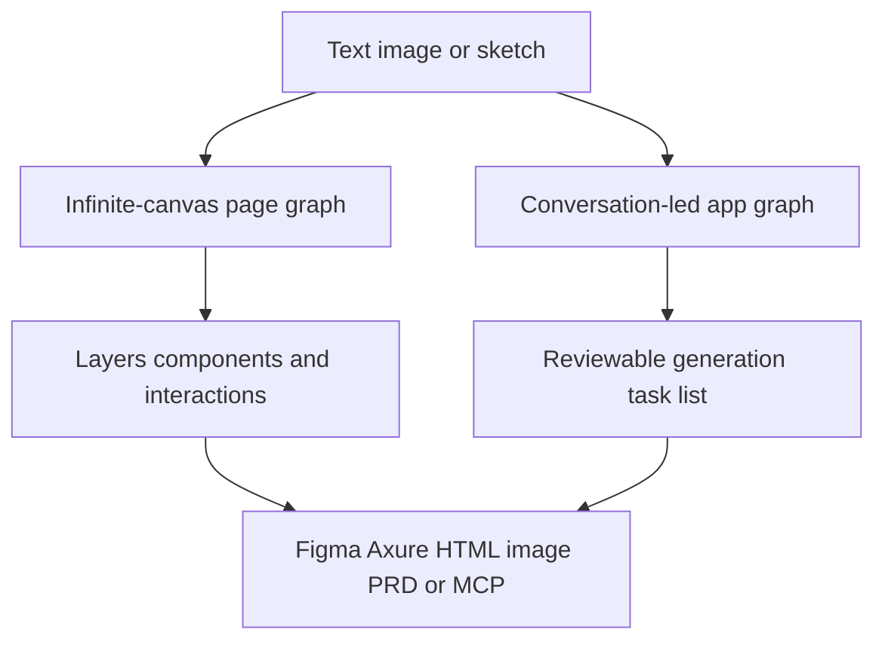

# GemDesign

> Research status: **Architecture-level** · Last reviewed: **2026-08-12**

GemDesign is an independently surfaced design workspace operated by the broader Gemcoder team. Its current canonical surface is `design.gemcoder.com`; the older `aigem.design` page routes users into the same company environment.

## Two project modes expose different control contracts

### Page prototype / infinite canvas

This mode starts with a blank page on a Figma-like infinite canvas. Text images or sketches generate editable layers. Users can select exact content then request a conversational change or manipulate position text spacing color properties and interactions manually. Hidden states such as dialogs remain beside the visible page instead of disappearing from the project.

### Application prototype

This mode is conversation-led. The agent decides which pages and site-wide transitions to create for a faster demo. After a generation it proposes a task list of new or modified pages; the person checks which tasks should execute next. It trades structural control for speed and is explicitly distinguished from the canvas mode.

## Artifact system and delivery

Reusable private components form a personal design-system library across projects. AI-generated interaction rules create navigation hover modal and error-state behavior. The retained prototype can be shared in an interactive presentation and exported as editable Figma or Axure work HTML images or a generated PRD. MCP exposes prototype code to coding agents as another delivery path.

The parent Gemcoder software-generation product is not collapsed into this record; it enters the recursive discovery ledger separately because a broader app builder may represent another product boundary.

## Team evidence

The Gemcoder first-party site identifies its Hangzhou address and a `yuantiaotech.com` contact domain. Region is recorded from that page rather than inferred from language.

## Primary evidence

- [Current GemDesign product](https://design.gemcoder.com/)
- [GemDesign introduction](https://design.gemcoder.com/book/)
- [Infinite-canvas and application modes](https://design.gemcoder.com/book/blog)
- [Feature overview](https://design.gemcoder.com/book/guide/functional/%E5%8A%9F%E8%83%BD/%E5%8A%9F%E8%83%BD%E6%A6%82%E8%A7%88/)
- [GemDesign MCP](https://design.gemcoder.com/book/guide/functional/gemdesignMCP/)
- [Gemcoder team contact and Hangzhou address](https://ai.gemcoder.com/)
