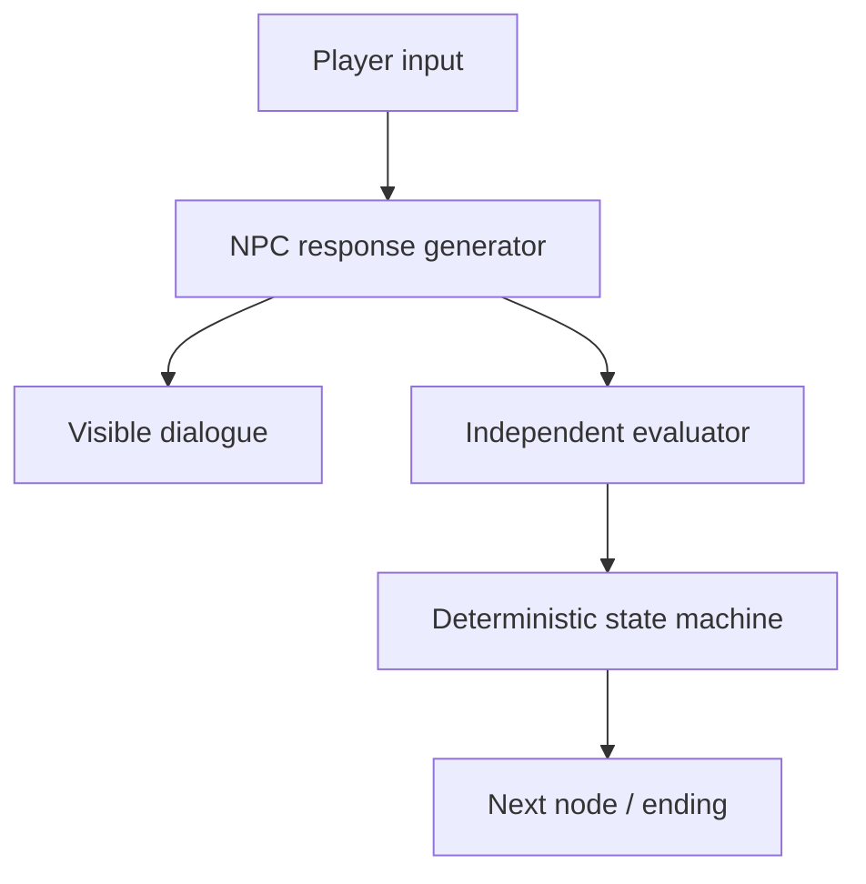

# Monogatari

> Research status: **Source-level** · Lifecycle: **active** · Last reviewed: **2026-08-12**

Monogatari is an AI-native visual-novel authoring workspace and runtime. It deliberately gives generative models character dialogue but withholds route score and ending authority from them.

## Narrative freedom sits inside a deterministic state machine

At commit [`3f7350d`](https://github.com/SakalioLabs/Monogatari/tree/3f7350de265ab9ed4df29b47e997f3e133c5b449) a project graph rooted at `settings.json` contains characters knowledge scenes scripted dialogue live roleplay events endings workflows assets localization and quality suites. During play one model generates the visible NPC response and a separate evaluator proposes score/evidence changes; deterministic rules validate those proposals and choose transitions.

The visual editor and MCP server mutate the same content graph through preconditioned transactions. `.monogatari` import/export uses portable paths and SHA-256 manifests; executable quality suites make critical routes replayable without a model.

The project supports local WebGPU and compatible hosted endpoints but no provider run was required to verify its state boundary. Public first-party evidence did not establish the team region.

## Pinned evidence

- [Data format](https://github.com/SakalioLabs/Monogatari/blob/3f7350de265ab9ed4df29b47e997f3e133c5b449/docs/DATA_FORMAT.md)
- [MCP contract](https://github.com/SakalioLabs/Monogatari/blob/3f7350de265ab9ed4df29b47e997f3e133c5b449/docs/MCP_SERVER.md)
- [Authoring transaction rules](https://github.com/SakalioLabs/Monogatari/blob/3f7350de265ab9ed4df29b47e997f3e133c5b449/.agents/skills/author-visual-novel/references/agent-transaction.md)
